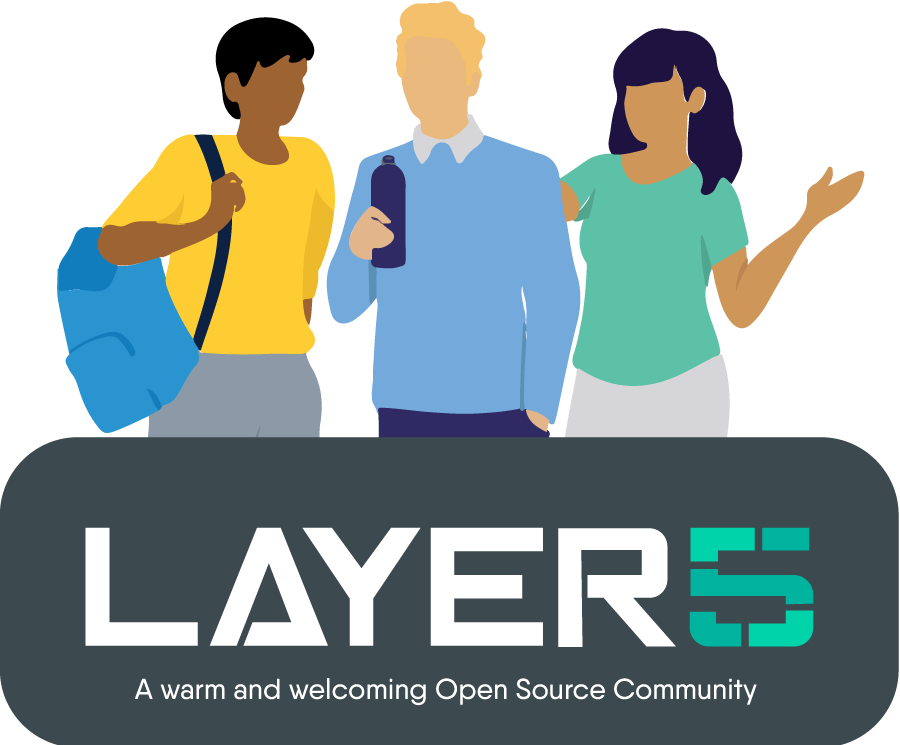

      <picture align="center">
         <source media="(prefers-color-scheme: dark)" srcset="./.github/readme/images/layer5-light-no-trim.svg">
         <source media="(prefers-color-scheme: light)" srcset="./.github/readme/images/layer5-no-trim.svg">
         
      </picture>

<h5>
<i>If you’re using Layer5 products or if you like the project, please <a href="https://github.com/layer5io/layer5/stargazers">★</a> this repository to show your support! 🤩</i>
</h5>

# About Layer5

[Layer5](https://layer5.io)'s cloud native application and infrastructure management software enables engineers to expect more from their infrastructure. We embrace _developer_-defined infrastructure. We empower developers to change how they write applications, support _operators_ in rethinking how they run modern infrastructure, and enable _product owners_ to regain full-control over their product portfolio.

### Contributions Welcome

✔️ <em><strong>Join</strong></em> any or all of the weekly meetings on <a href="https://meet.layer5.io">community calendar</a>. 
✔️ <em><strong>Watch</strong></em> community <a href="https://www.youtube.com/Layer5io?sub_confirmation=1">meeting recordings</a>. 
✔️ <em><strong>Access</strong></em> the <a href="https://drive.google.com/drive/u/4/folders/0ABH8aabN4WAKUk9PVA">Community Drive</a> by completing a community <a href="https://layer5.io/newcomer">Member Form</a>. 
✔️ <em><strong>Discuss</strong></em> in the <a href="https://discuss.layer5.io">Community Forum</a>. 
✔️ <em><strong>Explore more</strong></em> in the <a href="https://layer5.io/community/handbook">Community Handbook</a>. 

Explore tutorials and documentation by product in the https://docs.layer5.io website; documentation and developer resources of Layer5 products. If you find a typo or you feel like you can improve the HTML, CSS, or JavaScript, we welcome contributions. Feel free to open issues or pull requests like any normal GitHub project, and we'll merge it in 🚀

## Building the Documentation

<h3>Build Docs with Golang</h3>

If your local development environment has a supported version (v1.21.0+) of Golang installed, next you'll need to install extended Hugo version as it has necessary SCSS/SASS support. Find all the Hugo packages here: <https://github.com/gohugoio/hugo/releases/tag/v0.120.4>

Now to setup and run the site locally execute:

1. `make setup`
2. `make site`
3. visit http://localhost:1313

If you pull down new code from GitHub, you will occasionally need to run `make setup` again. Otherwise, there's no need to re-run `make setup` each time the site is run, you can just run `make site` to get it going and have it automatically reload as you make and save site edits.

<h3>Build Docs with Docker</h3>

Running the site locally is simple. Provided you have Docker installed, clone this repo, run `make docker`, and then visit <http://localhost:1313>.

> [!IMPORTANT]  
> This requires Docker Desktop version **4.24** or later, or Docker Engine with Docker
> Compose version [**2.22**](https://docs.docker.com/compose/file-watch/) or later.

      
### Contribution Guidelines

**--> See https://docs.layer5.io/contributing <--** for a detailed contribution guide.

## Documentation Structure

The following is the high-level outline and information architecture for Layer5 documentation.

**Goal:** Offer comprehensive, organized, and accessible documentation for diverse audiences, from new users to expert contributors.

**Target Audience:**

- **Personas:** Beginners, developers, admins, operators, security specialists, contributors, users of all experience levels.
- **Needs:** Varied - learning fundamentals, managing tasks, understanding advanced concepts, contributing code.

<h3>Cloud Section: Information Architecture</h3>

### Getting Started

- Creating an Account
- Creating your first Designs

### Concepts

An overview of Layer5 Cloud concepts and their relationships to one another.

#### Identity

- **Organizations:** Organizations, Managing Organization Permissions
- **Teams:** Teams, Managing Teams Permissions
- **Users:** User Management, Managing User Permissions

#### Security

- **Tokens:** API Tokens are used to authenticate to Layer5 Cloud’s REST API.
- **Keychains**: Keychains are a collection of keys
- **Keys**: Keys are the atomic unit of access control
- **Roles**: Roles map permissions to users.

#### Catalog

The Cloud Catalog is a web-based, public catalog to facilitate easy sharing and discovery of common cloud native architectures and design patterns.

#### Workspaces

Workspaces serve as a virtual space for your team-based work.

#### Tutorials

- Kanvas Snapshots
- Sharing a Workspace
- Recognizing User and Contributor Milestones

### Self-Hosted

Keep your Kanvas designs internal to your workplace. Get remote support from Layer5 when you need it.

### Reference

Low-level ReST API reference for extending Layer5 Cloud.

<h3>Kanvas Section: Information Architecture</h3>

### Getting Started with Designs

- **Starting from a pattern:** A Pattern is an entity that augments the operational behavior of a deployed instance of a Design.
- **Creating Relationships:** Relationships identify and facilitate genealogy between Components.
- **Working with Components:** Components represent entities in the ecosystem, exposing capabilities of the underlying platform.
- **Starting from scratch:** Emphasize the underlying system behavior for each action you take.

### Exploring Designer

- **Reviewing Designs:** Learn how to leverage comments in Kanvas’s Designer Mode to enhance collaboration and streamline design reviews.
- **Whiteboarding:** Whiteboarding and Freestyle Drawing inside Kanvas
- **Export Designs:** How to export your designs for backup, sharing or offline use.

### Working with Components

Designs are descriptive, declarative characterizations of how your Kubernetes infrastructure should be configured

### Navigating Operator

Operator mode is for operating your Kubernetes clusters and cloud native infrastructure.

### Core Tasks

- **Whiteboarding:** Kanvas Designer supports freestyle design, meaning that you can customize the appearance and layout of your diagrams without any constraints.
- **Deploying Designs:** Validating Designs, Undeploying Designs, Deploying Designs, Cloning a Design

### Reference

- **Keyboard Shortcuts:** Learn the keyboard shortcuts for Kanvas to enhance your designing experience.
- **Troubleshooting Kanvas:** Learn to Troubleshoot the Kanvas

Our projects are community-driven and open to collaboration. 👍 Be sure to see the <a href="https://layer5.io/community/newcomers" aria-label="Welcome Guide">Layer5 Community Welcome Guide</a> for a tour of resources available to you. You can also join our <a href="http://slack.layer5.io" aria-label="Slack">Slack</a> to get involved.

<h3>Find your MeshMate</h3>

  MeshMates are experienced Layer5 community members who will help you learn your way around, discover live projects and expand your community network.
  Become a <b>Meshtee</b> today!

Find out more on the <a href="https://layer5.io/community" aria-label="Community page">Layer5 community</a>.  
    

&nbsp;

<a href="https://slack.layer5.io" aria-label="Join the Layer5 Slack community">

<picture align="right">
  <source media="(prefers-color-scheme: dark)" srcset=".github/readme/images/slack-dark-128.png"  width="110px" align="right" style="margin-left:10px;margin-top:10px;">
  <source media="(prefers-color-scheme: light)" srcset=".github/readme/images/slack-128.png" width="110px" align="right" style="margin-left:10px;padding-top:5px;">
  
</picture>
</a>

✔️ <em><strong>Join</strong></em> any or all of the weekly meetings on <a href="https://calendar.google.com/calendar/b/1?cid=bGF5ZXI1LmlvX2VoMmFhOWRwZjFnNDBlbHZvYzc2MmpucGhzQGdyb3VwLmNhbGVuZGFyLmdvb2dsZS5jb20">Community calendar</a>. 
✔️ <em><strong>Watch</strong></em> community <a href="https://www.youtube.com/playlist?list=PL3A-A6hPO2IMPPqVjuzgqNU5xwnFFn3n0">meeting recordings</a>. 
✔️ <em><strong>Access</strong></em> the <a href="https://drive.google.com/drive/u/4/folders/0ABH8aabN4WAKUk9PVA">Community Drive</a> by completing a community <a href="https://layer5.io/newcomer">Member Form</a>. 
✔️ <em><strong>Discuss</strong></em> in the <a href="https://discuss.layer5.io">Community Forum</a>. 
✔️ <em><strong>Explore more</strong></em> in the <a href="https://layer5.io/community/handbook">Community Handbook</a>. 

<i>Not sure where to start?</i> Grab an open issue with the <a href="https://github.com/issues?q=is%3Aopen+is%3Aissue+archived%3Afalse+(org%3Alayer5io+OR+org%3Ameshery+OR+org%3Alayer5labs+OR+org%3Aservice-mesh-performance+OR+org%3Aservice-mesh-patterns+OR+org%3Ameshery-extensions)+label%3A%22help+wanted%22" aria-label="help-wanted label">help-wanted label</a>.

