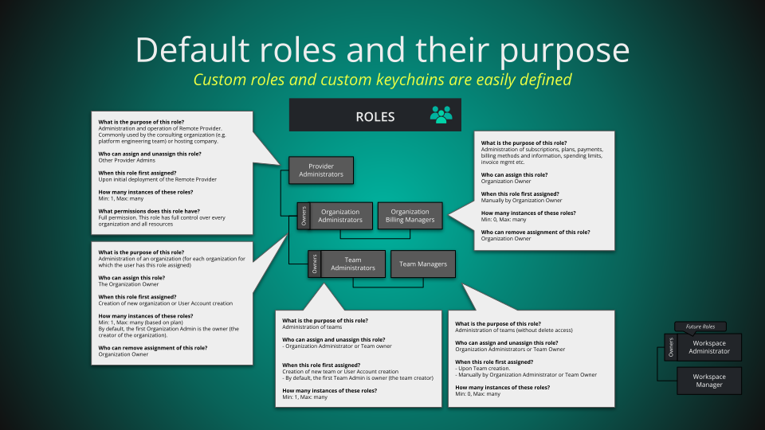
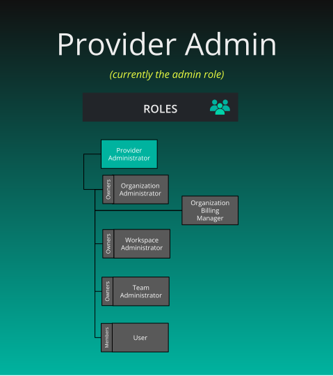
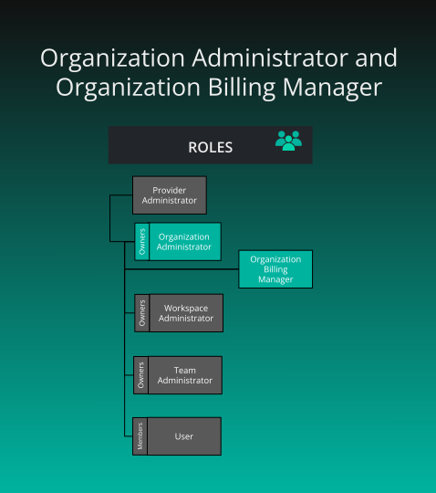

# Roles

> Roles map permissions to users. Roles contain any number of keychains, which contain any number of keys (permissions). Assign roles to users to grant permissions.

Roles map permissions to users. Roles contain any number of keychains, which contain any number of keys (permissions). Assign roles to users to grant permissions.

## Provider Admin Role

      <a href='https://docs.layer5.io/cloud/reference/default-permissions/#Provider+Admin' target='_blank'>Provider Admin Role</a>
    

    

        

  

      

  

    

        
<strong>What is the purpose of this role?</strong>

<ul>
<li>Used for administration of Layer5 Cloud.</li>
<li>Used for debugging and monitoring.</li>
<li>Applicable to platform engineering team and on-prem users.</li>
</ul>

<strong>Who can assign this role?</strong>

<ul>
<li>Provider Admins</li>
</ul>

<strong>When this role is first assigned?</strong>

<ul>
<li>On ☁️ boot-up (using build args)</li>
</ul>

<strong>How many instances of these roles?</strong>

<ul>
<li>Min: 1, Max: many (based on plan)</li>
</ul>

<strong>Who can remove assignment of this role?</strong>

<ul>
<li>Provider Admins</li>
</ul>

<strong>What permissions does this role have?</strong>

<ul>
<li>Can create, view, edit and delete every resource</li>
</ul>

      

  

## Organization Roles

    

        

  

      

  

      
<h3 id="organization-administrator" class="heading-link">
  <a href='https://docs.layer5.io/cloud/reference/default-permissions/#Org+Admin' target='_blank'>Organization Administrator</a>
  <a href="#organization-administrator" class="heading-anchor" aria-label="Permalink to this heading">🔗</a>
</h3>

    

    

        
<strong>What is the purpose of this role?</strong>

<ul>
<li>Administration of an organization</li>
</ul>

<strong>Who can assign this role?</strong>

<ul>
<li>The Organization Owner</li>
</ul>

<strong>When this role is first assigned?</strong>

<ul>
<li>Creation of new organization or User Account creation</li>
</ul>

<strong>How many instances of these roles?</strong>

<ul>
<li>Min: 1, Max: many (based on plan)</li>
<li>By default, the first Organization Admin is the owner (the creator of the organization).</li>
</ul>

<strong>Who can remove assignment of this role?</strong>

<ul>
<li>Organization Owner</li>
</ul>

      

  

      
<h3 id="organization-billing-manager" class="heading-link">
  <a href='https://docs.layer5.io/cloud/reference/default-permissions/#Org+Billing+Manager' target='_blank'>Organization Billing Manager</a>
  <a href="#organization-billing-manager" class="heading-anchor" aria-label="Permalink to this heading">🔗</a>
</h3>

    

    

        
<strong>What is the purpose of this role?</strong>

<ul>
<li>Administration of subscriptions, plans, payments, billing methods and information, spending limits, invoice mgmt etc.</li>
</ul>

<strong>Who can assign this role?</strong>

<ul>
<li>Organization Owner</li>
</ul>

<strong>When this role is first assigned?</strong>

<ul>
<li>Manually by Organization Owner</li>
</ul>

<strong>How many instances of these roles?</strong>

<ul>
<li>Min: 0, Max: many</li>
</ul>

<strong>Who can remove assignment of this role?</strong>

<ul>
<li>Organization Owner</li>
</ul>

      

  

  <h4 class="alert-heading">Organization owners as entitlements</h4>
  
      
It&rsquo;s essential to understand that owners are not roles, but entitlements.

Organization owners carry the organization administrator role, and may be joined in their organization administration duties by any number of other users carrying the organization administrator role. However, the organization owner also has the administrative privilege to delete the organization.

The entitlement of &ldquo;organization owner&rdquo; is automatically bestowed to the creator of a organization. The individual user who created a given organization initially is therefore granted certain administrative privileges beyond that of other organization administrators. Specifically, organization owners retain the sole permission to delete the organization.

For more information, see <a href="/cloud/concepts/identity-and-security/organizations/">Organization</a>.

  

## Workspace Roles

    

        

  

      

  

      
<h3 id="workspace-administrator" class="heading-link">
  <a href='https://docs.layer5.io/cloud/reference/default-permissions/#Workspace+Admin' target='_blank'>Workspace Administrator</a>
  <a href="#workspace-administrator" class="heading-anchor" aria-label="Permalink to this heading">🔗</a>
</h3>

    

    

        
<strong>What is the purpose of this role?</strong>

<ul>
<li>Administration of a workspace along with curation of content for an organization&rsquo;s catalog (for each organization for which the user has this role assigned)</li>
</ul>

<strong>Who can assign this role?</strong>

<ul>
<li>Organization Administrators or Workspace Owner</li>
</ul>

<strong>When this role is first assigned?</strong>

<ul>
<li>Creation of new workspace</li>
</ul>

<strong>How many instances of these roles?</strong>

<ul>
<li>Min: 1, Max: many</li>
<li>By default, the first Workspace Administrator is the owner (the creator) of the workspace.</li>
</ul>

<strong>Who can remove assignment of this role?</strong>

<ul>
<li>Organization Administrators or Workspace Owner</li>
</ul>

      

  

  <h4 class="alert-heading">Workspace owners as entitlements</h4>
  
      
It&rsquo;s essential to understand that owners are not roles, but entitlements.

Workspace owners carry the organization administrator role, and may be joined in their workspace administration duties by any number of other users carrying the workspace administrator role. However, the workspace owner also has the administrative privilege to delete the workspace.

The entitlement of &ldquo;workspace owner&rdquo; is automatically bestowed to the creator of a workspace. The individual user who created a given workspace initially is therefore granted certain administrative privileges beyond that of other workspace administrators. Specifically, workspace owners retain the sole permission to delete the workspace.

  

## Team Roles

    

        

  

      

  

      
<h3 id="team-administrator" class="heading-link">
  <a href='https://docs.layer5.io/cloud/reference/default-permissions/#Team+Admin' target='_blank'>Team Administrator</a>
  <a href="#team-administrator" class="heading-anchor" aria-label="Permalink to this heading">🔗</a>
</h3>

    

    

        
<strong>What is the purpose of this role?</strong>

<ul>
<li>Administration of teams</li>
</ul>

<strong>Who can assign and unassign this role?</strong>

<ul>
<li>Organization Administrator or Team owner</li>
</ul>

<strong>When is this role first assigned?</strong>

<ul>
<li>Creation of new team or User Account creation</li>
<li>By default, the first Team Admin is owner (the team creator)</li>
</ul>

<strong>How many instances of these roles?</strong>
Min: 1, Max: many

      

  

      
<h3 id="team-manager" class="heading-link">
  Team Manager
  <a href="#team-manager" class="heading-anchor" aria-label="Permalink to this heading">🔗</a>
</h3>

    

    

        
<strong>What is the purpose of this role?</strong>

<ul>
<li>Administration of teams (without delete access)</li>
</ul>

<strong>Who can assign and unassign this role?</strong>

<ul>
<li>Organization Administrators or Team Owner</li>
</ul>

<strong>When is this role first assigned?</strong>

<ul>
<li>Manually by Organization Administrator or Team Owner</li>
</ul>

<strong>How many instances of these roles?</strong>

<ul>
<li>Min: 0, Max: many</li>
</ul>

      

  

  

  <h4 class="alert-heading">Owners as entitlements, not roles</h4>
  
      
It&rsquo;s essential to understand that owners are not roles, but entitlements.

Team owners carry the team administrator role, and may be joined in their team administration duties by any number of other users carrying the team administrator role. However, the team owner also has the administrative privilege to delete the team.

The entitlement of &ldquo;team owner&rdquo; is automatically bestowed to the creator of a team. The individual user who created a given team initially is therefore granted certain administrative privileges beyond that of other team administrators. Specifically, team owners retain the sole permission to delete the team.

For more information, see <a href="/cloud/concepts/identity-and-security/teams/">Teams</a>.

  

## Example: The Orbital Labs Role Hierarchy

The following illustrates how Provider Admin, Org Admin, and Team Admin roles stack in practice across the Orbital Labs ecosystem. See [Meet Five and the Cast]() for the full narrative.

      <strong>Dr. Aiko Sato</strong> — Provider Admin
    

    

        
<strong>Organization:</strong> Constellation Cloud 
<strong>Scope:</strong> All tenants (Orbital Labs, Stellar Dynamics, and others)

Dr. Aiko Sato holds the Provider Admin role at Constellation Cloud, the MSP that manages Orbital Labs as a tenant. Provider Admins can create, view, edit and delete every resource across all tenant organizations. Dr. Sato has seen every misconfigured RBAC policy known to humankind, which is why she documents each one.

      

  

      <strong>Maya Chen</strong> — Organization Administrator
    

    

        
<strong>Organization:</strong> Orbital Labs 
<strong>Scope:</strong> All resources within Orbital Labs

Maya Chen holds the Org Admin role for Orbital Labs. She manages user accounts, team membership, workspace creation, and role assignments within Orbital Labs. She also serves as Team Admin for the Development team — an Org Admin may administer any team in their organization.

      

  

      <strong>Zara Osei</strong> — Team Administrator
    

    

        
<strong>Organization:</strong> Orbital Labs 
<strong>Team:</strong> Infrastructure 
<strong>Scope:</strong> Infrastructure team members and their workspace access

Zara Osei holds the Team Admin role for Orbital Labs&rsquo; Infrastructure team. She manages keychain assignments for Five and controls which environments the Infrastructure team can access. Access requests go through Zara&rsquo;s 48-hour SLA — no exceptions, no matter how urgent Five thinks the situation is.

      

  

  <h4 class="alert-heading" style="color: #3772ff;">Info</h4>
  
      Role assignments are org-scoped. Dr. Aiko&rsquo;s Provider Admin role spans all tenants; Maya&rsquo;s Org Admin role applies only within Orbital Labs; Zara&rsquo;s Team Admin role applies only to the Infrastructure team within Orbital Labs.
  

