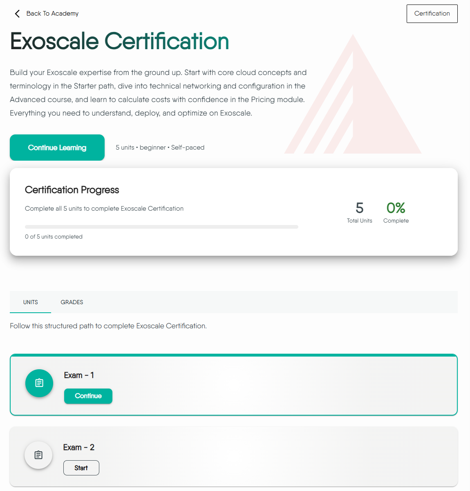

In [Layer5 Academy](https://cloud.layer5.io/academy/), a **Certification** is a top-level content type designed to formally **validate** a learner's professional skills and expertise in a specific domain. Unlike a Learning Path, which guides a user through a structured learning process, a Certification focuses primarily on assessment and evaluation.

The successful completion of a Certification results in an official, shareable **Certificate of Completion** and a valuable badge, signifying a verified level of proficiency.



## Certification vs Other Content Types

To better understand its unique role, here is a comparison with other content types in the Academy:

| Feature | Learning Path | Challenge | Certification |
| :--- | :--- | :--- | :--- |
| Primary Goal | To teach and guide through a comprehensive curriculum. | To solve a specific, hands-on problem in a competitive or timed scenario. | To validate and prove existing knowledge through formal examination. |
| Structure | Hierarchical (Path → Courses → Modules). | Typically a single, scenario-based task. | Flat; a collection of one or more exams. |
| Main Content | Lessons, informational pages, labs, and progressive assessments (Quizzes/Tests). | A set of instructions for a practical task and a validation mechanism. | A series of rigorous exams, potentially with a brief study guide. |
| Outcome | Acquired knowledge and skills. | A score, rank status. | An optional, paid official certificate and a verifiable badge.|

## Directory Structure

All content for a new certification must reside within the `content/certifications/orgID` directory. To keep content organized, each certification has its own folder named with a descriptive, URL-friendly slug.

The URL will follow this pattern: `https://cloud.layer5.io/academy/content/certifications/<certification-folder-name>/`

### File Structure

Below is a typical file structure for a new certification:

```
content/certifications/
└── layer5-certification-exam/          <-- The <certification-name> directory
    ├── _index.md                       <-- Defines the certification's metadata
    ├── exam-1.md                       <-- (Optional) A standard content page for introduction
    ├── optional-exam-2.md              <-- An optional supplementary exam
    └── exam-3.md                       <-- A mandatory exam (You must complete all previous units to access this exam)
```

**Key Files:**
- **`_index.md`**: The entry point for your certification containing all metadata (title, description, banner, etc.)
- **Exam Files (`*.md`)**: Individual Markdown files containing the exams. Order and optional status are controlled by frontmatter, not filename.

### Setting Up the Certification (`_index.md`)

The `_index.md` file defines the core properties of your certification. Its frontmatter controls how the certification is presented to users and categorized within the Academy.

Here's a complete example of the YAML frontmatter for a certification's `_index.md` file:

```yaml
---
type: "certification"
id: "445a80d2-1234-1234-1234-2329c5ddcdec"
title: "Layer5 Network Certification"
description: "Validate your expertise in Layer5 networking technologies through comprehensive assessment"
banner: "images/layer5-icon.svg"
weight: 1
tags: [network, cloud, infrastructure]
level: "beginner"
categories: "platform"
---
```

### Frontmatter Fields Reference

| Field | Required | Description |
| :--- | :--- | :--- |
| `type` | ✅ | Must be set to `"certification"` to identify this content correctly. |
| `id` | ✅ | A globally unique identifier (UUID) for the certification. |
| `title` | ✅ | The human-readable title that will be displayed to users. |
| `description` | ✅ | A comprehensive summary of the certification's scope and objectives. |
| `weight` | ❌ | Controls the display order (lower numbers appear first). |
| `banner` | ❌ | Path to an image in the `static` folder, e.g., `images/icon.svg`. |
| `tags` | ❌ | Keywords for content discovery. Multiple tags can be selected. |
| `level` | ❌ | A string indicating the intended difficulty (e.g., `beginner`, `intermediate`, `advanced`). |
| `categories` | ❌ | A string that assigns the certification to a specific category. |

## Composing Certification Content

A certification is primarily a collection of exams designed to validate a learner's skills. However, you can also include standard content pages to provide context and guide the learner.

The content within a certification folder can include:

- **Exams:** These are the core, assessable components. A certification can contain one or multiple exams. You can control the display order using the `weight` field in each file's frontmatter.
- **Informational Pages:** You can add standard Markdown pages to serve as an introduction, a study guide, or a list of helpful resources. These pages do not contain questions and are not part of the formal assessment process.


Every "Exam" file within a certification follows the unified Academy assessment standard.

For detailed instructions on how to write an exam file, define various question types, set scoring and passing percentages, and use advanced options, please refer to our comprehensive [Integrating Assessments in the Academy](../) guide.


## Advanced Features

Certifications include unique features that distinguish them from other content types in the Academy, providing additional value for both content creators and learners.

### Certificate of Completion

The primary outcome of successfully completing a certification is the issuance of an official Certificate of Completion. This certificate serves as a formal validation of the learner's skills and expertise in the subject matter.

The specific design, template, and data schema for the certificates are currently being finalized and will be available in a future update.

### Monetization

A key feature unique to the Certification content type is the ability to be configured as **paid content**. While accessing and participating in Learning Paths and Challenges are typically free, Certifications can be offered as premium, high-value accreditations for professional development.

The specific steps for setting prices and integrating payment processing are planned for a future release and will be documented accordingly.