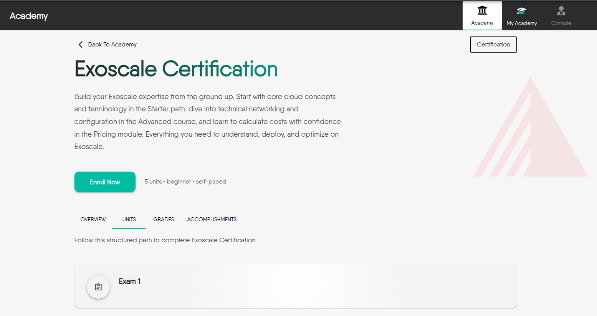
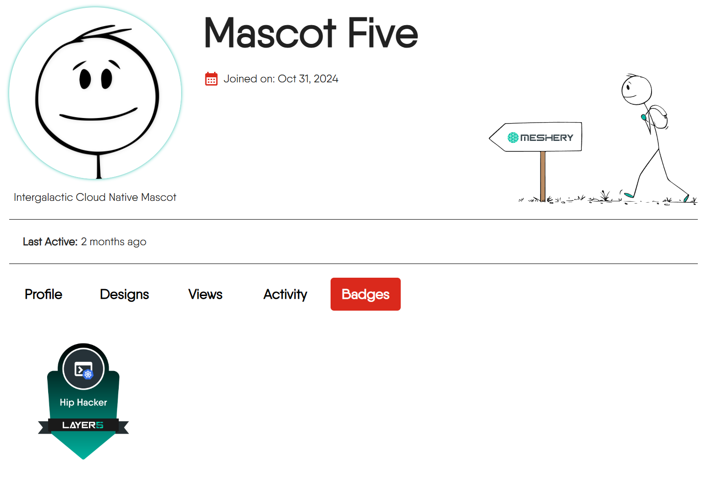

In [Layer5 Academy](https://cloud.layer5.io/academy/), a **Certification** is a formal assessment designed to validate a learner's professional skills in a specific domain. Unlike a Learning Path, which guides a user through a curriculum, a Certification's primary goal is evaluation.

The successful completion of a Certification results in an official, shareable **Certificate of Completion** and a valuable badge, signifying a verified level of proficiency.



### When to Use a Certification

To understand its unique role, here is a comparison with other content types in the Academy. Use this table to decide if a Certification is the right format for your content.

| Feature | Learning Path | Challenge | Certification |
| :--- | :--- | :--- | :--- |
| Primary Goal | To teach and guide through a comprehensive curriculum. | To solve a specific, hands-on problem in a competitive scenario. | To validate and prove existing knowledge through formal examination. |
| Structure | Hierarchical (Path → Courses → Modules). | Typically a single, scenario-based task. | Flat; a collection of one or more exams. |
| Main Content | Lessons, informational pages, labs, and progressive assessments. | A set of instructions for a practical task and a validation mechanism. | A series of exams, potentially with a brief study guide. |
| Outcome | Acquired knowledge and skills. | A score, rank status. | An optional, paid official certificate and a verifiable badge.|


A Certification is ideal when the main objective is to test, not teach. It assumes learners have prior knowledge and are ready to prove their expertise.


## How to Create Your Certification

Building a new certification involves setting up the correct directory structure and defining its properties through Markdown frontmatter.

### 1. Set Up the Directory Structure

All content for a new certification must reside within the `content/certifications/orgID` directory. To keep content organized, each certification has its own folder named with a descriptive, URL-friendly slug.

The final URL will follow this pattern: `https://cloud.layer5.io/academy/content/certifications/<certification-folder-name>/`

Below is the standard file structure:

```
content/certifications/
└── orgID/layer5-certification-exam/     <-- The <certification-name> directory
    ├── _index.md                  <-- Defines the certification's metadata
    ├── exam-1.md                  <-- (Optional) A standard content page for introduction
    ├── optional-exam-2.md         <-- An optional supplementary exam
    └── exam-3.md                  <-- A mandatory exam, accessible after completing all previous required units.
```

**Key Files:**
- **`_index.md`**: The entry point for your certification containing all metadata (title, description, banner, etc.)
- **Exam Files (`*.md`)**: Individual Markdown files containing the exams. Order and optional status are controlled by frontmatter, not filename.

### 2. Define the Certification with Frontmatter

The `_index.md` file's frontmatter controls how the certification is presented to users..

Here's a complete example of the YAML frontmatter for a certification's `_index.md` file:

```yaml
---
type: "certification"
id: "445a80d2-1234-1234-1234-2329c5ddcdec"
title: "Layer5 Network Certification"
description: "Validate your expertise in Layer5 networking technologies through comprehensive assessment"
banner: "images/layer5-icon.svg"
weight: 1
tags: [layer5, cloud, infrastructure]
level: "beginner"
categories: "platform"
---
```

#### Frontmatter Fields Reference

| Field | Required | Description |
| :--- | :--- | :--- |
| `type` | ✅ | Must be set to `"certification"` to identify this content correctly. |
| `id` | ✅ | A globally unique identifier (UUID) for the certification. |
| `title` | ✅ | The human-readable title that will be displayed to users. |
| `description` | ✅ | A comprehensive summary of the certification's scope and objectives. |
| `weight` | ❌ | Controls the display order (lower numbers appear first). Items are sorted alphabetically by title if not specified.|
| `banner` | ❌ | Path to an image in the `static` folder, e.g., `images/icon.svg`. |
| `tags` | ❌ | Keywords for content discovery. Multiple tags can be selected. |
| `level` | ❌ | A string for the intended difficulty (`beginner`, `intermediate`, `advanced`). Default: `beginner`. |
| `categories` | ❌ | A string that assigns the certification to a specific category. |

### 3. Add Content and Exams

A certification is primarily composed of exams. However, you can also include standard content pages to provide context.

  - **Exams:** The core assessable components. A certification can contain one or multiple exams.
  - **Informational Pages:** Standard Markdown pages that can serve as an introduction, a study guide, or a list of helpful resources.


Every "Exam" file within a certification follows the unified Academy assessment standard.

For detailed instructions on how to write an exam file, define various question types, set scoring and passing percentages, and use advanced options, please refer to our comprehensive [Integrating Assessments in the Academy](../integrating-assessments-in-the-academy/) guide.


## Learner Outcomes: Badges and Certificates

Successfully completing a certification provides learners with valuable, verifiable credentials.

### Badges

Upon successful completion of all mandatory exams, learners are awarded a digital badge. This badge serves as a verifiable credential that is perfect for sharing on professional profiles to showcase the achievement.



### Official Certificates

The ultimate outcome of a certification is an **official Certificate of Completion**.

A key feature unique to the Certification content type is that while the learning materials and exams are offered for free, the **issuance of the official certificate is a paid feature**. This model allows anyone to learn and validate their skills at no cost, with the option to purchase the formal certificate to document their accomplishment.


## Frequently Asked Questions

<details>
  <summary>Can my certification have only one exam?</summary>
  
Yes, it can. The simplest form of a certification consists of a single final exam. You can also include multiple independent exams if you wish to assess different skills.
</details>

<details>
  <summary>When should I choose to create a "Certification" instead of a "Learning Path"?</summary>
  
You should choose a Certification when your primary goal is to **test and assess** a learner's existing knowledge, rather than **teaching them** from scratch. A Learning Path focuses on instruction, while a Certification focuses on assessment.
</details>

<details>
  <summary>What does an "Optional" exam mean, and how does it affect a learner's progress?</summary>
  
An optional exam is supplementary material. Learners can take it, but they **do not** have to pass it to earn the final certificate. Its score **does not count** towards the certification's passing requirements. This is typically used for extra practice or to test non-core knowledge.
</details>

<details>
  <summary>How do I set an exam as "Optional"?</summary>
  
You need to add a specific field, `is_optional: true`, to the front matter of the exam's `.md` file. This field tells the system that the exam is not a mandatory requirement to pass the certification.
</details>

<details>
  <summary>Can I control the order of multiple exams within a certification?</summary>
  
Yes, you can. Each exam file's front matter has a `weight` field. Lower numbers result in an earlier display order. If you don't set a `weight`, the exams will be sorted alphabetically by file title by default.
</details>

<details>
  <summary>As a content creator, do I need to handle the certificate payment process?</summary>
  
No, you don't. The payment and certificate issuance process is handled by the Layer5 platform. You only need to focus on creating high-quality assessment content.
</details>
