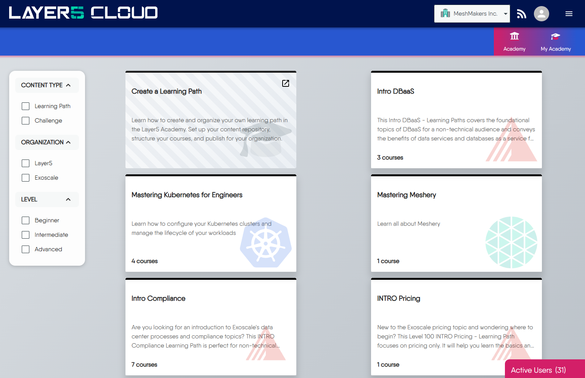

The [Layer5 Cloud Academy](https://cloud.layer5.io/academy) is a modular learning management system (LMS) designed for building learning paths and interactive, hands-on challenges. It is deeply integrated into the Layer5 cloud ecosystem and **[Kanvas](https://kanvas.new/)** — a visual designer for cloud native infrastructure. This integration allows you to embed live visualizations, interactive designs, and contextual experiences directly into your courses.

This approach transforms learning from passive reading into active, hands-on practice.



### Who Can Create Content

The ability to create, manage, and publish content is available to organizations on our **Enterprise Plan**. This plan includes full support for:

  - **Multi-tenancy:** Your content, users, and data are securely isolated from all other organizations.
  - **White-labeling:** You can brand the Academy with your own logo and color scheme.
  - **Customization:** You have complete control over the learning paths and challenges you create.

> You can learn more about our subscription plans on the [Layer5 Pricing](https://layer5.io/pricing) page.

### Content Creation Process

We believe you should always own your content. That’s why the Academy is designed around a Git-native workflow that avoids vendor lock-in.

Instead of using a restrictive web UI, you manage all your learning content within **your own Git repositories**. This gives you the full power of version control, collaboration through pull requests, and a workflow that your developers are already comfortable with. 

The entire experience is powered by **[Hugo](https://gohugo.io/)**, a powerful static site engine, but we've abstracted away the complexity. You and your team only need to write in simple Markdown.


You don't need to be a web developer to create beautiful and effective learning content. The provided theme handles all the layouts, styling, and complex components, letting you focus solely on the quality of your material.


### Organizing Your Learning Paths

Your content is structured hierarchically to create a clear and logical learning experience for your users.

At the highest level, you have a **Learning Path**, which contains one or more **Courses**. Each Course is broken down into **Modules**, and each Module consists of individual learning activities like **Pages** (for text) and **Labs** (for hands-on practice). In addition, **Tests** can be integrated at various levels of this hierarchy. This modular structure makes your content easy to navigate, manage, and update.

For example, a **Learning Path** named **"Mastering Kubernetes"** might contain:
  * A **Course** on **"Core Concepts"**, which is broken down into multiple modules:
      * **Module 1: "Workload Fundamentals"**, containing a **Page** on the "Anatomy of a Pod" and a hands-on **Lab** for "Scaling Deployments".
      * **Module 2: "Networking Principles"**, containing a **Page** that covers "Services and Ingress" and a **Tests** on networking concepts.


To ensure security and isolation, all of your content files must be placed within a directory named for your organization UUID. You'll learn the specifics of how to do this in our [hands-on tutorial](/cloud/academy/creating-your-learning-path/).


### Branded Email Communications

When using the Academy with white-labeling enabled, all system-generated emails (badge awards, certificate awards, challenge registrations) automatically reflect your organization's branding.

Below is an example email template showing how badge award notifications appear when white-labeling is enabled. The parts enclosed in `{{}}` are automatically replaced with your organization's specific information:

**Email Template Structure:**
```
From: no-reply@{{OrganizationDomain}}                    ← Your custom domain
Subject: New badge(s) awarded by {{OrganizationName}}    ← Your organization name

    Congratulations, {{Awardee}}!                        ← Student's name
    You have earned the following badges:

    {{Badges}}                                           ← Cicable badge with name and description

    [Go to Profile Button{{PublicProfileLink}}]          ← Direct link to profile

    Share your achievements with the world:
    X | LinkedIn | Facebook
---
{{OrganizationName}} Academy | Powered by Layer5 Cloud 
```

Here is a real-world example of the email:


When users click the badge, they will go to the details in the Academy:



Email templates automatically incorporate your organization's logo and primary brand color as configured in your [Layer5 Cloud Organization Settings](https://cloud.layer5.io/identity/organizations). Custom email templates can be provided for Enterprise customers with specific branding requirements.


