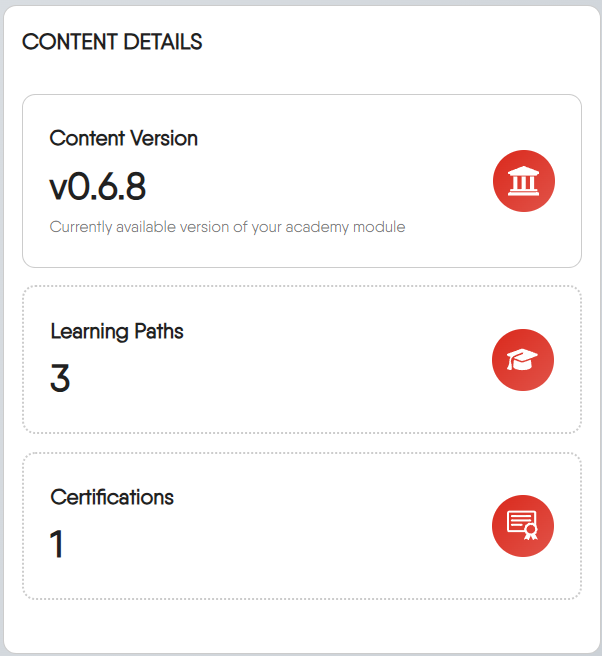
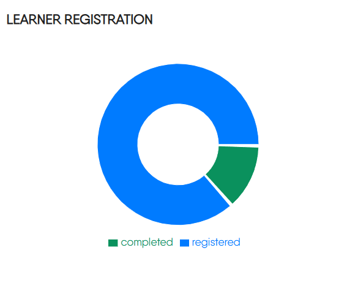
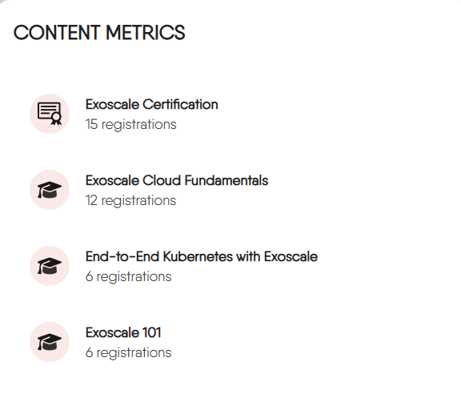
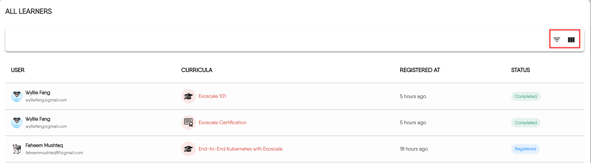
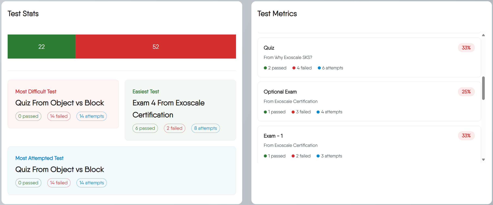

The [Instructor Console](https://cloud.layer5.io/academy/instructors-console) serves as your command center for the Layer5 Academy, providing both a comprehensive overview of your content and detailed insights into learner engagement.

### Gaining Access

To view the Instructor Console, you must have the **Academy Admin** role or be an **organization admin**.


The Instructor Console and custom academy features are available exclusively for organizations on an Enterprise plan. [Learn more](https://layer5.io/pricing)


### Using the Content Creation Tool

The Instructor Console includes a Content Creation Tool to help you develop new learning materials. It's a simple, guided process that generates the initial configuration for your content.

This tool walks you through three quick steps to create your content's boilerplate configuration.

1.  **Basic Information**: First, you'll provide the essential details for your new content, such as its **Content Type** (Learning Path/Certification/Challenge), **Title**, and **Description**.

    | Feature | Learning Path | Challenge | Certification |
    | :--- | :--- | :--- | :--- |
    | Primary Goal | To teach and guide through a comprehensive curriculum. | To solve a specific, hands-on problem in a competitive scenario. | To validate and prove existing knowledge through formal examination. |
    | Main Content | Lessons, informational pages, labs, and progressive assessments. | A set of instructions for a practical task and a validation mechanism. | A series of exams, potentially with a brief study guide. |
    | Outcome | Acquired knowledge and skills. | A score and rank status. | An optional, paid official certificate and a verifiable badge.|

2.  **Content Details**: Next, you'll refine additional properties for the content.

3.  **Copy Template**: Finally, the Creation Tool presents you with a **"Generated Front Matter & Setup Guide"**. You'll copy this YAML configuration and place it at the top of the corresponding `_index.md` file in your content repository.


Think of the console's creation tool as a 'quick start' generator. It generates the necessary configuration boilerplate, but the detailed work of writing, structuring files, and publishing your content is done in your Git repository. For that, you'll need to follow our [comprehensive guides](/cloud/academy/creating-content/).


## Understanding the Dashboard

Below the creation tool is the main dashboard, which provides an overview of your academy's statistics through a series of widgets.

### Core Metrics

The three cards display your most important, high-level statistics:

- **Total Learners**: A running count of every unique user who has registered for any of your content.
- **Active Learners**: The number of learners currently working through content who haven't completed it yet.
- **Total Test Taken**: The total number of test attempts across all your content, including retakes.

### Content Details

This widget provides a quick inventory of your academy's content:

- **Content Version**: Shows the current version of the academy module your learners are using.
- **Content Stats**: Shows a quick count of the different types of content you've published. Each category is interactive; clicking on one will take you to the Academy Catalog, pre-filtered to show all your content of that type.

### Learner Registration

This donut chart provides an immediate visual summary of your learner base. It shows the proportion of learners who are currently working through content (`registered`) compared to those who have successfully finished their content (`completed`).

### Content Metrics

It lists your content and ranks them by the total number of registrations, giving you a clear view of what learners find most engaging. Each title is a direct link, allowing you to navigate straight to it.

### All Learners Report

The All Learners section provides a detailed, interactive table that allows you to track individual progress, see who is taking which content, and get a granular view of your learner base.

#### Understanding the Table

Each row in the table represents a single user's registration for a specific content. Here's what each column means:

-   **USER**: The learner's information. Clicking the avatar will take you to their public user profile.
-   **CURRICULA**: The specific content the user is enrolled in. Clicking the title will navigate you directly to that content.
-   **REGISTERED AT**: A timestamp indicating when the user enrolled. This is shown as a relative time (e.g., "6 hours ago") and will display the full date on hover.
-   **STATUS**: The learner's current standing in the content. Statuses include:
    -   `Registered` (Blue): The learner has enrolled but has not yet completed the content.
    -   `Completed` (Green): The learner has successfully finished all required parts of the content.
    -   `Withdrawn` (Red): The learner has unenrolled from the content.

#### Filtering and Finding Learners

To find specific groups of learners, use the filter control at the top-right of the table.

-   **Filter by Content Type**: Want to see everyone enrolled only in Certifications? Select `Certification` from the 'Content Type' filter.
-   **Filter by Status**: Need a list of everyone who has successfully finished content? Select `Completed` from the 'Status' filter.

#### Customizing Your View

You can customize which columns are visible to tailor the report to your specific needs. Click the **View Columns** button at the top-right of the table. A dropdown menu will appear, allowing you to check or uncheck columns to show or hide them.

#### Navigating Through Pages

If there are a large number of learner registrations, the report is split into multiple pages. Use the controls at the bottom of the table to navigate through the data:

**Rows per page**: Choose how many records to display on each page (e.g., 10, 25, 50).

### Analyzing Test Performance

The final section is dedicated to analyzing the performance of your assessments. 

#### Test Stats

These statistics provide a high-level summary of all test activities in your academy.

-   **Pass/Fail Summary Bar:** This bar chart gives you an at-a-glance comparison of the total number of passed attempts (green) versus failed attempts (red) across all tests.

-   **Insight Cards:** These three cards automatically surface key trends and outliers from your data:
    -   **Most Difficult Test:** The quiz with the lowest pass-to-fail ratio, helping you identify challenging content.
    -   **Easiest Test:** The quiz with the highest pass-to-fail ratio.
    -   **Most Attempted Test:** The quiz that learners have attempted the most times, regardless of the outcome.

#### Test Metrics

The **Test Metrics** list provides a detailed performance breakdown for each individual test. Each test title in this list is a clickable link that will take you directly to that assessment.

The percentage (e.g., `33%`) shows the overall pass rate for that specific test.


Use this list to quickly identify which specific assessments are causing the most trouble for your learners. A low pass rate on a particular assessment might indicate that the source material needs clarification or that the questions themselves are unclear.


## Frequently Asked Questions

I'm my organization's administrator. Can I assign Academy Admin roles?

Yes, you can assign Academy Admin roles to users within your organization. As an administrator, you have the ability to manage user permissions and roles in [user page](https://cloud.layer5.io/identity/users).

Can I export the All Learners Report to a CSV or Excel file?

Currently, the Instructor Console does not have a built-in feature to export the report directly to a file format like CSV. If you need this functionality urgently, please contact us at https://layer5.io/company/contact

Does "Total Test Taken" show the number of unique learners who took tests?

No. The "Total Test Taken" metric is a raw count of all attempts, including retakes by the same user. It is a measure of overall testing activity, not the number of unique learners who have been tested.

