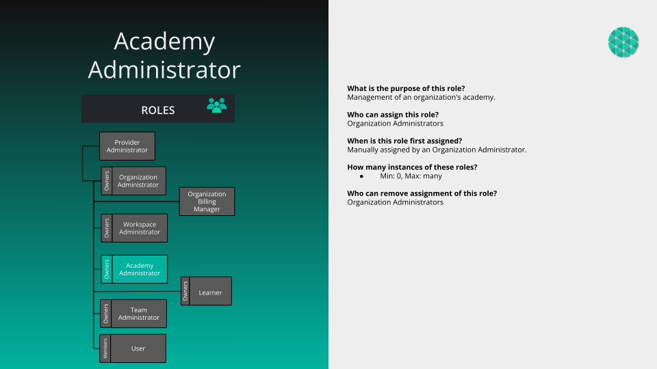
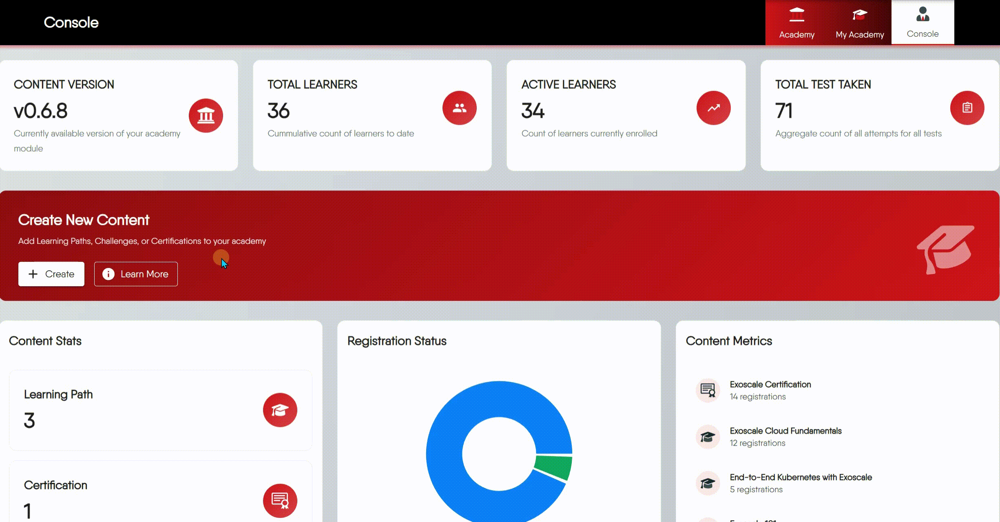
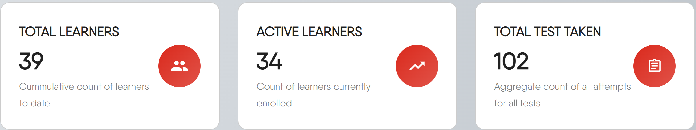
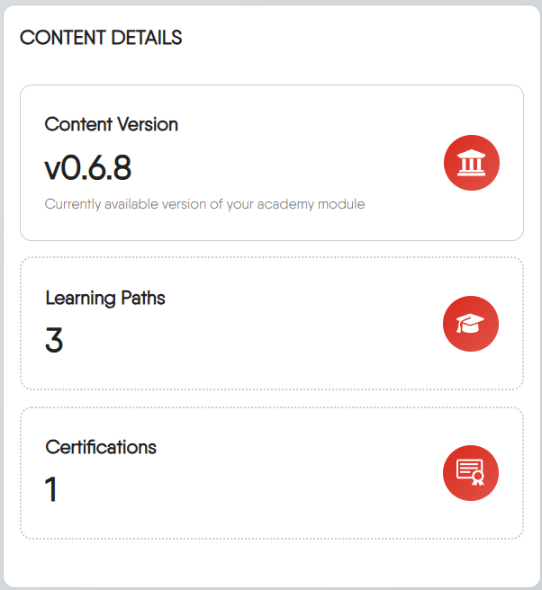
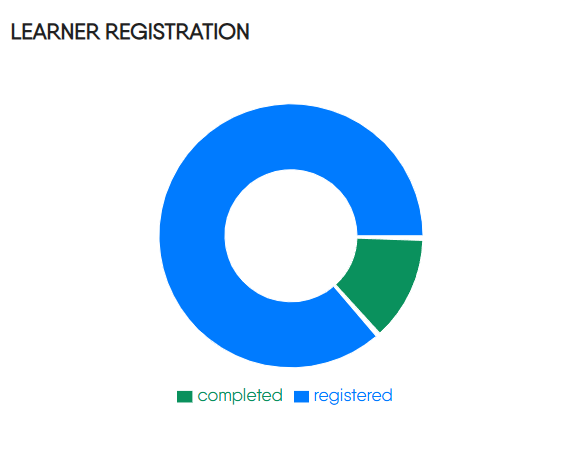
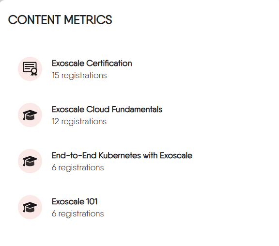
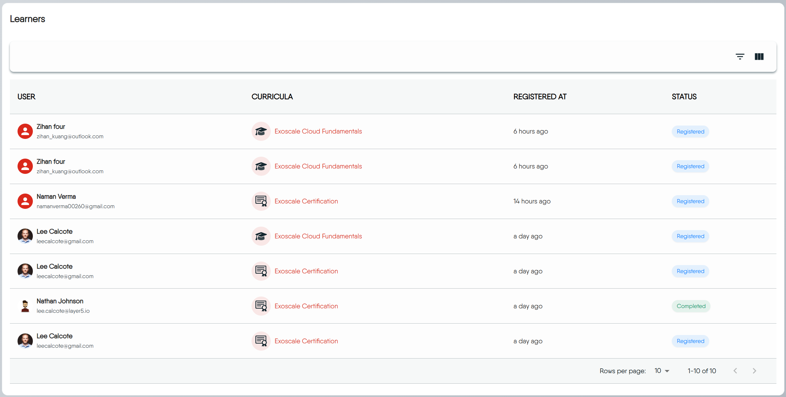
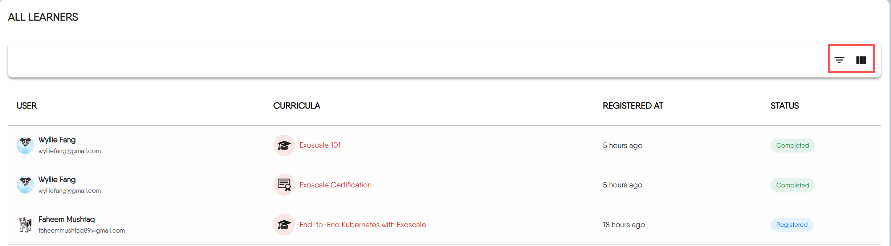
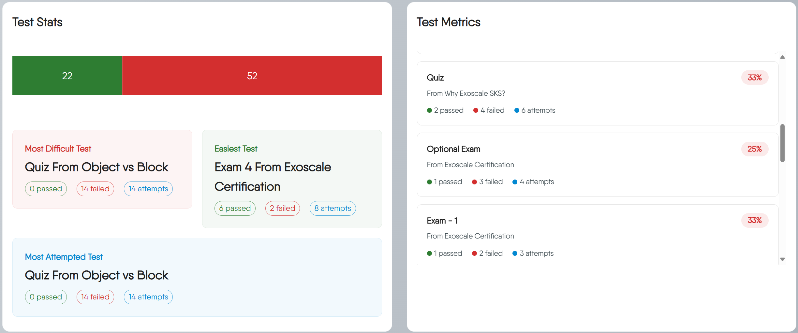

The [Academy Instructor Console](https://cloud.layer5.io/academy/instructors-console) serves as your command center for the Layer5 Academy, providing both a comprehensive overview of your content and detailed insights into learner engagement.

### Gaining Access

To view the Instructor Console, you must have the **Academy Admin** role or be an **organization admin**.


The Instructor Console and custom academy features are available exclusively for organizations on an Enterprise plan. [Learn more](https://layer5.io/pricing)


### Using the Content Creation Tool

The Instructor Console includes a Content Creation Tool to help you develop new learning materials. It's a simple, guided process that generates the initial configuration for your content.

This tool walks you through three quick steps to create your content's boilerplate configuration.

1. **Basic Information**: First, you'll provide the essential details for your new content, such as its **Content Type** (Learning Path/Certification/Challenge), **Title**, and **Description**.

    | Feature | Learning Path | Challenge | Certification |
    | :--- | :--- | :--- | :--- |
    | Primary Goal | To teach and guide through a comprehensive curriculum. | To solve a specific, hands-on problem in a competitive scenario. | To validate and prove existing knowledge through formal examination. |
    | Main Content | Lessons, informational pages, labs, and progressive assessments. | A set of instructions for a practical task and a validation mechanism. | A series of exams, potentially with a brief study guide. |
    | Outcome | Acquired knowledge and skills. | A score and rank status. | An optional, paid official certificate and a verifiable badge.|

2. **Content Details**: Next, you'll refine additional properties for the content.

> Need help understanding these properties? [Learn more]().

3. **Copy Template**: Finally, the Creation Tool presents you with a **"Generated Front Matter & Setup Guide"**. You'll copy this YAML configuration and place it at the top of the corresponding `_index.md` file in your content repository.


Think of the console's creation tool as a 'quick start' generator. It generates the necessary configuration boilerplate, but the detailed work of writing, structuring files, and publishing your content is done in your Git repository. For that, you'll need to follow our [comprehensive guides]().


## Understanding the Dashboard

Below the creation tool is the main dashboard, which provides an overview of your academy's statistics through a series of widgets.

### Core Metrics

These charts display your most important, high-level statistics, giving you a snapshot of your academy's health:

<!-- Screenshot out of date: it shows the old three-card row (Total Learners / Active Learners /
     Total Test Taken). The shipped Overview has the five cards listed below. Recapture against the
     current console. Tracked in layer5io/docs#1184. -->

*This screenshot predates the current layout and is pending recapture. The console now shows the five cards described below.*

- **Total Learners**: Represents the overall reach of your academy. This is the total number of people who have ever shown interest in your content.
- **Active Learners**: Measures current engagement. This is the number of distinct learners who have worked with your content this calendar month, giving you an idea of your active student body.
- **Registrations**: Every registration in the organization, whatever the state of the content it points at. This is the same total the [Learner Registration](#learner-registration) chart breaks down, so the two always agree.
- **Completion Rate**: Registrations marked completed as a share of all registrations.
- **Quiz Pass Rate**: The share of quiz attempts that passed, across every test in your organization. The card's subtitle carries the underlying counts (for example "762 of 1,036 attempts passed"), so the raw attempt total is still visible.

A rate card with nothing to divide renders as `-`, not `0%`. "Nobody has attempted this quiz yet" and "everybody failed it" are different facts, and reporting the first as zero would send you looking for a problem that isn't there.

**Strategic Uses**
- Monitor Total Learners growth - steady increases indicate growing academy reach
- Analyze Quiz Pass Rate - a low rate suggests challenging material or unclear content, a very high rate may indicate assessments that are too easy. The attempt count in the card's subtitle distinguishes a low rate over many attempts (a real difficulty signal) from one over a handful (not yet meaningful).


The **Active Learners** metric is a key indicator for engagement and billing. It counts *learners*, not registrations, and it is scoped to the current calendar month.

A learner counts as active this month if, against academy content that is still live, they either created or touched a registration during the month, or submitted a quiz attempt during the month. A learner who does both counts once. A learner who enrolled months ago and takes a quiz this month is active this month, even though their registration row has not changed.

Because it counts distinct people over a monthly window rather than counting registrations, it is not directly comparable to the registration totals beside it, and it resets each month rather than accumulating. A learner who finished a curriculum long ago still counts as active in any month they take a quiz.



The **Curricula** tab has its own registrations card, named **Registrations Here**, which deliberately counts something narrower: only registrations against the published curricula listed on that tab. It is normally a smaller number than the Overview's **Registrations** card, which counts every registration in the organization including those against draft or retired content. That gap is expected, not a discrepancy - the card carries a tooltip explaining the difference.


### Content Details

This widget provides a quick inventory of your academy's content:

- **Content Version**: Shows the version of the academy content your learners are using. 
- **Content Stats**: Shows a quick count of the different types of content you've published. Each category is interactive; clicking on one will take you to the Academy Catalog, pre-filtered to show all your content of that type.

**Strategic Uses**
- Monitor content version updates - when version numbers don't change, check if your GitHub releases and Layer5 Cloud deployments are complete
- Track content distribution - if one content type dominates, consider diversifying your academy offerings


If you've recently published new content but don't see the version number updated here, it is likely due to the platform's two-stage release process. Your updates become fully live only after both your content repository's GitHub Release is created and the subsequent Layer5 Cloud release is deployed. 

For a complete walkthrough of this workflow, see the [Publishing Your Content Guide]().


### Learner Registration

This chart provides an immediate visual summary of your learner base. 

While the chart will only display statuses that currently have data, the system recognizes the following five definitions, each represented by a specific color:
  -   `Registered` (Blue): The learner has enrolled but has not yet started the content.
  -   `In Progress` (Amber): The learner has started the content but has not yet finished it.
  -   `Completed` (Green): The learner has successfully finished all required parts of the content.
  -   `Failed` (Crimson): The learner did not pass the content.
  -   `Withdrawn` (Red): The learner has unenrolled from the content.

**Strategic Uses**
- Monitor the `registered` vs `completed` ratio - if `registered` grows much faster than `completed`, your content may be too difficult or lacks engagement
- Watch for large `withdrawn` segments - high withdrawal rates may indicate content quality issues or poor learner experience
- Track completion rates over time - improving rates suggest content optimization success, declining rates may signal new content challenges

### Content Metrics

It lists your content and ranks them by the total number of passes, giving you a clear view of what learners find most engaging. Each title is a direct link, allowing you to navigate straight to it.

**Strategic Uses**
- Identify top-performing content - high registration numbers indicate strong learner interest, use this to understand what resonates
- Monitor new content launch performance - if new Learning Paths get few registrations, check marketing or content positioning
- Compare content performance - if similar topics have very different registration numbers, investigate what makes the difference

### All Learners Report

The All Learners section provides a detailed, interactive table that allows you to track individual progress, see who is taking which content, and get a granular view of your learner base.

#### Understanding the Table

Each row in the table represents a single user's registration for a specific content. Here's what each column means:

-   **USER**: The learner's information. Clicking the avatar will take you to their public user profile.
-   **CURRICULA**: The specific content the user is enrolled in. Clicking the title will navigate you directly to that content.
-   **REGISTERED AT**: A timestamp indicating when the user enrolled. This is shown as a relative time (e.g., "6 hours ago") and will display the full date on hover.
-   **STATUS**: The learner's current standing in the content. The definition for each status is provided in the Learner Registration section [above](#learner-registration).

#### Filtering and Finding Learners

To find specific groups of learners, use the filter control at the top-right of the table.

-   **Filter by Content Type**: Want to see everyone enrolled only in Certifications? Select `Certification` from the 'Content Type' filter.
-   **Filter by Status**: Need a list of everyone who has successfully finished content? Select `Completed` from the 'Status' filter.

#### Customizing Your View

You can customize which columns are visible to tailor the report to your specific needs. Click the **View Columns** button at the top-right of the table. A dropdown menu will appear, allowing you to check or uncheck columns to show or hide them.

#### Navigating Through Pages

If there are a large number of learner registrations, the report is split into multiple pages. Use the controls at the bottom of the table to navigate through the data:

**Rows per page**: Choose how many records to display on each page (e.g., 10, 25, 50).

**Strategic Uses**
- Identify at-risk learners - filter for users in `Registered` status for over 30 days, they may need support or content may be too challenging
- Gather feedback from recent completions - contact learners who moved to `Completed` status within the last week while content is fresh in their minds

### Analyzing Test Performance

The final section is dedicated to analyzing the performance of your assessments. 

#### Test Stats

These statistics provide a high-level summary of all test activities in your academy.

-   **Pass/Fail Summary Bar:** This bar chart gives you an at-a-glance comparison of the total number of passed attempts (green) versus failed attempts (red) across all tests.

-   **Insight Cards:** These three cards automatically surface key trends and outliers from your data:
    -   **Lowest Pass Rate:** The quiz with the smallest share of passing attempts, helping you identify challenging content.
    -   **Highest Pass Rate:** The quiz with the largest share of passing attempts.
    -   **Most Attempted Test:** The quiz that learners have attempted the most times, regardless of the outcome.

    The two rate cards rank on pass rate rather than on raw pass and fail counts, and only tests with at least five attempts are ranked. Ranking on counts would measure popularity instead of difficulty - the test the most people take holds both the most passes and the most failures - and the attempts floor stops a single learner failing a brand-new quiz from crowning it the hardest test. In a young academy where no test has reached five attempts yet, the ranking falls back to the full set.

#### Test Metrics

The **Test Metrics** list provides a detailed performance breakdown for each individual test. Each test title in this list is a clickable link that will take you directly to that assessment.

The percentage (e.g., `33%`) shows the overall pass rate for that specific test.


Use this list to quickly identify which specific assessments are causing the most trouble for your learners. A low pass rate on a particular assessment might indicate that the source material needs clarification or that the questions themselves are unclear.


**Strategic Uses**
- Investigate difficult tests - when a quiz appears in the **Lowest Pass Rate** card, review the content and questions for clarity
- Monitor test attempt patterns - if **Most Attempted Test** has low pass rates, learners may be struggling with fundamental concepts
- Use pass rate trends - improving pass rates suggest content optimization success, declining rates may indicate new content is too challenging

## Frequently Asked Questions

I'm my organization's administrator. Can I assign Academy Admin roles?

Yes, you can assign Academy Admin roles to users within your organization. As an administrator, you have the ability to manage user permissions and roles in [user page](https://cloud.layer5.io/identity/users).

Can I export the All Learners Report to a CSV or Excel file?

Currently, the Instructor Console does not have a built-in feature to export the report directly to a file format like CSV. If you need this functionality urgently, please contact us at https://layer5.io/company/contact

Does "Quiz Pass Rate" count unique learners?

No. It is computed over attempts, not people: retakes by the same learner each count, so a learner who fails twice and then passes contributes two failures and one pass. It measures assessment outcomes, not how many distinct learners have been tested. For a headcount, use Total Learners or Active Learners.

