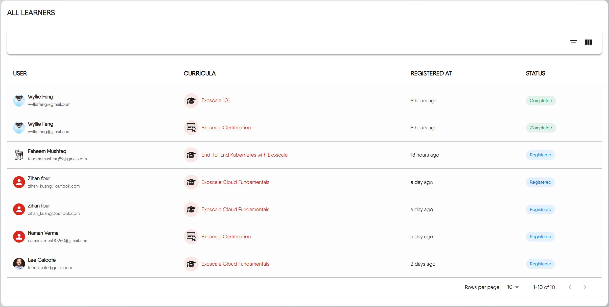

The Instructor Console is your central command center for the Layer5 Academy. It's where you can get a bird's-eye view of your educational content and dive deep into how learners are engaging with it. Here, you can track learner progress, analyze test performance, and manage all of your academy's content and metrics.

### Gaining Access

To view the Instructor Console, you must be assigned the Academy Admin role.


The Instructor Console and custom academy features are available exclusively for organizations on an Enterprise plan. [Learn more](https://layer5.io/pricing)


If you are part of an organization with an Enterprise plan but do not see the console in your navigation, you'll need to request access. Reach out to your organization's system administrator. Ask them to assign the **Academy Admin** role to your user account.

Once the role is assigned, the Instructor Console will become visible in your navigation menu.

## Layout Overview

The Instructor Console is organized into several key sections that provide comprehensive insights into your academy's performance and learner engagement.

### Core Metrics

These four cards at the top provide your most immediate, high-level statistics:

- **Content Version**: This shows the version of the academy module your learners are currently using.
- **Total Learners**: A running total of every unique user who has ever registered for any of your content.
- **Active Learners**: The number of learners who are currently "in-progress." They have registered for content but have not yet completed it.
- **Total Test Taken**: The total number of times any test has been attempted across all your courses. This counts retakes as well.

### Using the Content Creation Tool

The Instructor Console includes a Content Creation Tool to kickstart the development of new learning materials. It's a simple, guided process to help you generate the initial configuration for your content.

This Tool guides you through three quick steps to generate your content's boilerplate configuration.

1.  **Basic Information**: First, you'll provide the essential details for your new content, such as its **Content Type** (Learning Path/Certification/challenge), **Title**, and **Description**.

| Feature | Learning Path | Challenge | Certification |
| :--- | :--- | :--- | :--- |
| Primary Goal | To teach and guide through a comprehensive curriculum. | To solve a specific, hands-on problem in a competitive scenario. | To validate and prove existing knowledge through formal examination. |
| Main Content | Lessons, informational pages, labs, and progressive assessments. | A set of instructions for a practical task and a validation mechanism. | A series of exams, potentially with a brief study guide. |
| Outcome | Acquired knowledge and skills. | A score, rank status. | An optional, paid official certificate and a verifiable badge.|

2.  **Content Details**: Next, you'll refine additional properties for the content.

3.  **Copy Template**: Finally, the Creation Tool presents you with a **"Generated Front Matter & Setup Guide"**. You will copy this YAML configuration and place it at the top of the corresponding `_index.md` file in your content repository.


Think of the console's creation tool as a 'quick start' generator. It generates the necessary configuration boilerplate, but the detailed work of writing, structuring files, and publishing your content is done in your Git repository. For that, you'll need to follow our [comprehensive guides]().


### Content and Registration Breakdowns

The dashboard offers a more granular look at your content's structure and your learners' overall status.

  - **Content Stats**: This card gives you a quick count of the different types of content you've published. Each category is interactive; clicking on one will take you to the Academy Catalog, pre-filtered to show all your content of that type.

  - **Registration Status**: This donut chart provides an immediate visual summary of your learner base. It shows the proportion of learners who are currently working through content (`registered`) compared to those who have successfully finished their courses (`completed`).

  - **Content Metrics**: Think of this as a leaderboard for your content. It lists your courses and ranks them by the total number of registrations, giving you a clear view of what learners find most engaging. Each title is a direct link, allowing you to navigate straight to it.

### The All Learners Report

The Learners section is a detailed, interactive table that allows you to track individual progress, see who is taking which courses, and get a granular view of your learner base.

**Understanding the Table**

Each row in the table represents a single user's registration for a specific content. Here's what each column means:

-   **USER**: The learner's information. Clicking the avatar will take you to their public user profile.
-   **CURRICULA**: The specific content the user is enrolled in. Clicking the title will navigate you directly to that content.
-   **REGISTERED AT**: A timestamp indicating when the user enrolled. This is shown as a relative time (e.g., "6 hours ago") and will display the full date on hover.
-   **STATUS**: The learner's current standing in the course. Statuses include:
    -   `Registered` (Blue): The learner has enrolled but has not yet completed the course.
    -   `Completed` (Green): The learner has successfully finished all required parts of the course.
    -   `Withdrawn` (Red): The learner has unenrolled from the course.

**Filtering and Finding Learners**

To find specific groups of learners, use the filter control located at the top-right of the table.

-   **Filter by Content Type**: Want to see everyone enrolled only in Certifications? Select `Certification` from the 'Content Type' filter.
-   **Filter by Status**: Need a list of everyone who has successfully finished a course? Select `Completed` from the 'Status' filter.

**Customizing Your View**

To tailor the report to your needs, you can customize which columns are visible. Click the **View Columns** button at the top-right of the table.

A dropdown menu will appear, allowing you to check or uncheck columns to show or hide them. This is particularly useful for simplifying the view to focus on specific data.

**Navigating Through Pages**

When you have a large number of registrations, the report is split into multiple pages. Use the controls at the bottom-right of the table to navigate:

**Rows per page**: Select how many records you want to see on a single page (e.g., 10, 25, 50).

### Analyzing Test Performance

The final section is dedicated to analyzing the performance of your assessments. 

#### Test Stats

The statistics on the left provide a high-level summary of all test activity in your academy.

-   **Pass/Fail Summary Bar:** This bar chart gives you an at-a-glance comparison of the total number of passed attempts (green) versus failed attempts (red) across all tests.

-   **Insight Cards:** These three cards automatically surface key trends and outliers from your data:
    -   **Most Difficult Test:** The quiz with the lowest pass-to-fail ratio, helping you identify challenging content.
    -   **Easiest Test:** The quiz with the highest pass-to-fail ratio.
    -   **Most Attempted Test:** The quiz that learners have attempted the most times, regardless of the outcome.

#### Detailed Test Metrics

The **Test Metrics** list on the right provides a detailed performance breakdown for each individual test. Each test title in this list is a clickable link that will take you directly to that assessment.

The percentage on the far right (e.g., `33%`) shows the overall pass rate for that specific test.


Use this list to quickly identify which specific exams are causing the most trouble for your learners. A low pass rate on a particular quiz might indicate that the source material needs clarification or that the questions themselves are unclear.


## Frequently Asked Questions

I'm my organization's administrator. Can I assign Academy Admin roles?

Yes, you can assign Academy Admin roles to users within your organization. As an administrator, you have the ability to manage user permissions and roles through your organization's user management system.

Can I export the All Learners Report to a CSV or Excel file?

Currently, the Instructor Console does not have a built-in feature to export the report directly to a file format like CSV. If you need this functionality urgently, please contact us at https://layer5.io/company/contact

Does "Total Test Taken" show the number of unique learners who took tests?

No. The "Total Test Taken" metric is a raw count of all attempts, including retakes by the same user. It is a measure of overall testing activity, not the number of unique learners who have been tested.

