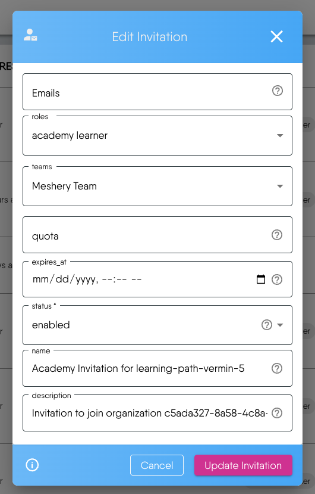

The Academy Content Template Creator is a step-by-step wizard that helps you create structured templates for your Academy content. This generator streamlines the process of
creating learning paths, challenges, and certifications by collecting all necessary metadata and generating a ready-to-use template.


## Getting Started

1. Access the Creator: Click on the "Create New Content" card in your Academy dashboard
2. Create Your Content: The wizard will guide you through **5 essential steps** to create your content template

Since it's straightforward, let's walk through a practical example to demonstrate the process.

## Example: Creating "Meshery Contributors Certification"

This example demonstrates how to use the **Academy Content Template Creator** to build a **certification** program for **Meshery contributors**. Each step shows what information to enter, followed by specific example values.

### Step 1: Basic Information

- Type: Choose "Certification" from Learning Path, Challenge, or Certification
- Title: "Meshery Contributors Certification"
- Description: "A comprehensive certification program for developers looking to become active contributors to Meshery"

### Step 2: Content Details

<!-- - Level: Intermediate (assumes basic cloud-native knowledge) -->
- Categories: "open-source, cloud-native"
- Add Tags: "meshery", "kubernetes", "golang", "contribution", "open-source"
- Banner Image: "images/meshery-contributors-banner.svg"

### Step 3: Content Access

- Workspace: "Meshery Academy"
- Team: "Contributors Program"
- Access Status: Enabled
- Content Access End Date: Leave blank for permanent access (Meshery always welcomes contributors)

**Understanding Access Status: Enabled vs Disabled**

The Access Status setting in Step 3 controls the visibility and accessibility of your Academy content to users.

**Enabled Status Behavior:**
- **Visible**: Content appears in Academy catalogs and search results
- **Accessible**: Users with proper permissions can view and interact with the content
- **Active**: All features work normally (enrollment, progress tracking, badge awarding)
- **Discoverable**: Content shows up in filtered searches and category browsing

**Disabled Status Behavior:**
- **Hidden**: Content does not appear in public Academy catalogs
- **Inaccessible**: Users cannot access the content even with direct links
- **Inactive**: No progress tracking or badge awarding occurs
- **Non-discoverable**: Content is excluded from search results and browsing

**For the Meshery Contributors Certification example:**

*If Enabled:*
- Contributors can immediately find and enroll in the certification
- Progress tracking begins upon enrollment
- Badge is awarded upon successful completion
- Content appears in the Contributors Program workspace

*If Disabled:*
- Certification is hidden from the Contributors Program
- No new enrollments possible
- Existing progress is paused
- Content remains invisible until re-enabled

### Step 4: Recognition


The Recognition step defines the badge or certificate awarded upon completion. You have two options:
- **Use Existing Recognition**: Choose from the Layer5 collection
- **Create New Recognition**: Design a custom badge with an image URL

**For our example:**
- Create a "Meshery Contributor" badge with the Meshery logo


### Step 5: Generate Template


After clicking "Continue" in Step 4, a success notification appears in the bottom-right corner confirming your template has been created successfully.


You can navigate back to any previous step to make modifications. When you return to earlier steps and make changes, your entries in the subsequent steps will remain intact.



**Generated Template Output for Meshery Contributors Certification:**

This template provides the YAML front matter metadata for static site generators (like Hugo/Jekyll). After copying it, we can directly create new content files in our Academy repository.

```yaml
---
type: "certification"
title: "Meshery Contributors Certification"
description: "A comprehensive certification program for developers looking to become active contributors to Meshery"
weight: 1
banner: "images/meshery-contributors-banner.svg"
id: "unique-content-id"
level: "beginner"
---

Provide a brief summary of what learners will gain.
<!-- Add your Academy content here -->
```


Make note of two key identifiers for your content files:
- **Content ID**: Unique identifier for this specific content
- **Organization ID**: Your organization's identifier (remains constant)



If you click "Back" and return to Step 5, a new Content ID will be generated. Simply use the new ID and discard the previous one.


### Next Steps

After generating our template:

1. **Copy the Template**: Use the provided copy button to get your front matter
2. **Create Your Content File**: Paste the template into a new .md file in your academy repository
3. **Add Your Content**: Replace the placeholder comment with your actual learning material
4. **Test and Review**: Preview your content before publishing
5. **Engage the Community**: Share your content with relevant teams and gather feedback

### Invitation


