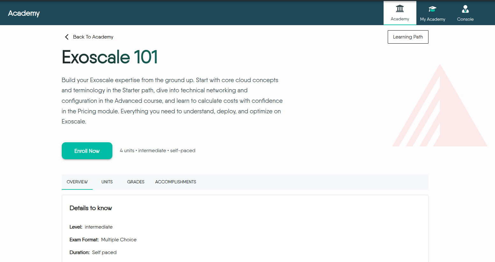
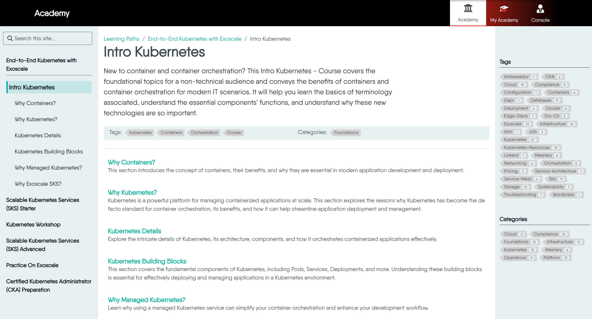

This guide is designed to be your friendly companion, helping you navigate the platform, understand its features, and make the most of your learning experience.

Here, you can achieve:

- A systematic understanding of complex topics
- Hands-on experience by solving real-world problems  
- Verifiable badges to showcase your skills
- Official certificates to formally recognize your expertise

## Exploring the Content Catalog

Your journey begins at the Academy's main catalog page, where you can discover all available learning content.

### Navigating the Catalog

First you will see a collection of content cards. Each card gives you a quick overview of learning content, including the type, its title, the number of courses it contains, and its difficulty level.

### Understanding Content Types

To help you choose the right content for your goals, we offer three distinct types. You can use the Content Type filter on the left to narrow your search.

1. **Learning Path**: Choose this when you want to systematically learn a new subject from start to finish. It's a comprehensive curriculum designed to build your knowledge from the ground up.

2. **Certification**: Choose this when you already have the knowledge and want to formally prove your skills. It focuses on assessment and evaluation through exams.

3. **Challenge**: Choose this when you want a hands-on, practical task to solve a specific problem, often in a competitive scenario.

## Starting Your Learning Journey

Once you've found a content that interests you, it's time to begin.

### Enrolling in a learning path

The content detail page gives you a full overview of what you'll learn. To start, simply click the "Enroll Now" button.

**Why enroll?**

Enrolling is a key step because it allows the Academy to track your progress. Once enrolled, the system will remember where you left off, mark your completed content, and save your quiz results, so you can always pick up right where you were.

### The Learning Interface

After enrolling, you'll be taken to the main learning interface. This is where you'll spend most of your time.

We've designed it to be simple and intuitive. Think of it in three parts:

1. **Your Learning Map (Left Sidebar)**: This is the complete outline of your course. It shows where you are currently positioned.

2. **Your Study Area (Center Panel)**: This is where the core content—text, images, and videos—is displayed.

3. **Discover More (Right Sidebar)**: Here, you can find tags and categories across all the content, helping you discover other relevant content in the Academy. You can click to see all related content.
   

After finishing a course, check out the **Tags** and **Categories** on the right. They are a great way to discover other related topics that might interest you.


## Testing Your Knowledge

Assessments are an integral part of the learning process, designed to reinforce your knowledge.

### How to Take a Quiz

By default, assessments in a Learning Path are mandatory. This creates a structured progression where you must pass the assessment for one section (like a Course) before unlocking the next. Passing an assessment marks that section as complete.

Some assessments may be marked as **Optional**. You can take these for extra practice, but you are not required to pass them to advance. 

### Answering Questions and Scoring

When you encounter an assessment, you'll see a clean interface with questions and answer options.

**Answering**: Select your answer(s) by clicking the corresponding radio button (for single-choice) or checkbox (for multiple-choice). For short-answer questions, type your response directly into the text field.


If you're ever unsure about a concept, you can always use the Back button to revisit previous courses.


**Scoring Rules:**

- **Single-Answer**: You receive full marks for selecting the one correct option.

- **Multiple-Answer**: Scoring is strict. You must select all correct options and none of the incorrect options to earn marks. There is no partial credit.

- **Short-Answer**: Your answer is compared case-insensitively, and extra spaces at the beginning or end are ignored.

**Submitting**: Once you've answered all questions, click the "Submit" button at the end of the quiz. Your results, including your score and pass/fail status, will be displayed immediately.

**If you fail**: You can retake the assessment. The system will highlight the successful parts, allowing you to precisely identify where you need improvement.

**If you pass**: Congratulations! You've successfully completed the assessment and can proceed to the next section.

## Your Achievements

Completing content in the Academy earns you valuable credentials that you can share with your professional network.

### Earning Badges and Certificates

**Badges**: You earn a digital badge for successfully completing all the required components of a Learning Path or Challenge. These are free and serve as a great way to showcase your new skills.

> See a live example on a [user's profile](https://cloud.layer5.io/user/a5eb9e0a-c9e3-4b66-890c-8f018e729306?tab=badges)

**Certificates**: You earn an official Certificate of Completion after passing a Certification exam. While the learning and exams are free, the issuance of the official certificate is an optional, paid feature.

## Frequently Asked Questions

> Expand a section below to learn more.

Will my learning progress be saved if I leave and come back later?

Yes, as long as you are enrolled in a content, your progress is saved automatically. You can always return and continue from your last completed course.

Can I skip courses and jump directly to the exam?

You can navigate to any course at any time using the sidebar. However, for a Learning Path to be marked as complete, you typically need to pass all required quizzes and the final test in sequence.

Can I download content materials for offline study?

Currently, all content is designed to be accessed online through the Academy platform. Offline or downloadable materials are not available at this time.

Where can I ask questions or discuss the content material?

Learning is often better together. If you have questions about the content or want to discuss topics with other learners and instructors, we encourage you to join the [Layer5 Community](https://layer5.io/community/handbook).

---

<strong>Certification and Assessment</strong>

If I fail an assessment, can I retake it?

It depends on the certification. Some certifications allow multiple attempts, while others do not offer retries. Please refer to the specific certification’s guidelines to confirm whether retakes are permitted.

Does my certificate expire?

Yes. Meshery Academy certifications may have an expiration date. Please check the specific certification details for validity duration.

How can I showcase my credential?

Upon successful completion, you’ll receive a verifiable digital certificate. You can share your achievement by adding it to your professional profiles (for example, on LinkedIn) or including it on your resume. A shareable verification link is available within your certification dashboard, which you can use to confirm your credential publicly.

