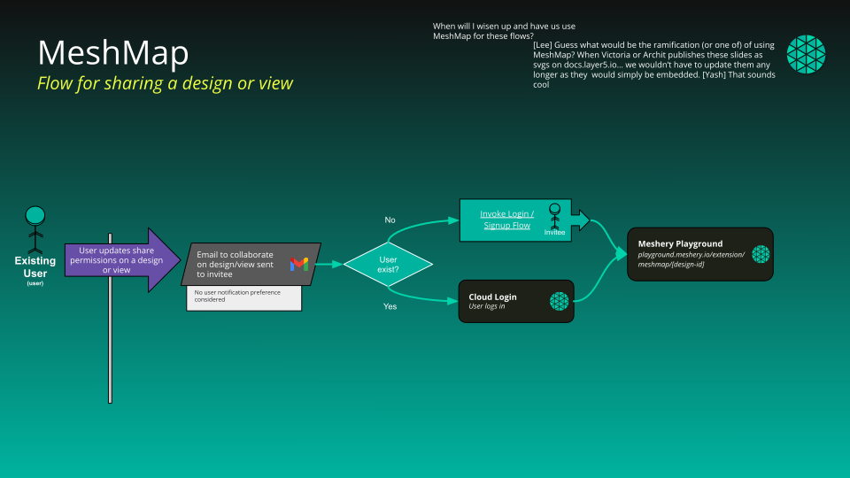

{}
Public Catalog: https://cloud.layer5.io/catalog
{}

<!--  -->

The Cloud Catalog is a web-based, public catalog to facilitate easy discovery of existing designs. Designs that are published into the catalog can be, but are not always curated for known best practices and patterns. Content is published at [cloud.layer5.io/catalog](https://cloud.layer5.io/catalog), and one-click import of catalog content into Meshery Server is seamlessly integrated.

### Content Visibility

Each item in the catalog comes with an associated level of visibility.

- Published: View and clone permission for all users. View for all non-users.
- Public: View and edit permissions for all users.
- Private: View and edit permissions only for design owner.

### Content Types
- Deployment
- Traffic Management
- Security
- Workloads
- Observability
- Scaling
- Resiliency

### Content Categories

Catalog content is categorized in a number of ways:
- **Patterns**: Cloud native patterns enable the business function in simple language.
- **Filters**: Embedded in the data plane of a service mesh, WebAssembly filters offer fine-grained control over service requests.
- **Programs**: Embedded in the data plane of a service mesh, eBPF programs performant, fine-grained control over service requests.
- **Policies**: Applied across the cloud native infrastructure under management, policies may be applied broadly and specifically.
 
<!-- List design metadata and descriptions here -->

### Publishing from Kanvas 🔗

To publish a design from Meshery Kanvas (Playground) into the Cloud Catalog:

- Open your design in Kanvas (for example from **My Designs → Open in Playground**).
- Click the **hamburger menu** in the top-left of Kanvas.
- Choose **Share… → Publish to catalog**.
- In the design details dialog, review or update the **name**, **type**, and **description**, then click **Publish To Catalog**.
- After the request is submitted, maintainers approve it, and the design appears in the public Catalog at [cloud.layer5.io/catalog](https://cloud.layer5.io/catalog).

### Content Tags

- Arbitrary strings for categorization.
- Content Support Levels: "Official", "Partner", "Community".
