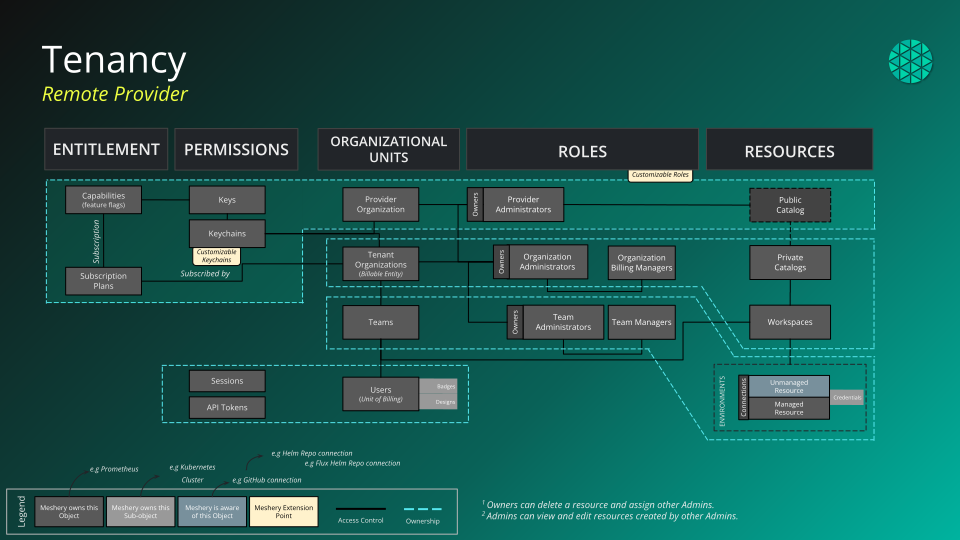

This section provides comprehensive guidance on the key concepts you need to understand to effectively use Layer5 Cloud. These concepts form the foundation of how Layer5 Cloud organizes resources, manages access, and enables collaboration.

## Core Architecture

Layer5 Cloud follows a hierarchical organizational model that enables enterprise-grade multi-tenancy and collaboration:

### Organizations
**Organizations** are the top-level tenant unit in Layer5 Cloud. Think of an organization as your company, department, or project boundary. Every user belongs to at least one organization, and organizations serve as the primary billing and administrative unit.


Organizations provide complete resource isolation and independent billing, making them ideal for separating different business units or customer environments.


### Workspaces
**Workspaces** are collaborative environments within an organization where teams work together on infrastructure designs, deployments, and management. Workspaces contain shared resources like:

- Infrastructure designs and patterns
- Environment configurations
- Connection credentials
- Deployment histories
- Team permissions

### Teams
**Teams** are groups of users within an organization who collaborate on specific projects or infrastructure components. Teams can be granted access to multiple workspaces and have fine-grained permissions.

### Users
**Users** are individual accounts that belong to organizations and teams. Each user has their own profile, preferences, and can contribute to shared workspaces.

## Resource Management Concepts

### Designs
**Designs** are declarative, version-controlled infrastructure configurations that describe how your cloud native applications and infrastructure should be deployed and managed. Designs can be:

- Created from scratch using Kanvas visual designer
- Imported from existing Kubernetes manifests
- Generated from templates in the catalog
- Shared and collaborated on with team members

### Environments
**Environments** represent deployment targets such as development, staging, or production clusters. Each environment can have:

- Connection credentials to Kubernetes clusters
- Environment-specific configurations
- Access controls and deployment policies
- Performance and compliance monitoring

### Connections
**Connections** are authenticated links to external systems and services such as:

- Kubernetes clusters
- Cloud provider APIs (AWS, GCP, Azure)
- Container registries
- CI/CD systems
- Monitoring and observability tools

### Credentials
**Credentials** are securely stored authentication information used by connections. Layer5 Cloud uses industry-standard encryption and access controls to protect sensitive information.

## Collaboration and Access Control

### Role-Based Access Control (RBAC)
Layer5 Cloud implements a flexible RBAC system that allows fine-grained control over who can access what resources. Permissions can be assigned at multiple levels:

- Organization level (admin, member)
- Workspace level (owner, collaborator, viewer)
- Resource level (design editor, deployer)

### Workspaces as Collaboration Boundaries
Workspaces serve as natural collaboration boundaries where teams can:

- Share infrastructure designs
- Collaborate on configurations
- Review and approve changes
- Manage deployments together
- Track performance and compliance


Organize workspaces around logical boundaries like applications, environments (dev/staging/prod), or team responsibilities for optimal collaboration.


## Integration and Extensibility

### Catalog Integration
The Layer5 **Catalog** is a public and private repository of infrastructure patterns, designs, and best practices. You can:

- Discover pre-built infrastructure patterns
- Publish your own designs for reuse
- Fork and customize existing patterns
- Contribute to the community knowledge base

### API and Extensibility
Layer5 Cloud provides comprehensive REST APIs that enable:

- Programmatic resource management
- Integration with CI/CD pipelines
- Custom tooling development
- Automated workflows and operations

### Git Integration
Native Git integration allows you to:

- Version control your infrastructure designs
- Trigger deployments from Git repositories
- Collaborate using familiar Git workflows
- Maintain infrastructure as code practices

## Understanding the Relationship Between Concepts

```
Organization (tenant boundary)
├── Users (individual accounts)
├── Teams (user groups)
└── Workspaces (collaboration environments)
    ├── Designs (infrastructure configurations)
    ├── Environments (deployment targets)
    ├── Connections (external integrations)
    └── Credentials (authentication data)
```

This hierarchical structure ensures:

- **Security**: Clear boundaries and access controls
- **Scalability**: Support for organizations of any size
- **Collaboration**: Flexible team-based workflows
- **Isolation**: Proper separation of environments and resources

## Next Steps

Now that you understand the core concepts, you can:

1. [Set up your Layer5 account](/cloud/getting-started/getting-started-with-layer5-account/)
2. [Create your first design](/cloud/getting-started/creating-a-design-from-templete.md/)
3. [Explore the catalog](/cloud/catalog/exploring-the-catalog/)
4. [Learn about organizations](/cloud/identity/organizations/)
5. [Set up teams and permissions](/cloud/identity/teams/)


These concepts work together to provide a complete platform for cloud native infrastructure management. Take time to understand how they relate to your specific use case and organizational structure.

