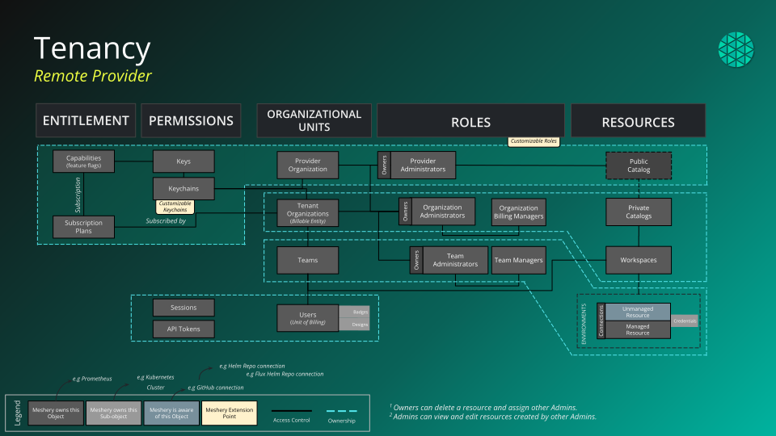

This section explains the underlying concepts of Layer5 Cloud — the building blocks that the rest of the documentation assumes you understand.

- [Meshery Server Registration](meshery-server-registration) — How a Meshery Server registers itself with Layer5 Cloud as its Remote Provider, how Cloud identifies an existing registration, and what fields are preserved across re-registration.
