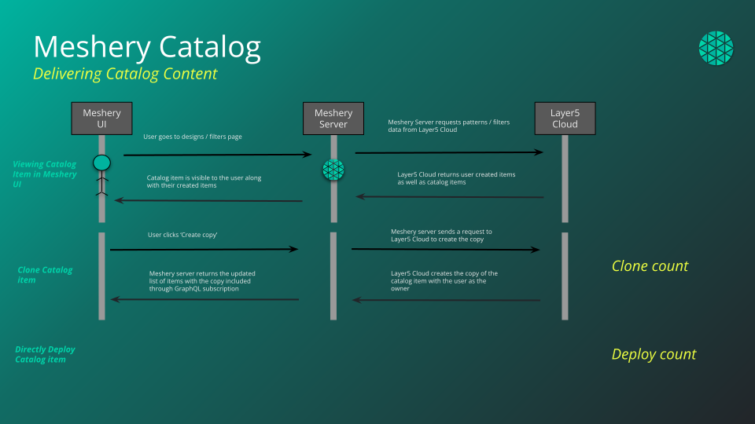
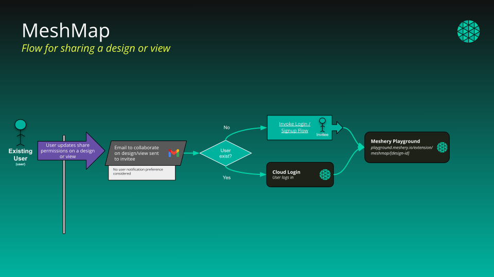

{}
Public Catalog: https://cloud.layer5.io/catalog
{}

<!--  -->

The Cloud Catalog is a web-based, public catalog to facilitate easy discovery of existing designs. Designs that are published into the catalog can be, but are not always curated for known best practices and patterns. Content is published at [cloud.layer5.io/catalog](https://cloud.layer5.io/catalog), and one-click import of catalog content into Meshery Server is seamlessly integrated.

### Content Visibility

Each item in the catalog comes with an associated level of visibility.

- Published: View and clone permission for all users. View for all non-users.
- Public: View and edit permissions for all users.
- Private: View and edit permissions only for design owner.

### Content Types
- Deployment
- Traffic Management
- Security
- Workloads
- Observability
- Scaling
- Resiliency

### Content Categories

Catalog content is categorized in a number of ways:
- **Patterns**: Cloud native patterns enable the business function in simple language.
- **Filters**: Embedded in the data plane of a service mesh, WebAssembly filters offer fine-grained control over service requests.
- **Programs**: Embedded in the data plane of a service mesh, eBPF programs performant, fine-grained control over service requests.
- **Policies**: Applied across the cloud native infrastructure under management, policies may be applied broadly and specifically.
 
<!-- List design metadata and descriptions here -->

### Publishing from Kanvas

To publish a design into the catalog:

1. Open your design in Kanvas (for example from **My Designs**).
1. Click the **hamburger menu** in the top-left of Kanvas.
1. Choose **Share… → Publish to catalog**.
1. In the design details dialog, review or update the **name**, **type**, and **description**, then click **Publish To Catalog**.
1. After the request is submitted, maintainers approve it, and the design appears in the [public catalog](https://cloud.layer5.io/catalog).

### Viewing Filters

Your filter list at [My Filters](https://cloud.layer5.io/catalog/content/my-filters) is not limited to filters you created. When you are signed in, it returns:

- every **public** and **published** filter, whoever owns it - including those belonging to other members of your teams;
- your own **private** filters;
- any filter that has been shared with you directly.

Private filters belonging to other people are never returned. The one exception is a provider administrator, who can see private content across the provider.

Signed-out visitors browsing someone's public profile see only that person's public and published filters.

Filters can be browsed in grid view or table view, and searched and sorted from either. For the operations you can perform on a filter once you have found it - import, publish, unpublish, clone, download, edit, view details, and delete - see [Envoy WASM Filter Management](https://docs.meshery.io/guides/infrastructure-management/filter-management) in the Meshery documentation.

### Importing Filters

WebAssembly filters can be brought into Layer5 Cloud in two ways:

- **File Upload**: select the filter file from your machine and give it a name.
- **URL Upload**: give a name and the `http` or `https` URL that serves the filter body directly.

An imported filter is saved under the name you enter on the import form, whichever method you use.


Layer5 Cloud is a hosted, multi-tenant service, so a URL import is fetched from Cloud's own network rather than from your machine. A URL whose host resolves - or redirects - to a loopback, link-local, private, carrier-grade NAT, or IPv6 unique-local address is refused, and only `http` and `https` URLs are accepted.

If your filter lives on an internal host, a private network, or anything else Cloud cannot reach from the public internet - an internal Git server, for example - use **File Upload** instead. It is the supported path for those sources and no capability is lost. There is deliberately no allowlist or opt-out setting.


If an import URL is mistyped, has moved, or answers with anything other than a success status, the import fails with **400 Bad Request**: the URL is the problem, so check that it is reachable from the public internet and serves the filter body itself rather than a download page. A `500` or `502` means the fetch itself failed in transit (for example a connection, TLS, or timeout failure) against a URL that was otherwise permitted.

### Content Tags

- Arbitrary strings for categorization.
- Content Support Levels: "Official", "Partner", "Community".
