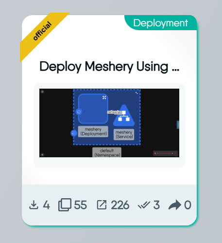
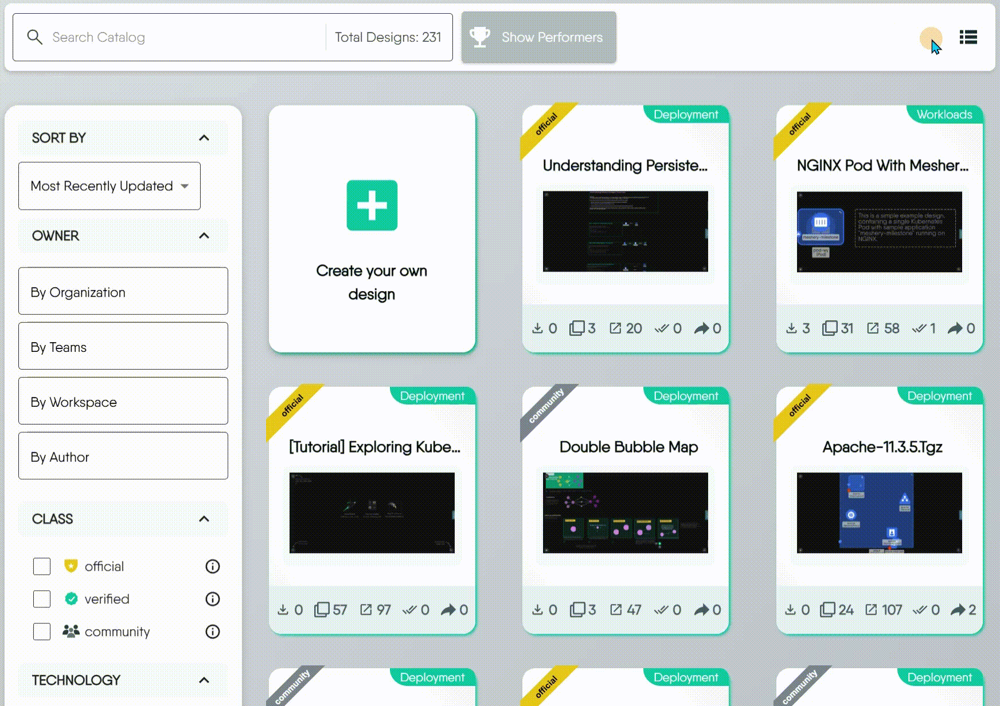
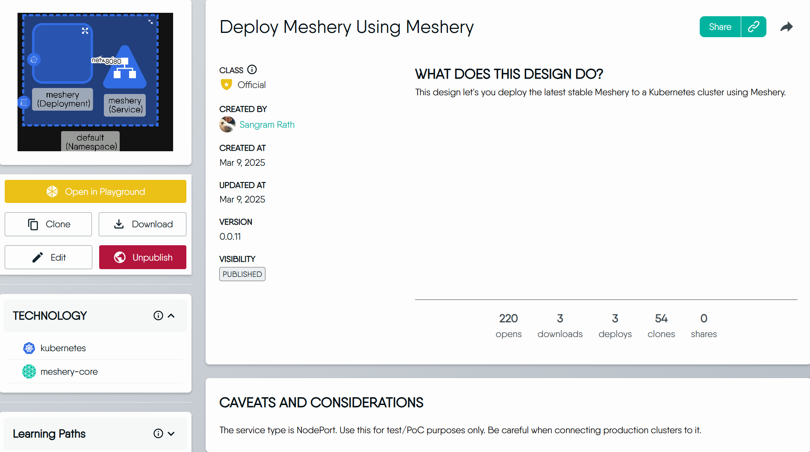
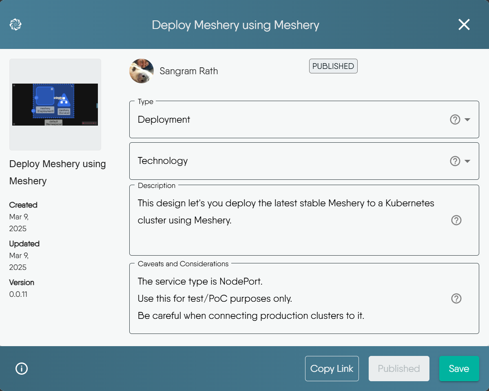

The [Cloud Catalog](https://cloud.layer5.io/catalog) is the central hub for well-architected cloud and cloud native patterns and best practices templates. Here, you can discover and share designs with the wider community.

## Viewing Catalog Items

Meshery Catalog displays all published designs in an organized, searchable format.

### Top Performers

At the top of the page, you can find the **Top Performers** section. This provides a snapshot of the **Leaderboard**, highlighting the most popular designs based on various [metrics]().

- To see the complete rankings, click the **Open Leaderboard** button.
- You can toggle the visibility of this section using the **Hide Performers** / **Show Performers** button.


To learn more about Leaderboard, see the [Leaderboard documentation]().


### Grid View

The grid view offers a visual, card-based layout that's ideal for browsing designs by their thumbnail.

Each card provides key information at a glance:

- **Class:** The banner in the top-left corner shows the design's classification (e.g., Official)
- **Type:** The tag in the top-right corner indicates the design's category (e.g., Deployment)
- **Metrics:** A row of icons at the bottom displays key usage statistics (Opens, Downloads, Deploys, Clones, Shares)
- **Detailed Information (on hover):** When you hover over a card, it flips to reveal more details, including the author, design version, technologies used, and the last updated time


To better understand what these Metrics represent, you can learn more about [design metrics]().


### Table View

Table view provides a dense, list-based format that's ideal for sorting and comparing items based on specific metrics.

To customize the information displayed in this view, click the **View Columns icon** and select the attributes you want to see, such as Author, Created At, or Downloads.

## Filtering and Sorting Catalog Items

The filter bar helps you narrow down the catalog to find exactly what you need. You can sort the entire catalog or apply specific filters.

### Sort By

You can order all items in the catalog based on different criteria, such as alphabetically, by most recently updated, or by popularity metrics like most cloned or downloaded.

### Owner

Filter designs based on their owner, whether it's your entire Organization, specific Teams, or an individual Author.

### Class

The **Class** filter helps you find content based on its level of verification:

- **Official:** Content produced and fully supported by Meshery maintainers. This represents the highest level of support and is considered the most reliable.
- **Verified:** Content produced by partners and verified by Meshery maintainers. While not directly maintained by Meshery, it has undergone a verification process to ensure quality and compatibility.
- **Community:** Content produced and shared by Meshery users. This includes a wide range of content with varying levels of support and reliability.

### Technology and Type

These filters correspond to the metadata authors provide when they publish designs. They allow you to find items based on the technologies they use or the function they perform.

- **Technology:** A list of technologies included in the design, like `Argo CD`, `AWS API Gateway`, or `Apache ShardingSphere`.
- **Type:** The category of the design, such as `deployment`, `observability`, `resiliency`, or `traffic-management`.

## Viewing Design Details

When you click on any design, you'll see its detail page. This page provides a complete overview of the design's purpose, technical details, and how you can use it.

### Key Information

- **Class, Created By, and Dates:** See the design's class, its original author, and when it was created and last updated.
- **Version:** The design's version number. This increments automatically each time the design is updated.
- **Visibility:** The status of the design. For all designs found in the public catalog, this will be **Published**.

As you scroll down the page, you will find other useful sections:

- **Caveats and Considerations:** Specific stipulations to consider and known behaviors to be aware of when using this design.
- **Similar Designs by Type:** At the bottom, other designs of the same type, helping you discover other relevant patterns.

## Available Actions

### Open in Playground

Clicking **Open in Playground** opens the design in the Kanvas designer running at [playground.meshery.io](https://playground.meshery.io/extension/meshmap), in a new browser tab. The catalog page you were on stays open behind it.

The Playground is a hosted, ready-to-use Kanvas instance. It is the fastest way to look inside a catalog design - you can pan, zoom, open components, and inspect relationships without installing Meshery or signing in. Changes you make there are not written back to the catalog design; to keep your own editable copy, [Clone](#clone) it instead.

The link Layer5 Cloud builds carries the design's identifier as URL parameters, so the Playground opens on that specific design rather than an empty canvas. See [URL Parameters]() for what those parameters mean and how to construct such a link yourself.

### Clone

Cloning creates a personal, editable copy of the design in your own workspace. This is useful when you want to use an existing public design as a starting point for your own customizations.

When you clone a design:

- The new copy will appear in your **[My Designs](https://cloud.layer5.io/catalog/content/my-designs)** tab.
- Its name will be appended with `(Copy)` to distinguish it from the original.
- The visibility of the cloned design is set to **Private** by default, so only you can see it until you decide to publish it.

### Download

The **Download** button allows you to save the design as a `Design (YAML)` file. This is useful for offline backups or sharing the file directly.

> For more advanced use cases, Meshery also supports exporting designs into other formats. To learn more, see the guide on [Exporting Designs]().


Design downloads include only the core YAML definition, excluding associated catalog metadata such as descriptions, technology, or class.


### Edit

After you've published a design, you might need to update its metadata or description. Clicking the **Edit** button opens a dialog where you can make your changes.

You can modify the following fields:

- **Type:** Change the design's category.
- **Technology:** Add or remove associated technology tags.
- **Description:** Update the main purpose and intended uses of the design.
- **Caveats and Considerations:** Revise any special stipulations or known behaviors.


Some properties of a published design are immutable and cannot be changed:

- **Name:** The original name of the published design cannot be modified.
- **Visibility:** You cannot change a published design's visibility directly. To remove it from the catalog, you must **Unpublish** it instead.


### Unpublish

If you no longer want a design to be published in the catalog, you can use the **Unpublish** button. This action will remove the design from  Meshery Catalog but does **not delete** it. The design will remain as a private design in your account.


Editing/Unpublish published designs requires specific user roles and permissions. Learn more: [Default Permissions documentation]().


### Delete

**Delete** removes a catalog item permanently. It applies to the catalog content you own - designs, views, and filters - and the confirmation dialog is titled **Delete Catalog item?**.

Deletion is not the same as [Unpublish](#unpublish). Unpublishing withdraws a design from the public catalog and keeps it in your account; deleting destroys it, and unassigns it from every workspace it belonged to at the same time. There is no trash and no undo.

You must own the item to delete it, and you need the delete permission for that item's type; a user who holds the permission but does not own the item is still refused. The permissions are type-specific:

| Catalog item | Permission required |
| --- | --- |
| Design | **Delete a design** |
| WASM filter | **Delete WASM Filter** |
| View | **Delete View** |

The **Delete** action is disabled when your role does not carry the permission for that item's type. See [Default Permissions]() for which roles hold each of them by default.

The table view of [My Designs](https://cloud.layer5.io/catalog/content/my-designs) also supports deleting several items at once: select rows with their checkboxes and use the bulk **Delete** action. Each selected item is deleted independently, so a failure on one does not stop the others - check the list afterwards.

> For the full walkthrough, including how deletion differs from removing a design from a workspace, see [Deleting a Design]().
