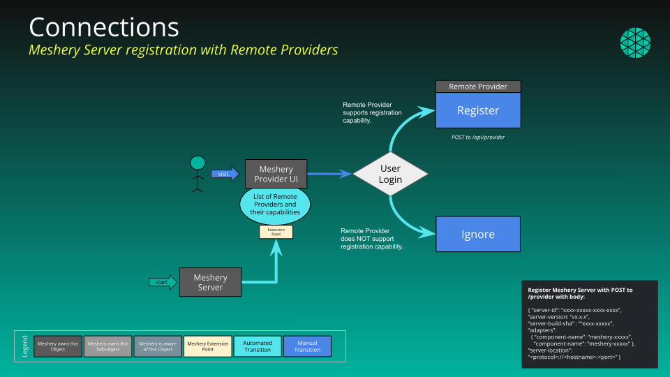

## Managed and Unmanaged Connections

Connections in Meshery refer to various resources that can be either managed or unmanaged, but are discovered and made accessible for use. Examples of Connections include Kubernetes clusters, Prometheus instances, Jaeger services, Nginx deployments, and more.

### Managed Connections

Managed connections refer to resources actively monitored and controlled by Meshery. These connections undergo various states in their lifecycle, from being discovered to connected. Meshery can efficiently interact with and manage these connections, enabling seamless integration into your workflow.

### Unmanaged Connections

Unmanaged connections, on the other hand, are resources that Remote provider (e.g Meshery Cloud) acknowledges and manages it's lifecycle and state, for example [GitHub](https://docs.meshery.io/extensions/snapshot) or Slack integration (coming soon). This distinction allows users to customize their Meshery experience based on specific requirements. 

## States and the Lifecycle of Managed Connections

Every connection can be in one of the below mentioned states at any given point of time. To better understand these states, consider you have a `Kubernetes` cluster with `Prometheus` already installed.

### 1. Discovered

All resources discovered by [MeshSync's](meshsync.md) multi-tier discovery or provided as part of config, and if Meshery can integrate, a connection with state as `Discovered` will be created. Though, the connection/resources are not tested for its reachability/usability i.e. Meshery has not made an attempt to connect or manage the connection.

When a connection has been discovered, it will be listed in the MeshSync browser / Connections table in Meshery UI. You can self transition a particular connection to [Register](#2-registered) / [Ignore](#4-ignored) state.

> Example: MeshSync discovers Prometheus components and inform Meshery Server about available Prometheus connection, but Meshery is yet to [connect](#3-connected) and start scraping metrics.

### 2. Registered

The connection in this state have been verified for its use and reachability but not yet being used. Almost all reachable connections will auto transition to Registered state from [Discovered](#1-discovered) state and it is upto the user what to do with this connection (i.e. User needs to administratively process the connection). It can be transitioned to [Connected](#3-connected), [Maintenance](#5-maintenance) and [Not Found](#8-not-found).

> EExampleg: User manually selects the registered Prometheus connection and transition to the [connected](#3-connected) state (i.e. User administratively processes the connection).

### 3. Connected

The connection in this state is administratively processed and being actively managed by Meshery. User can interface and invoke set of actions with the connection. 
From this state the transition can happen to either [Maintenance](#5-maintenance) or [Ignore](#4-ignored) state.   Auto transition to [Disconnected](#6-disconnected) state will occur if Meshery can no longer communicate with the connection, which can occur due to connectivity issue/AuthN-AuthZ/connection was deleted outside Meshery or any other issue.

> Example: Meshery is communicating with Prometheus APIs to scrape metrics and present it in the UI.

_Certain connections can auto-transition to connected state._

### 4. Ignored

The connection is administratively processed to be ignored from Meshery's view of management. Meshery will not re-discover this connection even when current user session gets expired.

> Example: Meshery server will stop/not scrape metrics from Prometheus. Though, the previous data (if connected previously) will continue to exist and user needs to manually delete.


You might intentionally choose to have Meshery ignore a given Prometheus connection, explicitly leaving in Meshery’s field of view, but identifying it as a connection not to manage. This is distinctly different than a Prometheus that Meshery was managing, but has been turned off/uninstalled and now Meshery is disconnected from the Prometheus.


### 5. Maintenance

The connection is administratively processed to be offline for maintenance tasks. This is different from being [Disconnected](#6-disconnected)/[Ignored](#4-ignored).

### 6. Disconnected

The connection was previously [discovered](#1-discovered)/[registered](#2-registered)/[connected](#3-connected) but is not available currently. This could happen due to connectivity issue/AuthN-AuthZ/connection was deleted outside meshery/administratively disconnected.

> Example: Prometheus crashed/API token provided at time of registration is revoked.


The connection was previously connected but is unreachable due to connectivity issue/AuthN-AuthZ/connection was **deleted outside Meshery** i.e. Connection was deleted beyond the Meshery's view of management.


### 7. Deleted

The connection is administratively processed to be deleted and removed from Meshery's view of management. All the available/collected data will also be deleted.

> Example: Prometheus metrics will no longer be accessible to you from the Meshery UI.

### 8. Not Found

User tried registering the connection **manually** but Meshery could not connect to it or if the connection is unavailable now. User can delete the connection or try re-registering.


You might attempt to transition to Connected state but the connection is unavaialble now due to being deleted/some other reason. This is distinctly different than a cluster with Prometheuses installed for `application monitoring` which was connected previously but is now unreachable from Meshery's view of management due to change in API token/similar issue.


_Connections like **Registration of Meshery server with remote provider** (and few other connection types) can self transtion to the valid states._