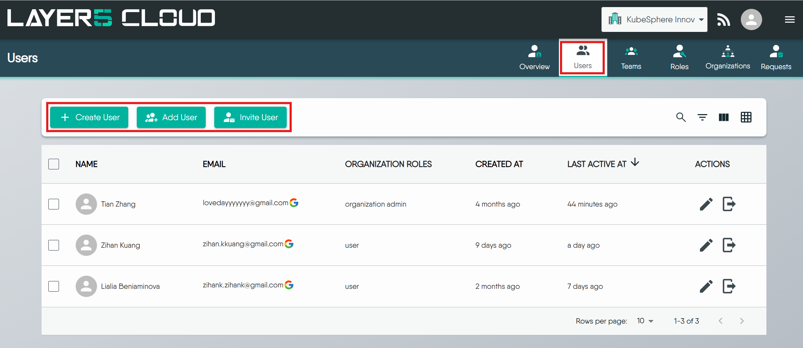
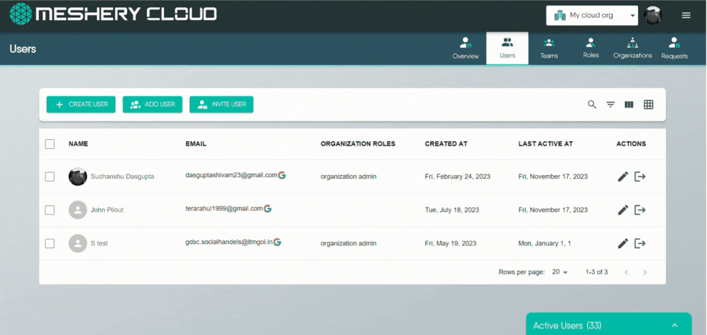
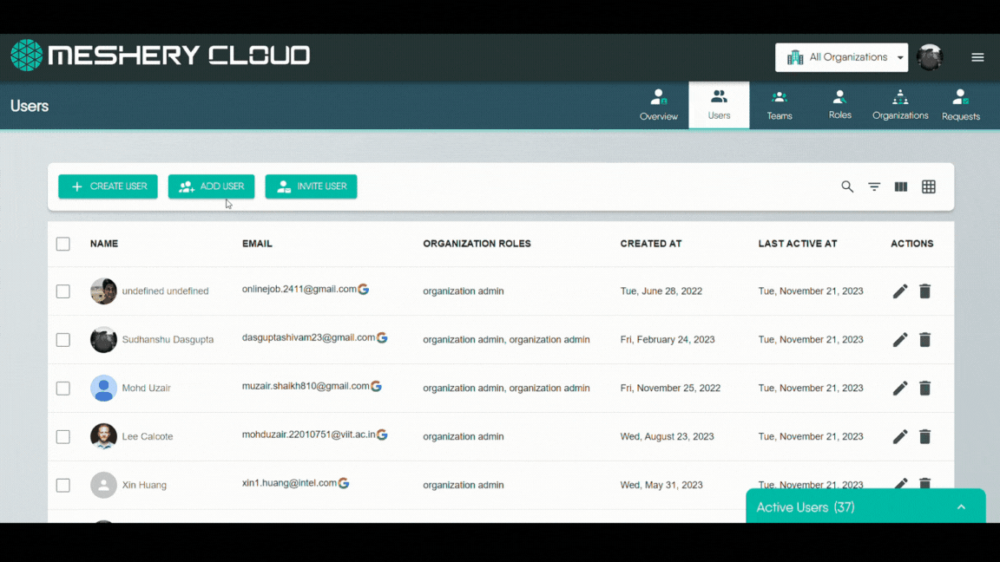
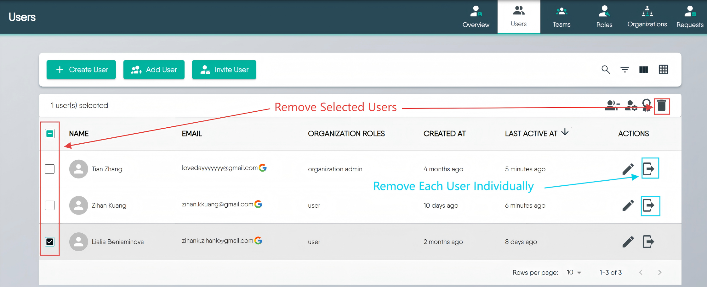

This guide outlines methods for creating user accounts, adding users to organizations, inviting new members, and managing user access within Layer5 Cloud to maintain a secure and organized environment.

## Create User Account

Seamlessly initiate new user accounts, ensuring a smooth onboarding process. Specify user details, such as email, and tailor their access by adding them to one or more organizations. Optionally assign roles, defining their scope within the platform. Complete the process by sending a personalized account setup email, streamlining the user's introduction to Layer5 Cloud.


Only Provider Admins and Organization Admins can create users. For more information, see [Roles]().


## Add / Remove Existing User

This section explains how to add existing Layer5 Cloud users to one of your organizations or remove them.



### Adding a User to an Organization

If someone already has a Layer5 Cloud account but isn't part of your organization, you can add them.

1. Go to the Users tab in the Identity section 
2. Click the **Add User** button.
3. Select the organization to which you want to add the user.
4. Select the user from the list of available users.
5. Assign appropriate roles within the organization.

### Removing Users from an Organization

You can remove users from an organization one by one or several at once. This action takes away their membership and access to that specific organization's resources but doesn’t delete their overall Layer5 Cloud account.

#### Method 1: Individual User Removal (One by One)
   * **Locate the User:** Find the specific user you wish to remove from the list.
   * **Use Row Action:** Click the "Remove User" icon.
   * **Confirm:** When prompted, confirm your decision to remove the user from the organization.

#### Method 2: Bulk User Removal (Multiple Users at Once)
   * **Select Users:** Use the checkboxes next to each user's name to select all the users you intend to remove.
   * **Use Bulk Action:** Click the "Delete" button.
   * **Confirm:** When prompted, confirm that you want to remove all the selected users from the organization.

#### What Removal Ends

Removing a member ends every access-bearing relationship they hold **inside that organization**, as a single operation:

* **Their organization membership**, together with the organization [roles]() attached to it.
* **Their membership in that organization's [teams]()**, together with the team [roles]() attached to those memberships.

Both matter, because permissions reach a user through the roles carried on those memberships. A [keychain]() granted by a team role is revoked by the removal just as an organization role's keychain is, so a removed member is left holding no [keys]() in the organization by either route. Both removal methods above behave identically in this respect; removing several members at once applies the same operation to each one.

Removal does **not** affect:

* The person's Layer5 Cloud user account, which continues to exist.
* Their membership in any other organization, or in teams belonging to those organizations.
* Designs, environments, and other resources they created, which remain in the organization.

Removal is not reversible from the Users tab. To restore someone's access, add them to the organization again and reassign their organization roles and team memberships - neither returns on its own.


The confirmation shown after a removal reports only that the member was removed from the organization. It does not list the team memberships that ended with it. Review the member's teams before removing them if you need a record of what their removal revoked.



An attempt to remove the organization's owner is rejected. Transfer ownership to another administrator first, then remove the former owner. See [Organization Roles]().


## Invite User via Email

You can invite new or existing users to join one of your organizations by sending them an email invitation.

* **How to Invite:**
    1.  Click the "Invite User" button.
    2.  Enter the person's First Name, Last Name, and Email address.
    3.  Assign them to a target Organization. Optionally, Team(s) and Organization Role(s) they will receive.
    4.  Layer5 Cloud sends an invitation email to the user.
* **What the User Does:** The person you invited will click a link in the email to accept. If they're new to Layer5 Cloud, they'll need to create an account first before they can join your organization.


An Organization Admin can assign organization roles to users, but provider roles can only be assigned by Provider Admins. For more information, see [Roles]().

