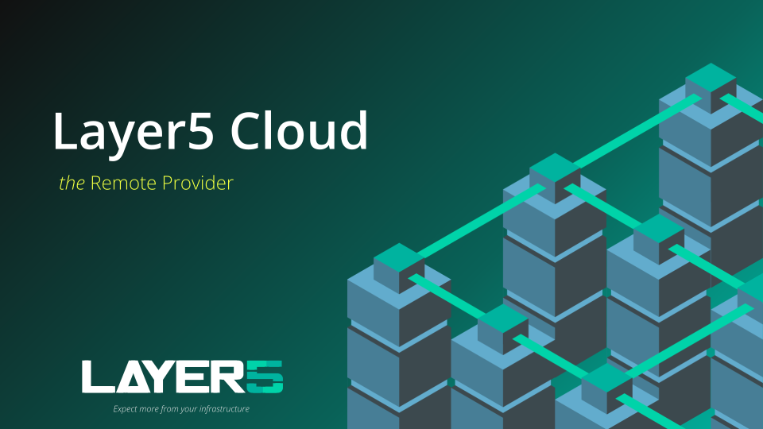

The Layer5 Cloud provides a centralized management plane for your cloud-native infrastructure. This guide will help you set up your account and deploy your first design.

## Prerequisites

Before you begin, ensure you have the following:
* A [Layer5 Cloud account](https://cloud.layer5.io).
* A running Kubernetes cluster (local or cloud-based).
* [Meshery](https://docs.meshery.io/installation) installed and connected to your cluster.

## Installation and Setup

Layer5 Cloud functions as a Remote Provider for Meshery. To get started:

1.  **Log in:** Navigate to your Meshery UI (usually `http://localhost:9081`).
2.  **Select Provider:** On the login screen, select **Layer5 Cloud** from the provider dropdown.
3.  **Authenticate:** You will be redirected to the Layer5 Cloud authentication page. Log in with your preferred identity provider (GitHub, Google, etc.).

## Core Workflow

Once authenticated, you can begin organizing your infrastructure using the following hierarchy:

* **Organizations:** Create an Organization to manage your teams and billing.
* **Workspaces:** Group your projects and resources logically.
* **Environments:** Map your Kubernetes clusters to specific environments (e.g., Staging, Production).

## Try it out!

To verify your setup, try deploying a sample design:

1.  Navigate to the **Designs** section in the sidebar.
2.  Click on **Import** and select a sample pattern from the Meshery Catalog.
3.  Click **Deploy** and select your target Environment.

---

### Need Help?
If you run into issues during setup, join our [Slack Community](http://slack.layer5.io) or check the [Troubleshooting Guide](/docs/troubleshooting).


Throughout these docs you'll follow Five — a Platform Engineer at Orbital Labs — and his colleagues as they set up organizations, configure workspaces, deploy designs, and navigate the occasional Friday-afternoon incident. [Meet Five and the full cast →]()

