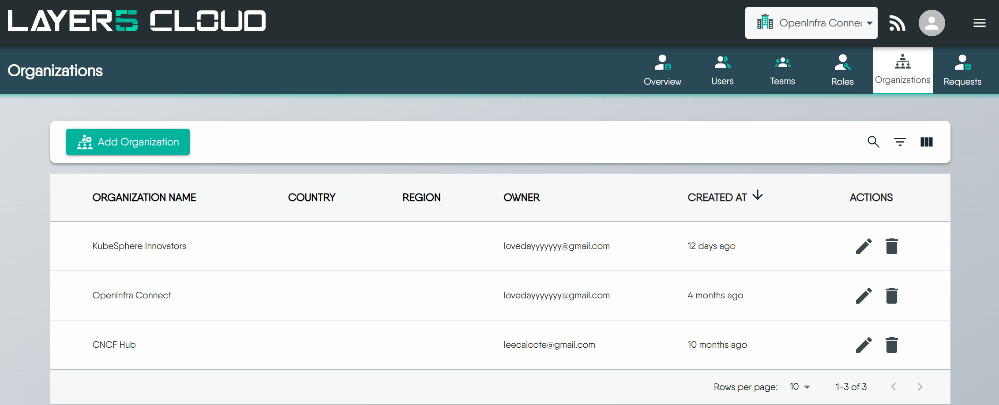
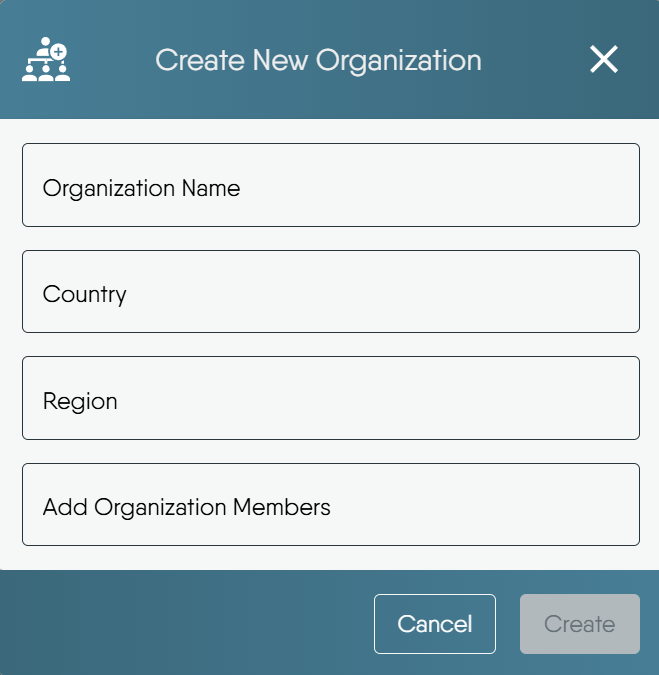
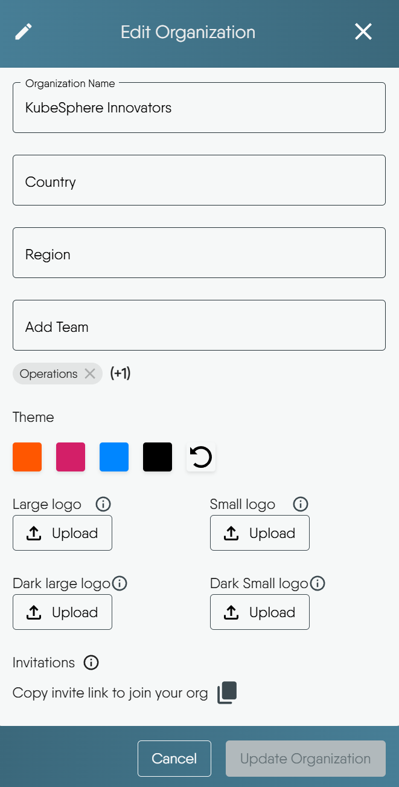
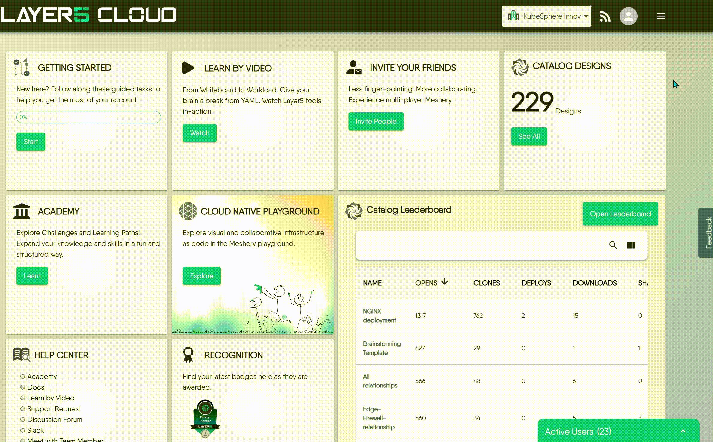
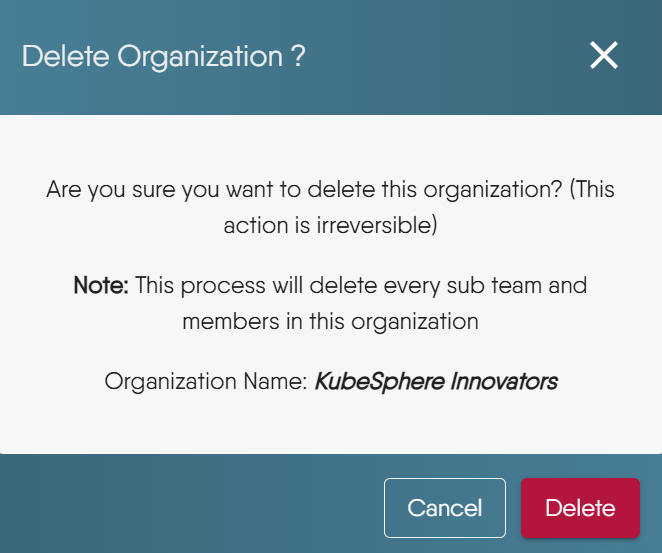

This guide covers creating new organizations, editing their details, inviting members, and deleting organizations when necessary.


Operations described on this page for managing your Organization typically require Organization Administrator or similar administrative roles. To understand the specific roles needed for each action, please refer to the [Default Permissions reference](https://docs.layer5.io/cloud/reference/default-permissions/).


## Creating an Organization

An Organization provides a way to structure your teams, users, and resource access for different projects or initiatives.

### How to create an Organization

1.  Go to the Organizations section, click the **Add Organization** button
2.  The "Create New Organization" modal will appear:
    -   Organization Name: Enter a unique name for your new Organization. This is a required field.
    -   Country (Optional): Select the country for your Organization.
    -   Region (Optional): Choose the time zone for your Organization.
    -   Add Organization Members (Optional): You can begin adding **existing** Layer5 Cloud users to your new Organization in this field.


If the "Add Organization" button is disabled, it means your current role does not permit creating additional Organizations. Only users with roles like Organization Administrator or Provider Administrator can create new Organizations.


## Editing Your Organization

You can update your Organization's name, location, associated teams, branding, identity providers, and access its invitation link by editing its details.

### How to Edit Your Organization

1.  Select the Organization you want to modify and click its **"Edit"** button.
2.  The "Edit Organization" modal will open:
    -   Add Team: Associate existing Teams with this Organization.
    -   Theme: Customize your Organization's visual theme by selecting from the available color swatches.
    -   Logos: Upload specific logo versions for various display contexts by clicking the respective **"Upload"** buttons.
    -   Invitations: Access a shareable link to invite users to your Organization.
    -   Identity Providers: Configure which OAuth applications power your Organization's sign-in (see [Configuring Identity Providers](#configuring-identity-providers-bring-your-own-credentials) below).

### Configuring Identity Providers (Bring-Your-Own Credentials)

The **Identity Providers** tab controls which OAuth applications power sign-in for your Organization. This is most useful when your Organization uses a custom domain and you want your own brand — not Layer5's — shown on the Google, GitHub, or OIDC consent screen.

The tab opens in one of two states:

-   **Using Layer5's default identity providers** (the default for every Organization): sign-in uses Layer5's shared OAuth applications. A Provider Administrator can select **Enable bring-your-own credentials** to begin configuring the Organization's own providers.
-   **Bring-your-own credentials (BYOC) enabled**: a row is shown for each configured provider. Use **Add Google**, **Add GitHub**, or **Add OIDC** to register a provider — each walkthrough displays the exact redirect URI to add to your OAuth application — and **Edit** or **Remove** to rotate or delete a provider's credentials. **Delete Identity Providers** reverts the Organization to Layer5's defaults.


Enabling or tearing down bring-your-own credentials is a Provider Administrator action, and Provider Administrators can manage the Identity Providers configuration of **any** Organization — whether or not they are a member of it. Adding, rotating, and removing individual provider connections is available to Organization Administrators and Owners.


Switching identity providers does not affect existing user accounts or login history. Users who signed in through a provider you later remove may need to re-authenticate.

## Using the Open Organization Invitation Link

To invite multiple users to your organization at once, or to allow open sign-ups (for example, for a public community), you can use the "Open Organization Invitation Link." This is a shareable link that lets users join directly.

### When to Use This Link
* Bulk Onboarding: To quickly onboard many users without sending individual emails.
* Public Sign-ups: To let people sign up openly, for instance, by posting the link on a community page or another public resource.
* Cross-Organizational Collaboration: To make it easy for collaborators from other organizations or external partners to join.


If you want to invite users directly to a specific team within your organization, please refer to the documentation on [Open Team Invites](https://docs.layer5.io/cloud/concepts/identity-and-security/teams/)


### How it Works

-  For New Users (without an existing Layer5 Cloud account):
    * When a new user clicks the invitation link, they will be directed to the sign-up page.
    * After creating their account, they will be automatically added to the organization associated with the invite link.

-  For Existing Users (with a Layer5 Cloud account):
    * An existing user who clicks the invitation link will be able to join the organization using their current account.[^1]

## Deleting Your Organization

Deleting an Organization is a permanent action that removes it entirely, including all associated teams, user memberships within that Organization, and its resources. 


Once an Organization is deleted, **this action cannot be undone**.


### Consequences of Deletion

Upon confirming deletion, the following are **permanently and irretrievably removed**:
* The Organization Itself: Including all its unique settings and configurations.
* All Associated Teams: All teams belonging to this Organization.
* User Access to this Organization: Users' memberships, roles, and permissions specific to this Organization are revoked. (Note: Users' individual accounts themselves are not deleted from the system).
* Owned Workspaces: All Workspaces belonging to this Organization.
* Designs and Environments: All Designs and Environments within the Organization's deleted Workspaces will also be permanently removed.

### When NOT to Delete
Avoid deleting an Organization if:
* You might need the Organization or its data later.
* Critical resources within it have not been backed up or migrated.
* Other users or services still depend on it.
* You only need to modify memberships or restructure parts of it.
* You are unsure about the full extent of its data or dependencies.

### When Deletion May Be Appropriate

* The Organization was for a temporary project or test and is no longer needed.
* It was created in error or is now redundant due to consolidation.
* Permanent removal of all its data is required for compliance or data lifecycle management.
* You are certain all its resources are obsolete or migrated, and no dependencies remain.

### How to Delete Your Organization

1.  Select the Organization you want to delete and click its **"Delete"** button.
2.  A confirmation modal will appear, requiring you to verify this action.
3. Click the "Delete" button to permanently remove the Organization. To abort the deletion, click "Cancel".

[^1]: Existing users who click this invitation link might encounter a "Page not found" error. This is a temporary bug and is being addressed.
