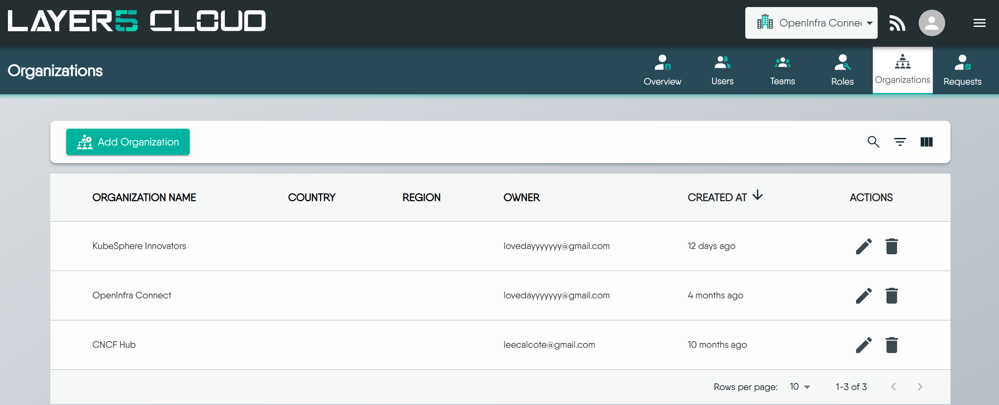
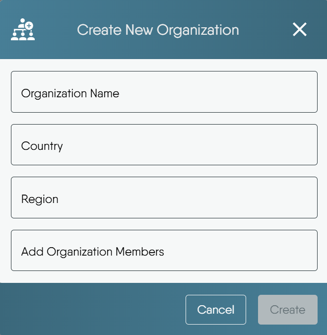
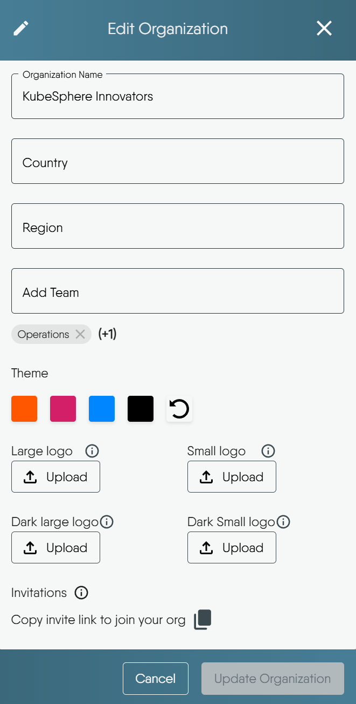
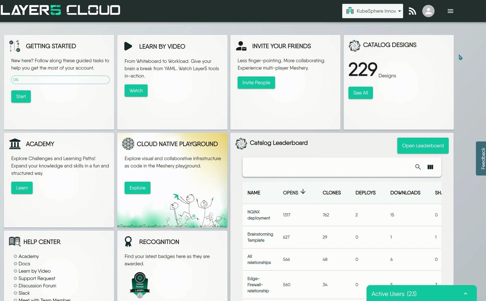
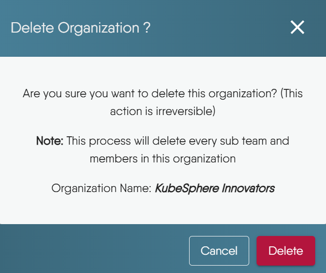

This guide covers creating new organizations, editing their details, inviting members, and deleting organizations when necessary.


Operations described on this page for managing your Organization typically require Organization Administrator or similar administrative roles. To understand the specific roles needed for each action, please refer to the [Default Permissions reference](https://docs.layer5.io/cloud/reference/default-permissions/).


## Creating an Organization

An Organization provides a way to structure your teams, users, and resource access for different projects or initiatives.

### How to create an Organization

1.  Go to the Organizations section, click the **Add Organization** button
2.  The "Create New Organization" modal will appear:
    -   Organization Name: Enter a unique name for your new Organization. This is a required field.
    -   Country (Optional): Select the country for your Organization.
    -   Region (Optional): Choose the time zone for your Organization.
    -   Add Organization Members (Optional): You can begin adding **existing** Layer5 Cloud users to your new Organization in this field.


If the "Add Organization" button is disabled, it means your current role does not permit creating additional Organizations. Only users with roles like Organization Administrator or Provider Administrator can create new Organizations.


## Editing Your Organization

You can update your Organization's name, location, associated teams, branding, and identity providers, as well as access its invitation link, by editing its details.

### How to Edit Your Organization

1.  Select the Organization you want to modify and click its **"Edit"** button.
2.  The "Edit Organization" modal will open:
    -   Add Team: Associate existing Teams with this Organization.
    -   Theme: Customize your Organization's visual theme by selecting from the available color swatches.
    -   Logos: Upload specific logo versions for various display contexts by clicking the respective **"Upload"** buttons.
    -   Invitations: Access a shareable link to invite users to your Organization.
    -   Identity Providers: Configure which OAuth applications power your Organization's sign-in (see [Configuring Identity Providers](#configuring-identity-providers-bring-your-own-credentials) below).
    -   Email: Configure your Organization's own outbound mail server, so email reaches your members from your own domain (see [Configuring your own mail server](#configuring-your-own-mail-server) below).

### Configuring Identity Providers (Bring-Your-Own Credentials)

The **Identity Providers** tab controls which OAuth applications power sign-in for your Organization. This is most useful when your Organization uses a custom domain and you want your own brand — not Layer5's — shown on the Google, GitHub, or OIDC consent screen.

By default, your Organization uses Layer5's shared OAuth applications. To override them, simply add your own provider — there is no separate "enable" step:

-   Use **Add Google**, **Add GitHub**, or **Add OIDC** to register a provider. Each walkthrough displays the exact redirect URI to add to your OAuth application. Saving your first provider switches the Organization to its own identity providers automatically.
-   Use **Edit** to rotate a provider's credentials, or **Remove** to delete a single provider. Removing your last provider reverts the Organization to Layer5's defaults.
-   Use **Delete All "Identity Providers"** to delete the environment named, "Identity Providers", therein deleting every configured provider at once, reverting to Provider Organization's defaults.

Every removal asks you to confirm and explains the consequences before it proceeds.


Organization Administrators and Owners can add, rotate, and remove their Organization's identity providers themselves. Provider Administrators can additionally manage the Identity Providers configuration (and the configuration of other aspects) of **any** Organization - whether or not they are members of it.


Switching identity providers does not affect existing user accounts or login history. Users who signed in through a provider you later remove may need to re-authenticate.

### Configuring your own mail server

The **Email** tab lets your Organization send its email through **its own SMTP server**, from **its own address**, instead of through Layer5's shared mail server.

By default, every notification, invitation, account-verification and password-recovery email for your Organization is delivered by Layer5 and arrives from a Layer5 address. The body of the message already carries your branding; only the envelope does not. Bringing your own mail server changes the envelope too, so your email aligns with your own SPF and DMARC policy.


Your mail server carries account verification and password recovery, not just notifications. A delivery problem therefore becomes a sign-in problem for your members. That is why **Fall back to the shared mail server** is switched on by default — leave it on unless you have a specific reason not to.


#### What you will need

-   The hostname and submission port of your SMTP server, and whether it uses STARTTLS or implicit TLS. Ports 25, 465, 587 and 2525 are supported.
-   A username and password your server accepts. For most hosted providers this is an **app password** or a dedicated SMTP credential, not your normal account password.
-   A **from address** on a domain you can prove you control — either your Organization's registered custom domain, or a domain you can publish a DNS TXT record on.

Your mail server must be reachable on the public internet. A relay on a private or internal network cannot be used.

#### How to configure it

1.  Open **Edit Organization** and select the **Email** tab, then click **Configure mail server**.
2.  Optionally pick a **Provider preset** — Gmail / Google Workspace, Microsoft 365, Amazon SES, SendGrid or Postmark. A preset fills only the host, port and encryption; the username and from address are always yours to enter.
3.  Fill in the rest of the form and click **Save mail server**. Nothing about your email changes yet — mail keeps going out through Layer5 while you finish setting up.
4.  **Verify your from domain.** If it matches your Organization's registered custom domain, it is verified immediately with no DNS record. Otherwise the page shows the exact TXT record to publish; publish it, then click **Re-check now**. DNS changes take time to propagate, so the first re-check often reports that no record was found.
5.  **Send a test message.** You can address it to anyone; left empty it goes to you. Once a message is delivered successfully, your Organization's email starts going out through your own server.

#### Reading the status

The Email tab shows one of four states, and the difference between them matters:

| Status | What it means |
| --- | --- |
| **Not yet proven** | Configured, but no message has been delivered through it yet. Email is still going out through Layer5. |
| **Delivering** | The last delivery succeeded. Your Organization's email is going out through your server. |
| **Failing** | Repeated failures stopped your server being contacted. What happens to a message now depends on your fallback setting. |
| **Turned off** | An administrator turned it off. Email is going out through Layer5. |

If a test message is refused, the page explains what went wrong, the probable cause, and what to try — for example, an authentication rejection usually means your provider requires an app password rather than your account password.

#### About your stored password

Your password is encrypted before it is stored and is **never shown again**, on this page or through the API.

Because of that, the settings form does not include a password field at all — saving your settings can never change or clear your stored password. Replacing it is a separate **Replace password** action, and its field is always empty when the page loads.

#### Turning it off or removing it

-   **Turn off** returns your Organization to Layer5's shared mail server but keeps your configuration and stored password, so you can turn it back on later.
-   **Remove mail server** deletes the configuration and the stored password. Your email is not interrupted — every message goes through Layer5's shared server from that moment — but re-adding means entering everything again and verifying your domain again.


Organization Administrators and Owners can configure, test and remove their Organization's mail server themselves.



Mail servers that require the `AUTH LOGIN` mechanism are not supported yet. If your Microsoft 365 tenant requires it, use an account that accepts `AUTH PLAIN`, or a Microsoft 365 high-volume SMTP relay.


## Using the Open Organization Invitation Link

To invite multiple users to your organization at once, or to allow open sign-ups (for example, for a public community), you can use the "Open Organization Invitation Link." This is a shareable link that lets users join directly.

### When to Use This Link
* Bulk Onboarding: To quickly onboard many users without sending individual emails.
* Public Sign-ups: To let people sign up openly, for instance, by posting the link on a community page or another public resource.
* Cross-Organizational Collaboration: To make it easy for collaborators from other organizations or external partners to join.


If you want to invite users directly to a specific team within your organization, please refer to the documentation on [Open Team Invites](https://docs.layer5.io/cloud/concepts/identity-and-security/teams/)


### How it Works

-  For New Users (without an existing Layer5 Cloud account):
    * When a new user clicks the invitation link, they will be directed to the sign-up page.
    * After creating their account, they will be automatically added to the organization associated with the invite link.

-  For Existing Users (with a Layer5 Cloud account):
    * An existing user who clicks the invitation link will be able to join the organization using their current account.[^1]

## Deleting Your Organization

Deleting an Organization is a permanent action that removes it entirely, including all associated teams, user memberships within that Organization, and its resources. 


Once an Organization is deleted, **this action cannot be undone**.


### Consequences of Deletion

Upon confirming deletion, the following are **permanently and irretrievably removed**:
* The Organization Itself: Including all its unique settings and configurations.
* All Associated Teams: All teams belonging to this Organization.
* User Access to this Organization: Users' memberships, roles, and permissions specific to this Organization are revoked. (Note: Users' individual accounts themselves are not deleted from the system).
* Owned Workspaces: All Workspaces belonging to this Organization.
* Designs and Environments: All Designs and Environments within the Organization's deleted Workspaces will also be permanently removed.

### When NOT to Delete
Avoid deleting an Organization if:
* You might need the Organization or its data later.
* Critical resources within it have not been backed up or migrated.
* Other users or services still depend on it.
* You only need to modify memberships or restructure parts of it.
* You are unsure about the full extent of its data or dependencies.

### When Deletion May Be Appropriate

* The Organization was for a temporary project or test and is no longer needed.
* It was created in error or is now redundant due to consolidation.
* Permanent removal of all its data is required for compliance or data lifecycle management.
* You are certain all its resources are obsolete or migrated, and no dependencies remain.

### How to Delete Your Organization

1.  Select the Organization you want to delete and click its **"Delete"** button.
2.  A confirmation modal will appear, requiring you to verify this action.
3. Click the "Delete" button to permanently remove the Organization. To abort the deletion, click "Cancel".

[^1]: Existing users who click this invitation link might encounter a "Page not found" error. This is a temporary bug and is being addressed.
