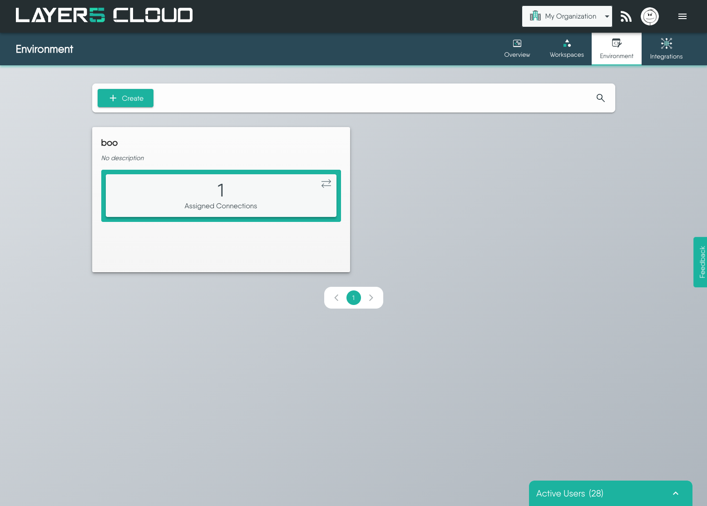

This guide walks you through the practical steps of managing your Environments. Here you will learn how to see the Environments in your organization, create and edit them, review the Connections that belong to an Environment, and assign or remove those Connections.

If you are new to the concept of Environments, start with the [Environments Overview]() to understand what an Environment is and how it relates to Connections, Credentials, and Workspaces.


Every action described in this guide is governed by roles and permissions. Buttons and icons for actions you are not authorized to perform are disabled rather than hidden, and the Environments page itself is only reachable with the **View Environment** key. For a breakdown of what your assigned role allows, see [Default Permissions]().


## View Environments

The [Environments page](https://cloud.layer5.io/spaces/environments) - **Environment** in the Spaces navigation, alongside Overview, Workspaces and Integrations - lists every Environment in the organization you currently have selected. Switching organizations with the organization context switcher in the top navigation bar changes the list.

Environments are presented as cards, ten to a page, with pagination beneath the grid. Each card shows:

- the Environment's **name**
- its **description**, or *No description* when none has been set
- an **Assigned Connections** tile carrying the number of Connections currently in the Environment

Flip a card over to reveal its management actions - the **pencil** (edit) and **trash can** (delete) icons - along with the **Created At** and **Updated At** timestamps.

If the organization has no Environments yet, the page shows a **No environments available** empty state instead of the grid.

### Finding an Environment

Click the **magnifier** in the toolbar to expand the search box, then filter the list by name. Searching resets you to the first page of results, so a match on a later page is still found.

<!-- SCREENSHOT NEEDED: Environments page, card flipped to its back face, must show the pencil and trash can icons, the bulk-select checkbox, and the Created At / Updated At timestamps -->

## View the Connections in an Environment

The **Assigned Connections** tile on an Environment card is both a count and a control. Clicking it opens the *&lt;Environment name&gt;* **Resources** dialog, which shows two lists side by side:

- **Available Connections (n)** on the left - Connections in the organization that are *not* in this Environment.
- **Assigned Connections (n)** on the right - the Connections that belong to this Environment.

The heading of each list carries its total, so the dialog answers "what is in this Environment, and what could be?" in one place. Both lists load twenty-five Connections at a time and fetch the next page as you scroll.


Assigning a Connection to an Environment implicitly makes its Credentials available too. Who can then use them is governed by the Workspaces the Environment is linked to - see [Access Control for Connections and Credentials]().


<!-- SCREENSHOT NEEDED: Environment Resources dialog (opened from the Assigned Connections tile), with connections present on both sides, must show the "Available Connections (n)" and "Assigned Connections (n)" headings, the four arrow buttons between the lists, and the Save / Cancel footer -->

## See the Environments in a Workspace

The Environments page lists every Environment in the organization. To see only the Environments that a particular Workspace can draw on, open the [Workspaces page](https://cloud.layer5.io/spaces/workspaces) and use that Workspace's **Environments** tile - the same control you use to link and unlink them.

See [Link Environments to a Workspace]() for the full procedure.


An Environment can be linked to more than one Workspace, and a Workspace can have more than one Environment. An Environment that appears in no Workspace is still perfectly valid - it simply is not shared with any team yet.


## Create an Environment


Creating an Environment requires the **Create Environment** key. Without it the **Create** button is disabled.


1. Switch to the organization that will own the Environment using the organization context switcher in the top navigation bar. The new Environment is automatically created in the currently selected organization.
2. On the [Environments page](https://cloud.layer5.io/spaces/environments), click **Create**.
3. Enter a **Name** (required) and an optional **Description**.
4. Click **Save**.

The new Environment appears in the grid with no Connections assigned. Assigning them is a separate step - see [Assign Connections to an Environment](#assign-connections-to-an-environment).

## Edit an Environment

You can change an Environment's name and description at any time.

1. Flip the Environment's card to its back face.
2. Click the **pencil** icon.
3. Amend the **Name** and **Description** in the **Edit Environment** dialog.
4. Click **Update**.

The owning **Organization** is fixed at creation and is therefore not offered for editing.


The Edit dialog covers the Environment's own details only. Its Connection membership is edited from the **Assigned Connections** tile on the card, described next.


## Assign Connections to an Environment

1. Click the **Assigned Connections** tile on the Environment's card to open the **Resources** dialog.
2. Select one or more Connections in the **Available Connections** list on the left.
3. Move them across with the arrow buttons between the two lists:
    - **>** moves the selected Connections to **Assigned Connections**.
    - **>>** moves every available Connection across at once.
4. Click **Save**.


The **>>** and **<<** buttons act on the whole list, so they stay disabled until every page of that list has been loaded. Scroll to the bottom of the list to load the rest, or move your selection across with **>** and **<** instead.


**Save** stays disabled until you have actually changed something, and one **Save** commits every addition and removal you made in the dialog together.

## Remove Connections from an Environment

Removal is the same dialog in the other direction:

1. Click the **Assigned Connections** tile on the Environment's card.
2. Select one or more Connections in the **Assigned Connections** list on the right.
3. Move them back with **<** (selected) or **<<** (all).
4. Click **Save**.


Taking a Connection out of an Environment only ends its membership of that Environment. The Connection itself, and any Credentials it uses, continue to exist and remain assigned to any other Environments they belong to. See [lifecycle of connections](https://docs.meshery.io/concepts/logical/connections) in the Meshery documentation for what does delete a Connection.


## Delete an Environment

You can delete a single Environment or several at once.

- **A single Environment:** flip its card and click the **trash can** icon, then confirm in the **Delete Environment?** prompt. Deletion is irreversible.
- **Several Environments:** tick the bulk-select checkbox on the back face of each card you want to remove. A bar appears above the grid reporting how many are selected; click its delete icon and confirm.


Deleting an Environment does **not** delete the Connections inside it. Connections that also belong to other Environments continue to belong to those Environments. The Environment is detached from any Workspaces it was linked to, and the resources it made available to those Workspaces stop being available through it.


While an Environment is bulk-selected its card cannot be flipped and its individual edit and delete icons are suppressed, so the bulk toolbar is the only way to act on it. Clear the selection to get the per-card actions back.
