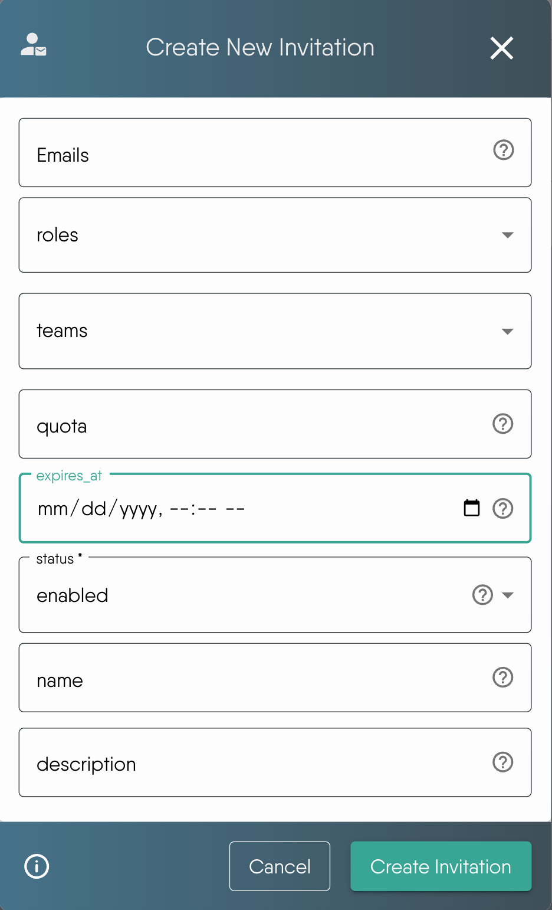
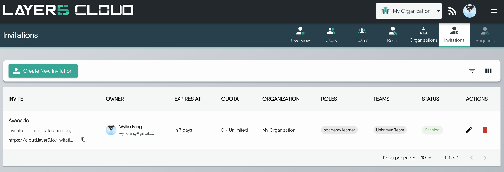

The [invitation system](https://cloud.layer5.io/identity/invitations) gives you precise control over how members join your organization, allowing you to streamline onboarding and enhance security.

You can create highly customized invitations for any scenario, from onboarding specific individuals to launching large-scale community challenges. Each invitation can be configured with expiration dates, usage quotas, and pre-assigned roles, ensuring new members get the right access from the moment they join.

### Key capabilities

The invitation system provides three main areas of control to help you manage access effectively.

#### Create custom invitations for any audience
Tailor each invitation to your specific needs with three flexible modes:
- Precise invitation: Target a single user by specifying their full email address.
- Domain-wide invitation: Onboard an entire organization at once by allowing any email from a specific domain (e.g., `*@layer5.io`).
- Public invitation: Leave the email field blank to create an open link for public events (e.g., Academy Challenge invitations).


Patterns like `*@company.com` allow anyone with that domain. Verify ownership and pair with roles and teams that grant only necessary access.


#### Control the invitation lifecycle
Manage access with settings that put you in control:
- Expiration date: Set a specific date and time for an invitation to automatically become invalid.
- Usage quota: Limit the number of times an invitation can be used.


If `expiresAt` is not set, the invitation never expires. If `quota` is not set, the invitation has unlimited uses.


#### Manage invitations dynamically
Instantly revoke access by switching an invitation's status between enabled and disabled at any time.

### How to create an invitation

To create a new invitation, navigate to the [Invitations page](https://cloud.layer5.io/identity/invitations) from the main menu. Click the **Create Invitation** button to open the creation dialog.

#### Invitation properties explained

| Property | Description |
| :--- |  :--- |
| `name` |  A name used to identify the invitation. |
| `description` | Additional information about the invitation's purpose. |
| `emails` |  List of email addresses or domain patterns allowed to use the invitation. If empty, the invitation is public. |
| `expiresAt` |  Date when the invitation becomes invalid. If not set, it never expires. |
| `quota` | Number that limits how many users can accept the invitation. If not set, there's no usage limit. |
| `roles` | List of roles automatically assigned to new members upon accepting the invitation. |
| `teams` | List of teams new members are automatically added to upon accepting the invitation. |

### Managing existing invitations

All existing invitations are displayed in a table that shows key invitation information.

From this overview table, you can perform several management actions:

* **Copy Link**: Click the copy icon to copy the invitation URL for sharing.
* **Edit Invitation**: Click the pencil icon to open the edit dialog and modify invitation properties.
* **Change Status**: Toggle between `Enabled` and `Disabled` to control whether the invitation can be accessed by users.

### Use cases and examples

The invitation system offers flexible configurations to fit a variety of use cases.


When a user who is not logged in clicks an invitation link, the system temporarily saves the invitation ID in a 30-minute cookie and redirects them to the login page. After a successful login, the system reads the cookie and seamlessly guides them back to complete the invitation acceptance process.


#### Scenario 1: Inviting a single team member

- Goal: Provide a new employee with a secure, single-use invitation that grants the correct initial permissions.
- Configuration:
  - Email: Set to the new member's specific email.
  - Roles: Assign their specific role (e.g., `Developer`).
  - Teams: Add them directly to their project team (e.g., `Frontend-Team`).
  - Quota: Set to `1` to ensure the link is only used once.

#### Scenario 2: Opening registration for an entire organization

- Goal: Allow all employees from your company to join using their corporate email without individual invitations.
- Configuration:
  - Email: Use a domain pattern to cover all employees.
  - Roles: Assign a default role for all new members.

#### Scenario 3: Launching a community challenge

- Goal: Create a public signup link for a limited-time community event with a maximum number of participants.
- Configuration:
  - Email: Leave blank for public access.
  - Name: Give it a clear name like "Layer5 Challenge 2025".
  - Expiration date: Set to the date and time the challenge registration closes.
  - Quota: Set to the maximum number of participants (e.g., `100`).
  - Roles: Assign a temporary role like `Learner`.


The available seats for learners are determined by your organization's subscription plan. Please be mindful of your subscription to manage costs effectively.


#### Scenario 4: Granting temporary partner access

- Goal: Give an external partner secure access to specific resources only for the duration of a project.
- Configuration:
  - Email: Use the partner's domain (e.g., `*@partner.com`).
  - Teams: Add them only to a shared project team (e.g., `Project-X-Shared`).
  - Expiration date: Set to the project's end date to revoke access.
  - Description: Add a note for internal reference, such as "Temporary access for Project X contractors".


Public links can be forwarded broadly. Always set an expiration date and a quota.
