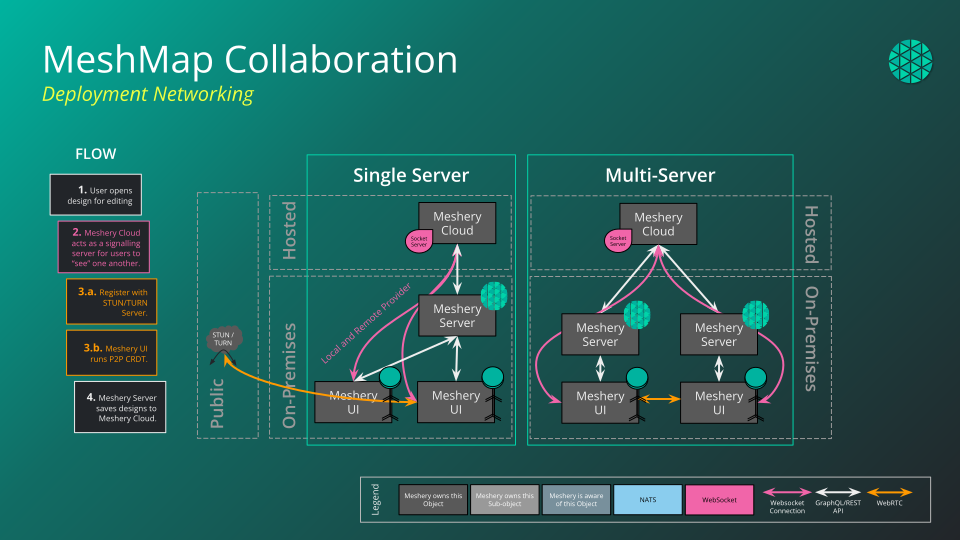

## Considerations of Peer-to-Peer Communication

Layer5 Cloud offers central coordination for real-time user presence and its multi-player experience and does so by propagating document (e.g. designs, views, and so on) updates peer-to-peer to all users using WebRTC. This allows for real-time collaboration without the need for a central server. The signaling server is only used to establish the initial connection between peers. The signaling server does not have access to the content of the document.

Characteristics of the peer-to-peer communication include:

- Fast message propagation
-Encryption and authorization over untrusted signaling servers
- No setup required, public signaling servers are available
- Very little server load
- Not suited for a large amount of collaborators on a single document (each peer is connected to each other)

### Default Configuration

By default, Layer5 Cloud uses the public signaling server provided by Layer5. This server is hosted by Layer5 and is available to all users. The server is not able to see the content of the documents, but it can see the metadata of the documents (title, list of users, etc.).

#### Default Number of Supported Users

Minimum: 20
Maximum: 34

Layer5 Cloud uses a min and max range for the total number of users in multi-player mode in one document at-a-time in order to prevent users forming clusters (groups), that can't connect to other users. The min and max range is randomly selected for each document editing session.
