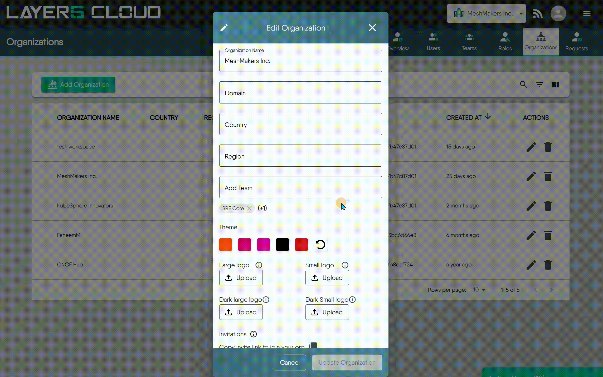
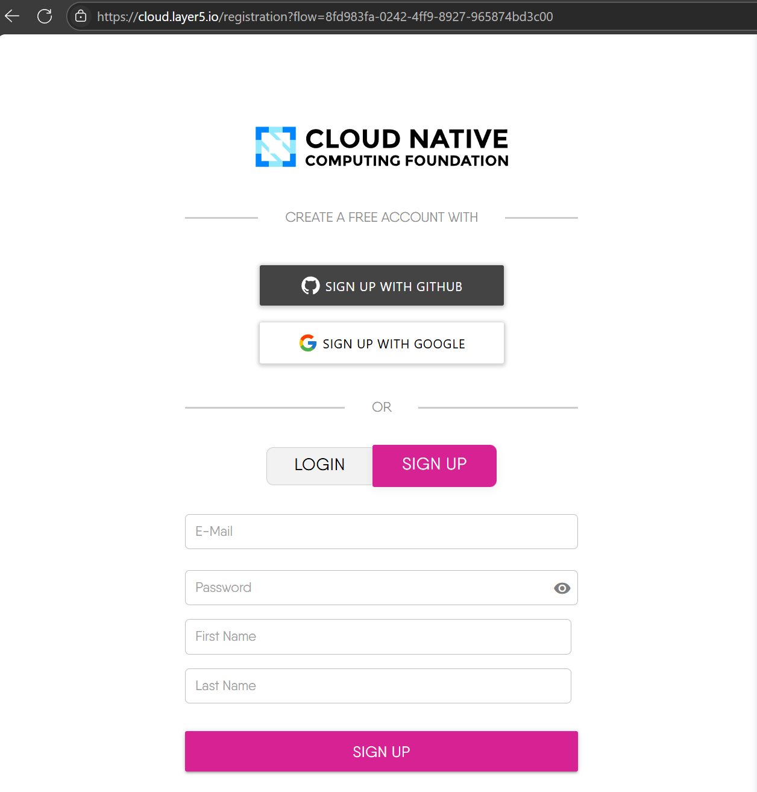
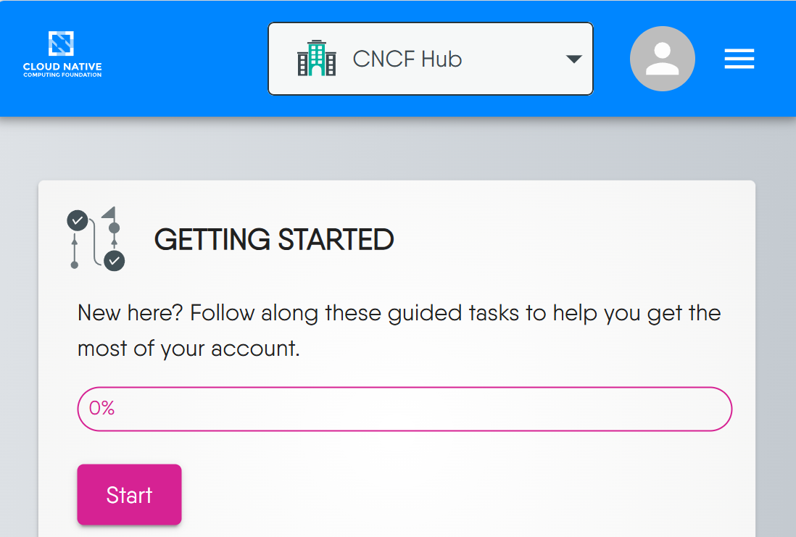

You can change the logo, color scheme, domain name, and other aspects of the user interface to match your own identity and preferences. White-labeling enables you to offer a seamless and consistent experience to your customers, partners, or internal users who access your service mesh platform. White-labeling also helps you to differentiate your platform from other Layer5 Cloud users and competitors, and to enhance your brand recognition and loyalty.

## Customizing Themes

The Layer5 Cloud dashboard can be customized with your own branding, including your full-sized logo, logo mark, and color scheme. Customized theme colors also affect email notifications.


{}
This example includes a custom branding with colors and full-sized logo.

{}
{}
This example includes a custom branding with colors and logo mark.

{}
{}
This example includes a custom branding with colors and full-sized logo.

{}
{}
This example includes a custom branding with colors and full-sized logo.

{}


### Enable White Labeling: Organization Preferences

Layer5 Cloud supports customizing themes on a per organization basis. This includes the ability to upload your own logo and define your own color scheme. Your logo will be displayed in the top left corner of the dashboard. Both a full-sized logo and a logo mark are supported.

As an [Organization Administrator](/cloud/security/roles/organization-roles/), you can add your organization's logo to the global navigation bar, which supports a large, horizontal logo for desktop users and a small, square logo for mobile users. The logo appears at the top of each user's window for all Layer5 Cloud pages within your organization.

{}
This example shows how to customize through different themes

{}

#### Custom Logos

You can upload your own logo for your organization. Logo appears in upper left corner of all Layer5 Cloud pages. All teams, workspaces, and users in your organization will use these custom logos.

Your custom logos will optionally be visible to external users if you choose to customize your login screen. Otherwise, your custom logos will only be visible to users within your organization.

If you use a mobile device, the logo mark will be visible.

#### Logo Image Requirements

Logo images must be either in SVG, PNG or GIF format. GIF images can be animated, but are not recommended given their distraction to users. The maximum file size for each image is 500 KB.
<pre>
Horizontal logo: 389 width x 32 height pixels
</pre>
If you upload a smaller or larger image, the image is resized to exactly 389 x 32 pixels. If the aspect ratio does not match, then the image will be distorted. For example, a 132 x 132 pixel image expands to 389 x 32 pixels, causing distortion.

<pre>
Square logo (mark): 32 width x 32 height pixels
</pre>



{}

When users register through the [Open Organization Invitation Link](https://docs.layer5.io/cloud/identity/organizations/org-management/#using-the-open-organization-invitation-link), they will see the full-sized logo.



{}

When logging into Layer5 Cloud on mobile devices, the small logo mark will be displayed.





### Uploading Your Logo

On the [Organizations page](https://cloud.layer5.io/identity/organizations), you can upload your custom logo for your organization.

1. Go to Menu and then [**Identity** > **Organization**].
1. To open the Edit window, click the pencil icon next to the organization name.
1. Click Select file to upload and select the logo image on your computer. You'll see a preview of your logo.
1. Click Save, if satisfied. You may change your custom logo images at any time.

## Organization Dashboard Customization

Layer5 Cloud supports customizing dashboard layouts on a per organization basis. As an administrator of your organization, you can customize the dashboard experience for all members of your organization. To customize your organization's dashboard, select from a collection of widgets to include or exclude.

<iframe width="560" height="315" src="https://www.youtube.com/embed/O07szEL5LSk" title="YouTube video player" frameborder="0" allow="accelerometer; autoplay; clipboard-write; encrypted-media; gyroscope; picture-in-picture; web-share" referrerpolicy="strict-origin-when-cross-origin" allowfullscreen></iframe>

*To customize your organization's dashboard, follow the steps in this video or the steps outlined in the screenshots below.*


{}

{}
{}

{}
{}

{}



Each of the prebuilt widgets can be added to a dashboard only once. If you find that a particular widget that you would like to have is not available, [please let us know](https://layer5.io/company/contact).


## Custom Domain Name and Login Screen

Layer5 Cloud supports customizing the login screen based on custom domain name. Redirect your users to your own domain name. For example, if your domain name is `mycompany.com`, you can redirect users to `meshery.mycompany.com`.

<!--  -->
<iframe width="560" height="315" src="https://www.youtube.com/embed/hZuhmP7lenk?si=1o8KLhk3K-HeJCcm" title="YouTube video player" frameborder="0" allow="accelerometer; autoplay; clipboard-write; encrypted-media; gyroscope; picture-in-picture; web-share" referrerpolicy="strict-origin-when-cross-origin" allowfullscreen></iframe>

Example: Layer5 Cloud custom branding on login screen with CNCF branding. Live example: <a href="https://cloud.layer5.io/signup?program=cncf">https://cloud.layer5.io/signup?program=cncf</a>

A subdomain is the part of a URL before the root domain. You can configure your subdomain as www or as a distinct section of your site, like hub.cncf.io.

Subdomains are configured with a CNAME record through your DNS provider.


Changing your custom domain name after configuring an external Academy can break the content integration. If you change your domain, you **must** also update the organizational folder name (`/content/learning-paths/<your-org-name>`) in your Academy content repository to match.


### Configuring a subdomain

To set up a www or custom subdomain, such as `www.example.com` or `meshery.example.com`, you must add your domain in the repository settings. After that, configure a CNAME record with your DNS provider.

In Layer5 Cloud, navigate to your Provider Organization.

Under your Organization name, click Edit. If you cannot click the "Edit" action, verify that you are a [Provider Administrator](/cloud/security/roles).

Under "Custom domain", type your custom domain, then click Save. This will create a server configuration that will require a reboot in order to take effect.


If your custom domain is an internationalized domain name, you must enter the Punycode encoded version.


Navigate to your DNS provider and create a CNAME record that points your subdomain to the default domain for your site. For example, if you want to use the subdomain `hub.cncf.io` for your user site, create a CNAME record that points `hub.cncf.io` to `cloud.layer5.io`. For more information about how to create the correct record, see your DNS provider's documentation.


Warning: We strongly recommend that you do not use wildcard DNS records, such as `*.example.com`. These records put you at an immediate risk of domain takeovers, even if you verify the domain. For example, if you verify example.com this prevents someone from using `a.example.com`, but they could still take over `b.a.example.com` (which is covered by the wildcard DNS record).


#### Domain Format Requirements

1. **Uniqueness:** The domain must be unique across all organizations in Meshery Cloud. It cannot be in use by another organization.

2. **Format:** Do not include the protocol (http:// or https://) or the www. prefix. You should enter the pure hostname (e.g., meshery.mycompany.com).

3. **Length:** The domain name must be between 3 and 63 characters long.

4. **Removing a Domain:** To remove a custom domain assignment, simply clear the domain field and save. An empty field is treated as a request to nullify the domain linkage.

#### Verifying your custom domain

Open Terminal.

To confirm that your DNS record is configured correctly, use the dig command, replacing `hub.cncf.io` with your subdomain.

<pre>
$ dig WWW.EXAMPLE.COM +nostats +nocomments +nocmd
> ;hub.cncf.io.                    IN      A
> hub.cncf.io.             3592    IN      CNAME   .
> meshery.layer5.io.      43192    IN      CNAME   meshery.layer5.io .
> meshery.layer5.io .        22    IN      A       192.0.2.1
</pre>

<!-- FUTURE: SUPPORT FOR HTTPS 
Optionally, to enforce HTTPS encryption for your site, select Enforce HTTPS. It can take up to 24 hours before this option is available. -->

## White Label FAQ

Frequently asked questions about white labeling.

**Do I need to self-host Layer5 Cloud in order to white-label it?**

No, you can access and use all the same custom theming, custom dashboards, and organization preferences from the hosted version of Layer5 Cloud as well.

**Do users have to use my custom URL to access the Organization?**

No. In addition to your custom URL, you'll always be able to log in from our website and access your Organization from <https://cloud.layer5.io>.

**When I send someone a link that includes my custom URL, do they need to be logged in?**

Yes. Users will need to be signed in through your custom URL (not through cloud.layer5.io) in order to open links that include your custom URL. Users who are not logged in can quickly do so, and subsequently, be redirected to the link you have shared.

**Why does the custom domain work for my colleagues but not for me?**

This issue could potentially be related to your local network environment. It's possible that a local proxy client, VPN, or network accelerator on your computer might be intercepting the network request before it can reach the public internet.
