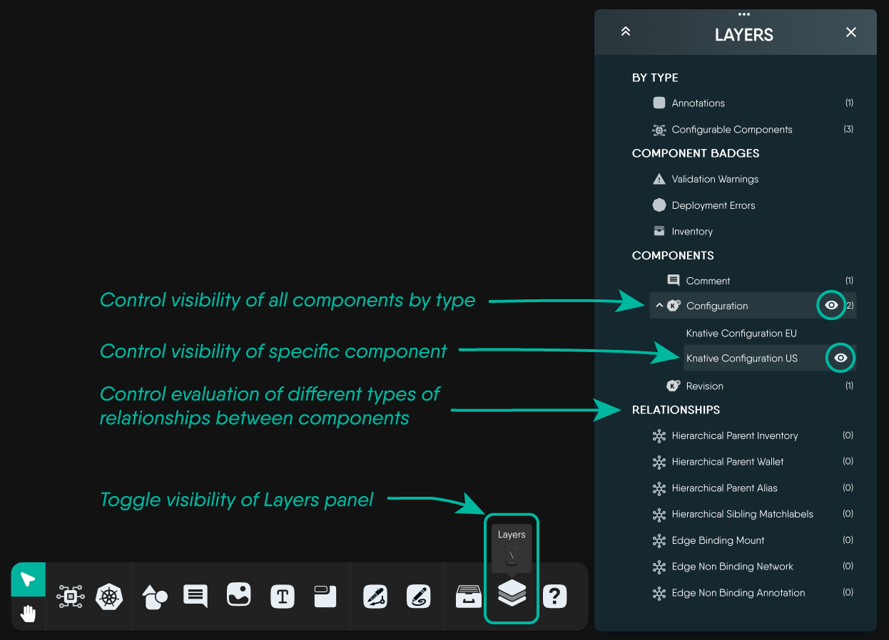

Kanvas is designed to handle a wide range of infrastructure and application configurations. However, there are some performance limits that you should be aware of when working with Kanvas. This guide will help you understand these limits and provide tips for tuning your environment for optimal performance.

## Performance Limits

### Maximum Number of Components

Kanvas has a maximum limit of 1,000 components per design. If you exceed this limit, you may experience performance issues such as slow loading times and laggy interactions. To avoid hitting this limit, consider breaking your design into smaller, more manageable designs.

<!--
#### Maximum Number of Components per Layer
  Needs a follow up -->

<!--
#### Maximum Number of Relationship
  Needs a follow up -->

#### Maximum Number of Annotation-only Components (non-semantically meaningful components)


A non-semantic component is a component that does not represent a meaningful entity in your design. For example, a textbox, a shape, a line, or a comment are all examples of non-semantic components. These components are used for annotation purposes only and do not have a direct relationship to the underlying infrastructure or application that you are modeling.


Kanvas allows up to 1,000 non-semantically meaningful components per design. Some designs have a large number of comments. While comments are a valuable collaboration tool, excessive comments can impact the performance of your design. Consider archiving or deleting old comments to keep your design running smoothly.

#### Maximum Number of Orchestrated Components (semantically meaningful components)


A semantic component is a component that represents a meaningful entity in your design. For example, a server, a database, or a network switch are all examples of semantic components. These components have a direct relationship to the underlying infrastructure or application that you are modeling.


### Maximum Number of Relationships

Kanvas supports up to 1,000 relationships per design. Exceeding this limit can impact the performance of your design, especially when rendering complex designs. To optimize performance, try to minimize the number of relationships in your design.

#### Maximum Number of TagSet Relationships


Tags are indexed and searchable. However, the performance of design operations may degrade as the number of tags increases. To ensure an optimal user experience, we recommend using tags judiciously and limiting the number of tags used in a design.

Upon loading a design exceeds that exceeds 20 tags within a single design, Kanvas will automatically disable grouping by tags. You can manually enable grouping by tags by clicking the "Group Components" button in the Designer dock. For more information, see [Working with Tags](/kanvas/designer/tagsets/).

<!--
#### Maximum Number of Relationships per Component
  Needs a follow up -->

### Maximum Number of Users

Under the Free [subscription plan](https://layer5.io/pricing), Kanvas supports at least 20 users per design. As resources allow, up to 34 users may simultaneously collaborate within a given design. If you have a large team collaborating on a design, be mindful of the number of users active at the same time. Too many users can strain the performance of your design, leading to slower response times and potential data loss. See [Layer5 Cloud Networking Services](/cloud/self-hosted/planning/peer-to-peer-communication) for more details.

### Impact of Images

Be aware that designs are self-contained documents and that all artifacts, like any images (e.g. SVG, PNG, GIF, WEBP, etc.) that are added to your design are embedded into your design document, adding to the overall size of your design file. The embedding of images into your design file ensures portability of your design. You can export your design with the assurity that your images will remain in your design upon (re-)import.

As the number and size of images contained in your design grows, images can significantly increase file size, potentially causing performance issues. With each change made to your design, the entire design file is uploaded to Layer5 Cloud. This same performance consideration applies during collaborative editing sessions with multiple users viewing/editing the same design. Each change to your design made by any user in the collaboration session will be propagated to every other currently collaborating user. If your design contains a large number of images, this can lead to slow performance and increased bandwidth usage.

Under the Free subscription plan, Kanvas support a single image size of up to 500KB of images per design with a total of 10MB per design. If you need to use more images, consider upgrading to a paid [subscription plan](https://layer5.io/pricing).

## Performance Tuning

### Optimize Your Design using the Layers Panel

To improve the performance of your design, consider optimizing by disabling one or more layers.

<figure>
  
  <figcaption>Control which layers of your design are visible using the Layers panel.</figcaption>
</figure>

Some layers specifically offer control of **visibility of components**, while other layers offer control over the **ongoing evaluation of relationships** between components. 

Depending on the type of layer disabled, either specific components or all components by type will display or not be displayed, allowing you to finely tune the performance of you design rendering experience by saving design resources and improving the performance of Kanvas as you adjust both the **number and type** of components in view. 

> Even though you might hide components, those components are not deleted or removed from your design. These components are simply hidden from current view.

In the same way, as you toggle the evaluation of different types of relationships, understand that this releationships between your components still exist. Those relationsihps are simply **temporarily hidding** from view and the overhead of their evaluation eliminated while the respective type of relationship is disabled.

Using the Layers panel you control the level of sophistication or simplicity of the rendering of components and relationships in your designs. You can both simplify your design layout by removing unnecessary elements and improve performance simultaneously. Alternatively, you can increase the level of detail in your design by enabling additional layers and relationships, while controlling the balance between detail and performance.


Hide layers you don't need at the moment to keep your workspace lightweight and responsive.


### Optimize use of Images in your Design

To optimize performance, consider the following:

1. Use vector images (SVG) instead of raster images (PNG, JPG, etc.) as they are typically smaller in size and scale without pixelation.
2. Prioritize using smaller file sizes whenever possible. Use the `webp` image format over `png`, `jpg`, or `gif` as it generally provides significantly better compression, resulting in faster design save times without sacrificing much image quality.
3. Remove any unnecessary images from your design.
4. Use image compression tools to reduce the size of your images before adding them to your design.

## Compound Node Rendering Performance

When working with compound nodes (parent nodes containing multiple child nodes), you may encounter performance challenges as the number of children increases. Understanding these issues and the optimizations available can help you create more responsive designs.

### Root Cause Analysis

The rendering performance of compound nodes with many children can be significantly impacted by several factors:

- **Badge Rendering Plugin Overhead**: The `@layer5/cytoscape-node-html-label` plugin, while powerful for rendering badges and labels, can become a performance bottleneck for compound nodes with many children.
- **Overly Broad Selectors**: The badge selector `node[?label]` matches virtually every node in the graph, causing unnecessary re-renders even for nodes that haven't changed.
- **Missing Viewport Culling**: Badges are rendered for all nodes in the design, even those currently off-screen and not visible to the user, wasting computational resources.
- **Re-render Multiplication**: With 100 child nodes in a compound parent, approximately 303 badge re-renders occur per update cycle.
- **Drag Operation Overhead**: During interactive operations like dragging, the system can generate 18,000-36,000 function calls per second, leading to UI lag and poor user experience.


Large compound nodes (100+ children) can experience significant lag during drag operations and viewport changes without proper optimizations.


### Performance Metrics

The following table illustrates the dramatic performance improvements achieved through optimization:

| Scenario | Before Optimization | After Optimization | Improvement |
|----------|---------------------|-------------------|-------------|
| Badge re-renders per update (100 children) | 303 | ~30 | 90% reduction |
| Function calls/sec during drag | 18,000-36,000 | 500-3,000 | 90-95% reduction |
| Perceived responsiveness | Laggy, choppy | Smooth, responsive | Significantly improved |

### Optimizations Implemented

Kanvas incorporates several key optimizations to address compound node rendering performance:

#### 1. Viewport Culling (50-80% reduction)

Only badges for nodes currently visible in the viewport are rendered. Nodes outside the visible area are skipped, reducing unnecessary computation.


Viewport culling is automatically enabled in Kanvas. No configuration is required to benefit from this optimization.


#### 2. Increased Memoization TTL (70% reduction)

Badge rendering is intelligently cached to avoid redundant computations:

- **Error Badges**: Cache duration increased from 300ms to 1000ms
- **Compound Badges**: Cache duration increased from 200ms to 1000ms

This means that if a node's state hasn't changed, its badge rendering is reused from cache rather than recomputed.

#### 3. Combined Impact (90-95% reduction)

When viewport culling and increased memoization work together, the overall reduction in badge re-renders reaches 90-95%, resulting in a dramatically more responsive user interface even with complex compound nodes.


These optimizations were implemented in PR #3917 and address issues documented in #3916 from the layer5labs/meshery-extensions repository.


## Cytoscape Plugin Performance Considerations

Kanvas leverages multiple Cytoscape.js plugins to provide rich interactive features. Understanding the performance characteristics of these plugins can help you anticipate and mitigate potential performance issues.

### Plugin-Specific Performance Characteristics

#### Compound Drag-and-Drop Plugin

The compound drag-and-drop functionality may experience performance degradation with large graphs. This is a known limitation documented in the plugin's own README. If you're working with designs containing hundreds of nodes, consider:

- Breaking your design into multiple smaller designs
- Using the Layers panel to hide unnecessary components during editing
- Limiting the number of compound nodes with large child counts

#### Event Cascade Issues

Multiple plugins listening to the same Cytoscape events can create a multiplication effect that compounds performance overhead:

- **Grid Guide Plugin**: Listens for drag events to display alignment guides
- **Automove Plugin**: Monitors node movements to maintain relationships
- **Popper Plugin**: Tracks node positions for tooltip positioning

When all these plugins respond to a single drag event, the computational cost multiplies, potentially causing lag during interactive operations.


The impact of event cascades is most noticeable during continuous operations like dragging. The render throttling optimizations described later in this document help mitigate this issue.


#### HTML Plugin Overhead

Earlier versions of Kanvas used DOM-based HTML rendering for interactive elements. Migration to a 2D canvas renderer has provided significant performance improvements for:

- **Resize Handles**: Canvas-based handles render faster and respond more smoothly
- **Overlays**: Canvas overlays avoid DOM manipulation overhead
- **Interactive Controls**: Canvas-based controls reduce browser reflow and repaint operations

#### Bubblesets Optimization

For designs with complex relationship visualizations, the Bubblesets algorithm has been optimized to provide better performance through improved algorithms that reduce computational complexity.


These optimizations were implemented across multiple PRs: #3885, #3887, and #3500 from the layer5labs/meshery-extensions repository.


## State Management and Rendering Optimizations

Efficient state management is critical for maintaining good performance as your designs grow in complexity. Kanvas employs several sophisticated techniques to optimize state updates and rendering.

### Fine-Grained Reactivity

Instead of expensive JSON snapshot computations that process the entire design state, Kanvas uses fine-grained state updates that only affect the specific parts of the design that have changed.

**Benefits:**
- Reduced CPU usage during state updates
- Faster response times for user interactions
- Lower memory consumption
- More predictable performance characteristics


Fine-grained reactivity is built into Kanvas's state management system and requires no configuration.


### Render Throttling

To prevent UI thrashing during continuous operations, Kanvas implements render throttling that locks down re-renders to a maximum of 10 per second during operations like:

- Dragging nodes or groups of nodes
- Resizing components
- Panning and zooming the viewport
- Bulk operations affecting multiple components

This ensures that the UI remains responsive even during intensive operations, preventing the browser from becoming overwhelmed with render requests.

**Target Performance:**
- Maximum re-renders: 10 per second
- Frame time budget: ~100ms per render
- Typical user-perceived lag: Minimal to none

### Selector Optimization

Cytoscape selectors used for sharedState snapshots have been optimized to reduce computational overhead:

- Use specific selectors instead of broad queries when possible
- Cache selector results when appropriate
- Minimize the number of selector evaluations per frame
- Defer non-critical selector operations to idle time

### Evaluation Deferral

Kanvas intelligently skips unnecessary feasibility evaluations for events that don't require validation:

- **Tap Events**: No feasibility check needed for simple selections
- **Double-Click Events**: Validation deferred until action is confirmed
- **Hover Events**: No evaluation unless tooltip or preview is needed

This reduces computational overhead for common user interactions that don't modify the design.


State management optimizations were implemented in PRs #3448, #3595, #3121, and #3114 from the layer5labs/meshery-extensions repository.


## Zoom and Viewport Performance

The zoom level and viewport position significantly impact rendering performance. Kanvas implements several optimizations to ensure smooth performance across all zoom levels.

### Minimum Zoom Viewport

Maintaining a consistent minimum zoom level ensures that detailed rendering works properly across all interactive elements:

- **Layers**: All layers render consistently at minimum zoom
- **Badges**: Error, warning, and info badges remain visible and properly sized
- **Textboxes**: Text remains readable without excessive scaling
- **Interactions**: Interactive handles and controls maintain proper hit targets
- **Device Compatibility**: Consistent experience across desktop, tablet, and mobile devices


Kanvas enforces minimum and maximum zoom limits to ensure optimal rendering performance and usability. Attempting to zoom beyond these limits will have no effect.


### Progressive Detail Rendering

Kanvas implements view filtering based on zoom level to show more or less detail depending on the current viewport:

- **Zoomed Out (Low Detail)**: Show component shapes and primary labels only
- **Medium Zoom**: Add relationship lines and secondary labels
- **Zoomed In (High Detail)**: Show all badges, annotations, and detailed metadata

This approach ensures that rendering resources are focused on visible, meaningful details at each zoom level.

**Performance Benefits:**
- Reduced rendering overhead at low zoom levels
- Faster panning and zooming operations
- Smoother performance with large designs
- Better user experience with progressive disclosure of information

### Zoom Rendering Consistency

Fixes have been implemented to ensure consistent rendering behavior at all zoom levels:

- Badges maintain proper sizing relative to nodes
- Relationship lines scale appropriately
- Interactive handles remain accessible
- Text remains readable without pixelation


Zoom and viewport optimizations were implemented in PRs #3528, #3711, and #2292 from the layer5labs/meshery-extensions repository.


## Performance Testing Guidelines

Regular performance testing helps ensure that your designs remain responsive as they grow in complexity. Use these guidelines to validate performance characteristics.

### Test Scenarios

Validate performance across a range of design complexities:

1. **Baseline Scenario**: 1 parent + 10 children
   - Expected behavior: Smooth, lag-free interactions
   - Use case: Small component groups, basic hierarchies

2. **Medium Complexity**: 1 parent + 50 children
   - Expected behavior: Responsive with minor delays acceptable
   - Use case: Moderate-sized microservice architectures, namespace groups

3. **Large/Complex**: 1 parent + 100 children
   - Expected behavior: Acceptable performance with optimizations
   - Use case: Large namespaces, complex service meshes, cluster visualizations

4. **Stress Test**: 3 levels of nesting
   - Expected behavior: Functional but may experience some lag
   - Use case: Deeply nested organizational structures, multi-tier architectures


Start with the baseline scenario and progressively increase complexity. This helps identify the specific point where performance begins to degrade.


### Target Metrics

Aim for the following performance targets when testing:

#### Frame Rate During Drag Operations
- **Target**: 60 FPS (frames per second)
- **Acceptable Threshold**: 30 FPS
- **Below Threshold**: Indicates performance issues requiring optimization

#### Time to First Badge Render
- **Target**: < 100ms
- **Measurement**: Time from design load to all visible badges rendered
- **Impact**: Affects perceived load time and user experience

#### Badge Re-renders Per Drag Operation
- **Target**: < 1,000 re-renders
- **Measurement**: Total badge rendering calls during a single drag operation
- **Impact**: Directly affects drag smoothness and responsiveness

### Monitoring Performance

To monitor performance during testing:

1. **Browser DevTools**: Use the Performance tab to record and analyze interactions
2. **Frame Rate**: Monitor FPS during drag operations
3. **CPU Usage**: Watch for excessive CPU spikes during interactions
4. **Memory Usage**: Check for memory leaks during extended sessions


Performance can vary significantly across browsers. Test in your primary target browsers (Chrome, Firefox, Safari) to ensure consistent experience.


## Long-term Architecture Recommendations

While current optimizations provide significant performance improvements, several architectural enhancements could provide even greater benefits in future versions of Kanvas.

### Canvas-Based Badge Rendering

Migrating from DOM-based badge rendering to canvas-based rendering could provide 10-100x performance improvement:

**Current Approach (DOM-based):**
- Each badge is an HTML element
- Browser must manage layout, styles, and reflows
- Limited by DOM manipulation performance

**Proposed Approach (Canvas-based):**
- Badges rendered directly to canvas
- No DOM manipulation overhead
- Batch rendering operations
- Better control over rendering pipeline

**Expected Benefits:**
- 10-100x faster badge rendering
- Reduced memory footprint
- Smoother animations and transitions
- Better scaling for large designs

### Virtual Badge Manager

A virtual badge manager would only render badges currently visible in the viewport:

**Implementation Strategy:**
- Track viewport bounds
- Maintain a spatial index of badge positions
- Render only badges intersecting with viewport
- Update dynamically as viewport changes

**Expected Benefits:**
- Constant rendering time regardless of total badge count
- Seamless handling of designs with thousands of nodes
- Reduced GPU memory usage
- Improved scrolling and panning performance

### Web Worker Rendering

Offloading computationally intensive operations to background threads (Web Workers) could prevent UI blocking:

**Candidate Operations:**
- Badge layout calculations
- Relationship path computations
- Validation and feasibility checks
- Complex selector evaluations

**Expected Benefits:**
- UI thread remains responsive during heavy computations
- Better multi-core CPU utilization
- Smoother user experience during intensive operations
- Reduced perceived lag


Web Worker rendering requires careful coordination between threads and may introduce complexity in state management.


### Progressive Rendering Strategy

Implement a priority-based rendering system that renders critical elements first:

**Rendering Priority Levels:**
1. **Critical (Immediate)**: Error badges, validation warnings
2. **High (< 50ms)**: Info badges, relationship indicators
3. **Medium (< 200ms)**: Annotations, secondary labels
4. **Low (Idle Time)**: Decorative elements, optional metadata

**Expected Benefits:**
- Faster time to interactive
- Critical information always visible
- Better perceived performance
- Graceful degradation under load


Progressive rendering ensures users see the most important information first, even if the design hasn't fully loaded.


## Performance-Related URL Parameters

Kanvas supports several URL parameters that can impact rendering performance and behavior. Understanding these parameters helps you optimize the loading and rendering of your designs.

### Full Render Mode

The `render=full` URL parameter enables comprehensive rendering of all design elements, including advanced relationships:

**Usage:**
```
https://cloud.layer5.io/kanvas/designer?design=<design-id>&render=full
```

**What It Includes:**
- All component relationships
- TagSet relationships and groupings
- Advanced semantic relationships
- Complete metadata rendering
- All badges and indicators

**Performance Implications:**
- Increased initial load time
- Higher memory usage
- More computational overhead during updates
- May impact performance on large designs (100+ components)


For designs with hundreds of components or complex TagSet relationships, full render mode may cause noticeable performance impact. Consider using standard render mode and selectively enabling layers as needed.


### Additional Parameters

For complete documentation on all available URL parameters and their effects, see [URL Parameters](/kanvas/advanced/url-parameters/).


URL parameters can be combined to customize your Kanvas experience. Experiment with different combinations to find the optimal balance between features and performance for your specific use case.

