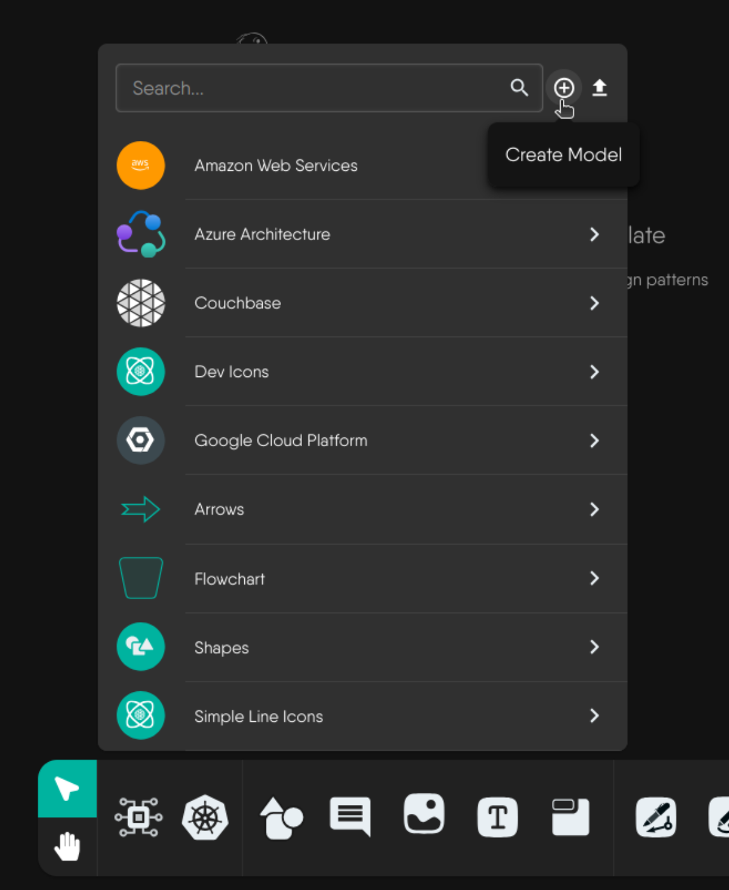
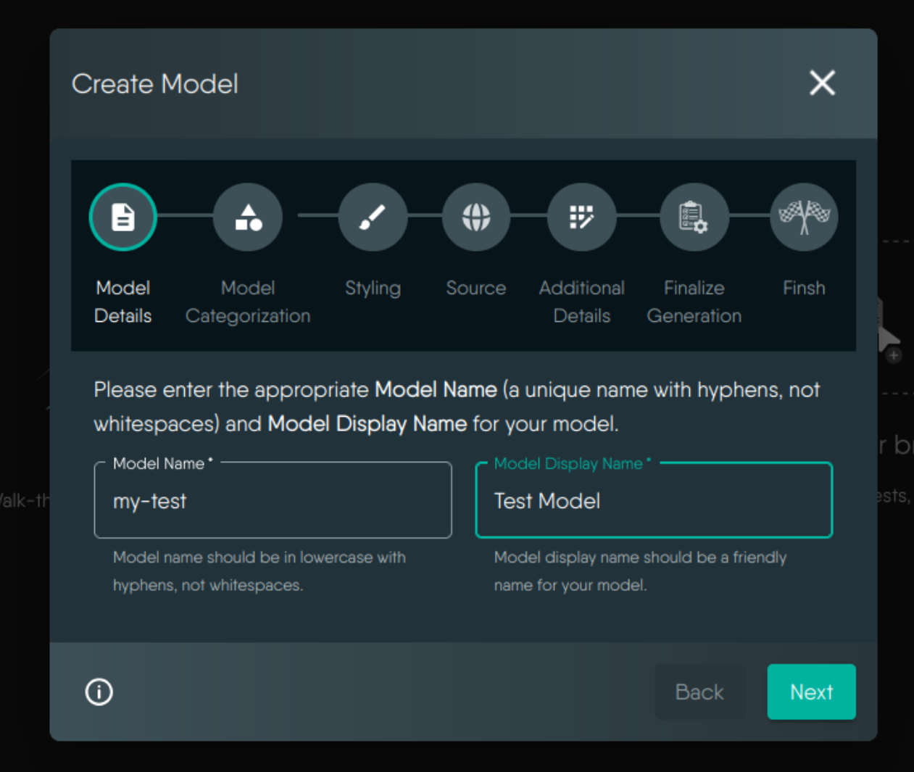
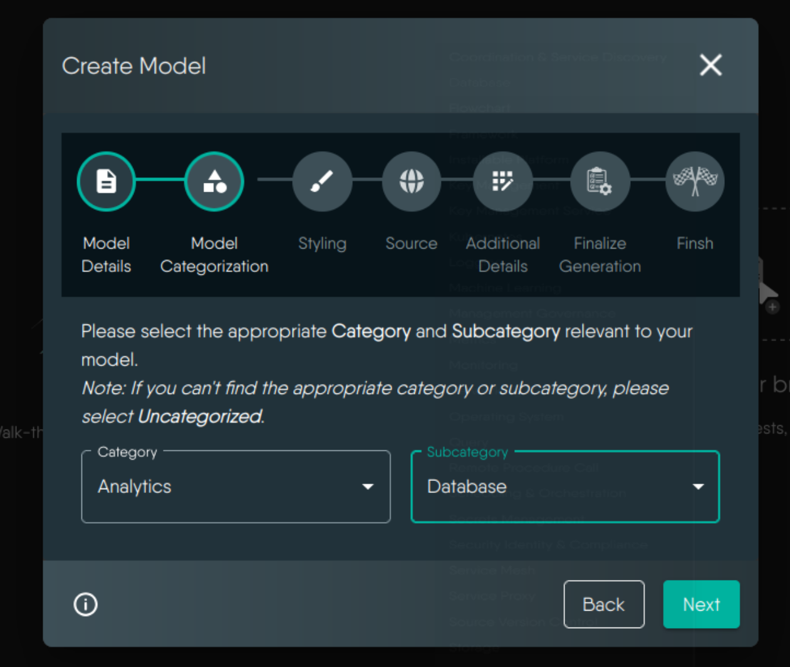
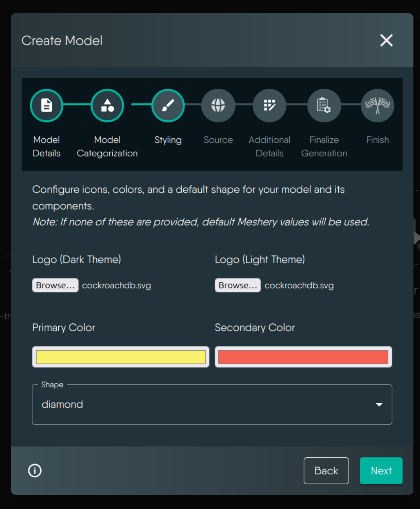
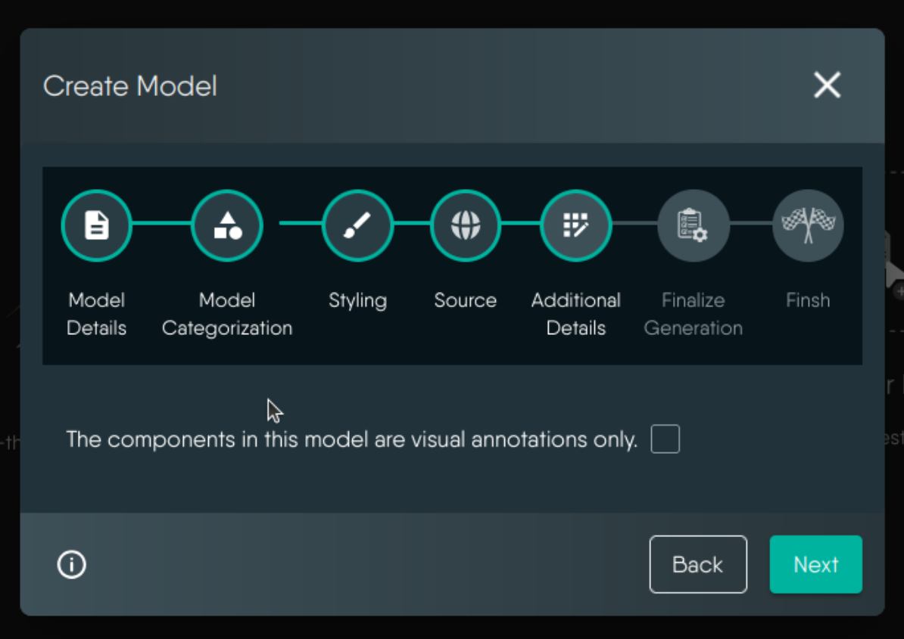
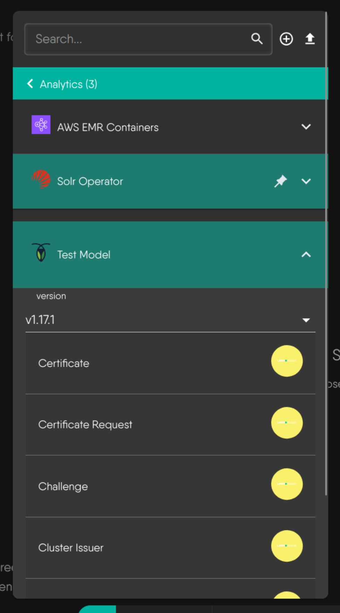
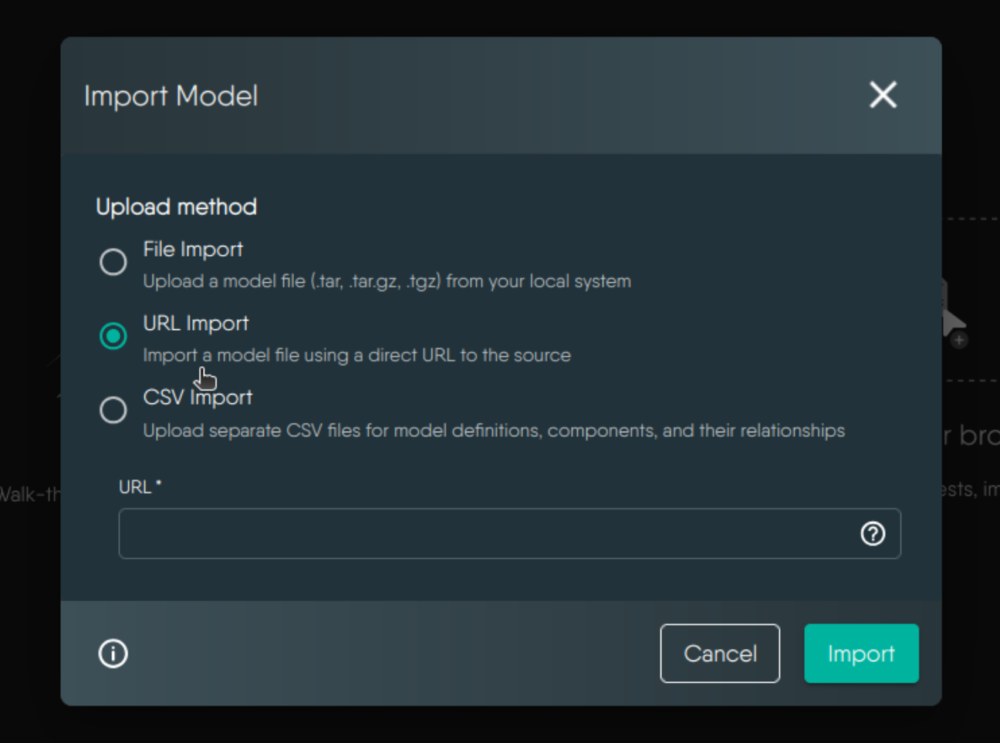
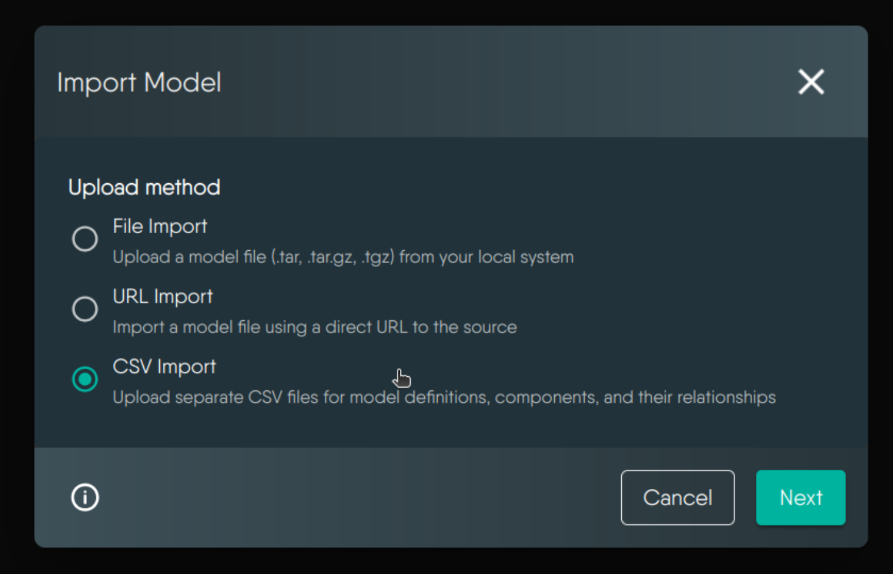
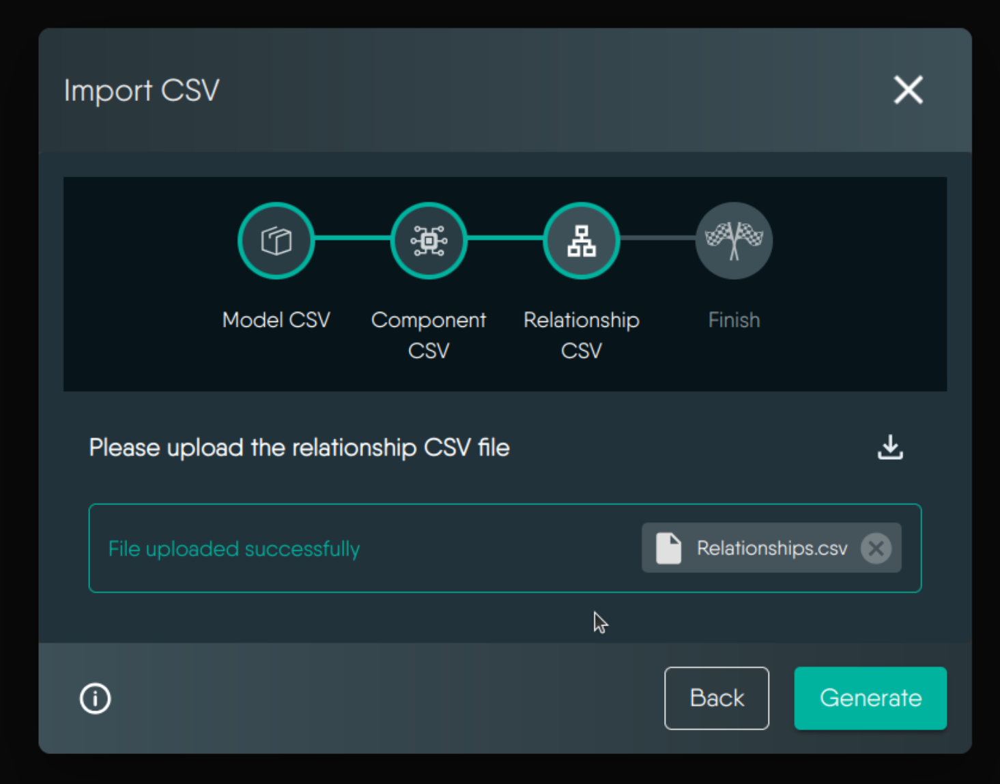
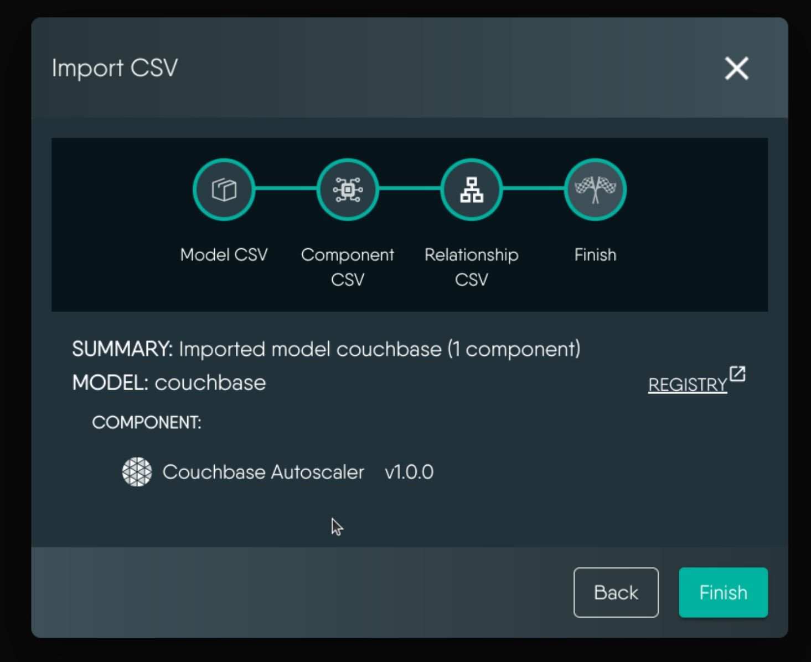

## Overview

Meshery Models are a way to represent the architecture of a system or application. Models are defined in JSON and can be used to visualize the components and relationships between them. This guide will walk you through the process of creating a new model.

Meshery Components are the building blocks of a model. Each component represents a different part of the system or application. Components can be anything from a database to a microservice to a server. Relationships define how components interact with each other. For example, a database component might have a relationship with a microservice component that represents the microservice’s dependency on the database.

## Creating your first Meshery Model

The following instructions are a no-fluff guide to creating your own Meshery Models quickly.

The create model wizard allows you to generate models in Meshery by providing URLs to source repositories or package registries. Here's how to use it:

#### 1. Access the Model Generation Interface

Navigate to Kanvas [Designer](https://playground.meshery.io/extension/meshmap) mode. From bottom dock click on shape or component tab. Click the **Create Model** icon to begin creating a new model.

#### 2. Configure Model Details

Enter the required information for your model:

- **Model Name:** Should be in lowercase with hyphens. For example, cert-manager.
- **Display Name:** How you want your model to be named. For example, Cert Manager.

    

#### 3. Set Model Categorization

Choose appropriate category and subcategory for your model from the dropdown menus. If your model doesn't fit existing categories, select **Uncategorized**. This helps organize models in the registry and makes them easier to find.

#### 4. Configure Model Styling

Customize your model's appearance:

- Upload logos for both dark and light themes
- Set primary and secondary colors for visual elements
- Select a shape for the model's icon in the UI

Note: If you don't provide custom styling, Meshery's default values will be used. You can change these later in the model definition.

  

#### 5. Provide Source Location

You can provide either a GitHub repository URL or an ArtifactHub package URL as your source:

- **For GitHub repositories:**
  Enter a URL in the format: `git://github.com/[organization or username]/[repository]/[branch]/path/to/crds`.
  For example: `git://github.com/cert-manager/cert-manager/master/deploy/crds`

- **For ArtifactHub packages:**
  Enter a URL in the format: `https://artifacthub.io/packages/search?ts_query_web={model-name}`

    

  **Pro tip:** Check the `sourceURL` column in the [Meshery Integration Sheet](https://docs.google.com/spreadsheets/d/1DZHnzxYWOlJ69Oguz4LkRVTFM79kC2tuvdwizOJmeMw) and try one of the listed sources.

#### 6. Additional Settings

In this step you can specify if the model is for visual annotation only

> **Visual Annotation Models**
>
> When a model is marked for visual annotation only, it means the model will be used purely for visualization and diagramming purposes within Meshery's interface, rather than for actual infrastructure management.

#### 7. Finalize and Generate

Now in this step you can verify all the model details you provided. If everything looks good, you can click the **Generate** button and it will start generating your model. During generation, Meshery will process the source information and create the appropriate model components. If you want to make any changes before generation, you can go back to the previous steps using the navigation buttons and edit the details as needed.

#### 8. Model Generation Status

Once the model generation is complete, you will see a success message indicating that your model has been successfully generated. You can also view all of the components and relationships that were created during the generation process.

#### 9. Accessing the Generated Model

After the model generation is complete, you can access the generated model in the Kanvas Designer from the shape or component picker. The generated model will be available within given category and subcategory you selected earlier or you can search for it using the search bar. You can drag and drop the model onto the kanvas to start using it in your designs.

## Importing a Model

There are several ways to import a model into Meshery. You can import a model from a file, a URL, or CSV files. To import a model, click on the **Import Model** button in the Kanvas Designer. You can find the import models button located next to the create model icon button in the bottom dock of the Kanvas Designer interface.

### Importing a Model from a File:

Select a local file to import. Supported formats include `.tar`, `.tar.gz`, and `.tgz`. For more details on the file structure you can export our existing models from registry.

1.  Select the **File Import** option.

    

2.  Click on **File Browser** button to select a local file.
3.  Click the **Import** button to import the model.
4.  New generated model will be appear in either shape or component picker.

### Importing a Model from a URL:

Enter the URL of the model you want to import. A direct URL to a single model file, for example: https://raw.githubusercontent.com/your-model-file.tar. Supported formats include `.tar`, `.tar.gz`, and `.tgz`.

1.  Select the **URL Import** option.

      

2.  Enter the URL of the model you want to import.
3.  Click the **Import** button to import the model.
4.  New generated model will be appear in either shape or component picker.

### Importing a Model from CSV:

Upload separate CSV files for model definitions, components, and their relationships.

The CSV Import feature allows you to generate models in Meshery by providing template CSV files that define your model structure, components, and relationships. Here's a comprehensive guide on how to use this feature:

1. Select the **Import from CSV** option.
   
2. **Prepare your CSV files:** You'll need three essential CSV files to define your model. You can download the template CSV files from the download icon in the top right corner of model. Each file serves a specific purpose:

   - **Model CSV:** Defines your model's core metadata, including name, version, and general properties.
   - **Components CSV:** Describes the individual components that make up your model.
   - **Relationships CSV:** Specifies how different components interact and connect with each other.

   **Pro tip:** Look at existing models in the [Meshery Integration Sheet](https://docs.google.com/spreadsheets/d/1DZHnzxYWOlJ69Oguz4LkRVTFM79kC2tuvdwizOJmeMw) to understand how to structure your CSV files effectively.

    

3. Upload Models, Components, and Relationships CSV:

   - Click the **Choose File** button to select your respective CSV files from your local machine.
   - Ensure that you upload the Model CSV first, followed by the Components CSV, and finally the Relationships CSV.

    

4. Click the **Generate** button to generate your model based on the provided CSV files.

5. Once the model generation is complete, you will see a success message indicating that your model has been successfully generated. You can also view all of the components and relationships that were created during the generation process.

   

6. After the model generation is complete, you can access the generated model in the Kanvas Designer from the shape or component picker. The generated model will be available within the given category and subcategory you selected earlier or you can search for it using the search bar. You can drag and drop the model onto the kanvas to start using it in your designs.

**Congratulations! You have successfully created a new model.**

### Contributing a Model Definition

1. Fork the [meshery/meshery.io](https://github.com/meshery/meshery.io) repository.
2. Create a new branch in your fork of the meshery/meshery.io repository.
3. Add your model definition to the `collections/_models` directory.
4. Create a pull request to the meshery/meshery.io repository.
5. Once your pull request is merged, your model will be available in the next Meshery release.
