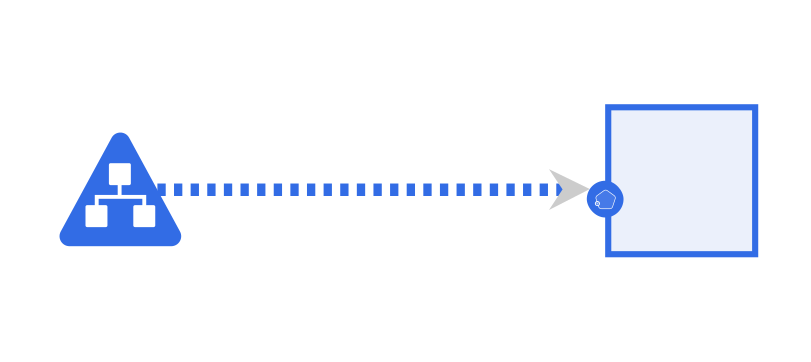
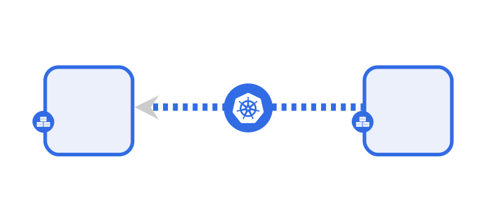
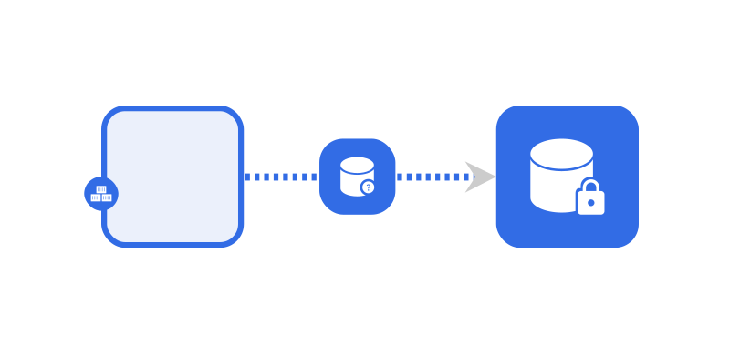
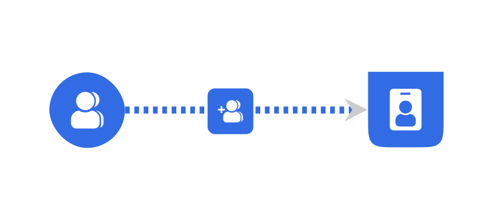
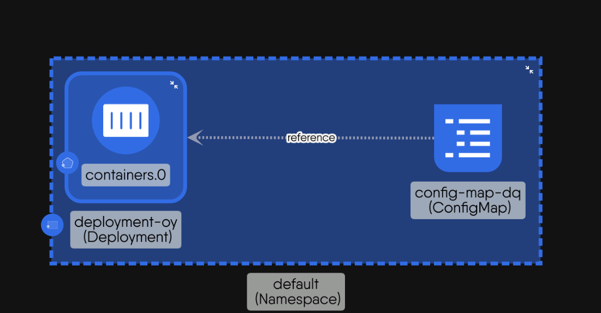
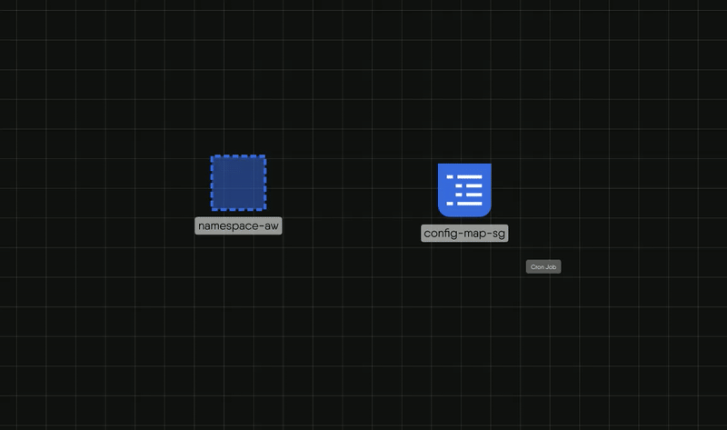
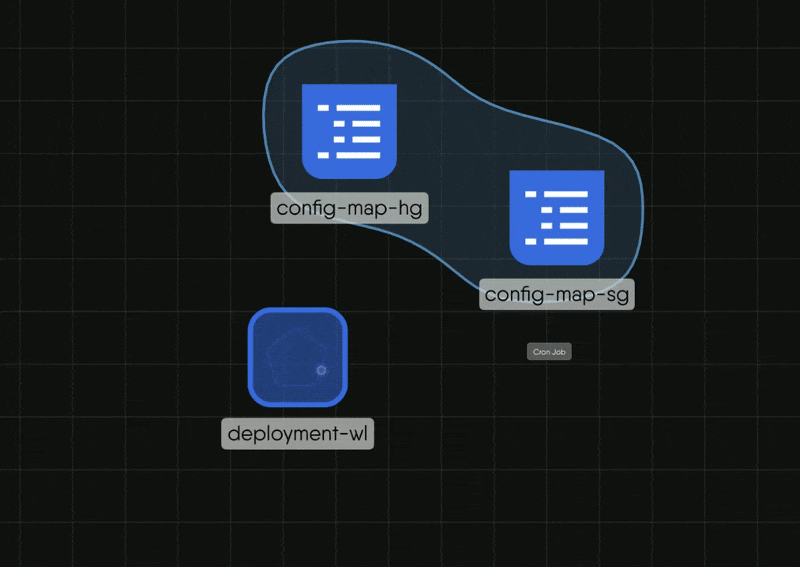
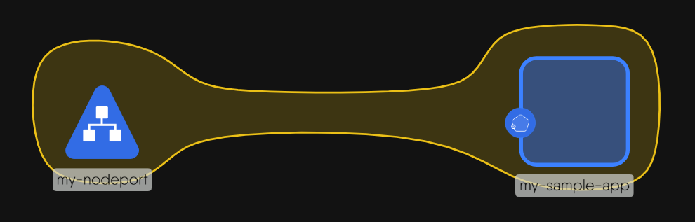

## What are Relationships?

Relationships define the nature of interaction between interconnected components in Kanvas. They represent various types of connections and dependencies between components no matter the genealogy of the relationship such as parent, siblings, binding.

## Types of Relationships

Relationships are categorized into different kinds, types, and subtypes, so that can be expressive of the specific manner in which one or more components relate to one another.

Here is a list of the different types of relationships that Kanvas supports:

### 1. Edge Relationships

Edge relationships indicate the possibility of traffic flow between two components. They enable communication and interaction between different Components within the system. There are 4 subtypes of the edge relationship.

**i. Edge-Network:**

The Edge-Network relationship type configures the networking between one or more components. This deals with IP addresses and DNS names and provides stable endpoints for communication. For instance, a “Service” provides a stable endpoint for accessing multiple replicas of a “Deployment”. Here's a visual representation of this kind of relationship.

  

**ii. Edge-Firewall**

This acts as intermediary for communications which include standard networking protocols like TCP and UDP. It can enforce network policies to control traffic between components, for example between two Pods.

   

**iii. Edge-Mount**

   This subtype addresses the storage and access possibility between involved components. For example, a “PersistentVolume” can be mounted to a “Pod” to provide persistent storage for the pod’s data.

   

**iv. Edge-Permission**

   This defines the permissions for components if they can have a possible relationship with other components. It ensures that only authorized components can interact with each other. For example, a “Role” can define permissions for Components to access specific resources.

   


**v. Edge-Reference**

The **Edge-Reference** relationship type represents a **logical or declarative link** between two components, where one component **refers to another by name, identifier, type, or scope**. This relationship allows components to dynamically locate, associate with, or depend on other components without being tightly coupled to them. It forms the basis for indirect communication, configuration reuse, ownership tracking, and dependency resolution in distributed systems.

This type of relationship does **not directly provide communication, access, or permission**, but **enables such interactions by declaring intent or pointing to another component**.


**Example of an Edge-Reference Relationship**

* A component that refers to a configuration object (e.g., referencing a config file or environment settings).
* A workload component referencing a credentials object or identity provider.
* A service referencing a volume or storage claim.
* A managed resource referencing its controller or owner entity.

**Kubernetes-Based Example**

```yaml
apiVersion: v1
kind: Pod
metadata:
  name: example-pod
spec:
  containers:
    - name: app
      image: nginx
      envFrom:
        - configMapRef:
            name: app-config  # <- Reference to configuration object
  volumes:
    - name: secret-volume
      secret:
        secretName: app-secret  # <- Reference to secret
```


   

### 2. Hierarchical Relationships

Hierarchical relationships involve either an ancestral connection of the components (i.e. the creation/deletion of a component higher up affects the existence of the components below in the lineage) or a connection which involves the inheritence of features from one component to the other. There are 2 subtypes of the hierarchical relationship.

**i. Hierarchical-Parent-Inventory**

  This is a relationship between components where the configuration settings of one component, known as the parent, are combined or integrated with the configuration settings of another component, known as the child. This implies that changes or updates made to the parent component can affect or influence the configuration of the child component. Here's an example of a Hierarchical-Inventory relationship

   

**ii. Hierarchical-Parent-Wallet**

 This is a relationship between components where one component is directly attached to a host component, acting as an integrated inventory item. This implies a reverse configuration dependency: the configuration settings of the parent component are mutated or updated to synchronize with the attached child component. For example, attaching a sidecar container or a WebAssembly (WASM) filter to a workload will automatically modify the host workload's configuration to include the new item. On the canvas, these attached items are visualized as a numeric design inventory badge on the parent component rather than as standalone shapes. Here's an example of a Hierarchical-Parent-wallet relationship

   

### 3. TagSets Relationships

These represent relationships between components of same Labels or Annotations key/value pairs. Labels and Annotations are two different types of Tags. Labels are often used to identify components and are visible on the design canvas. Annotations are often used to provide additional information about components.


