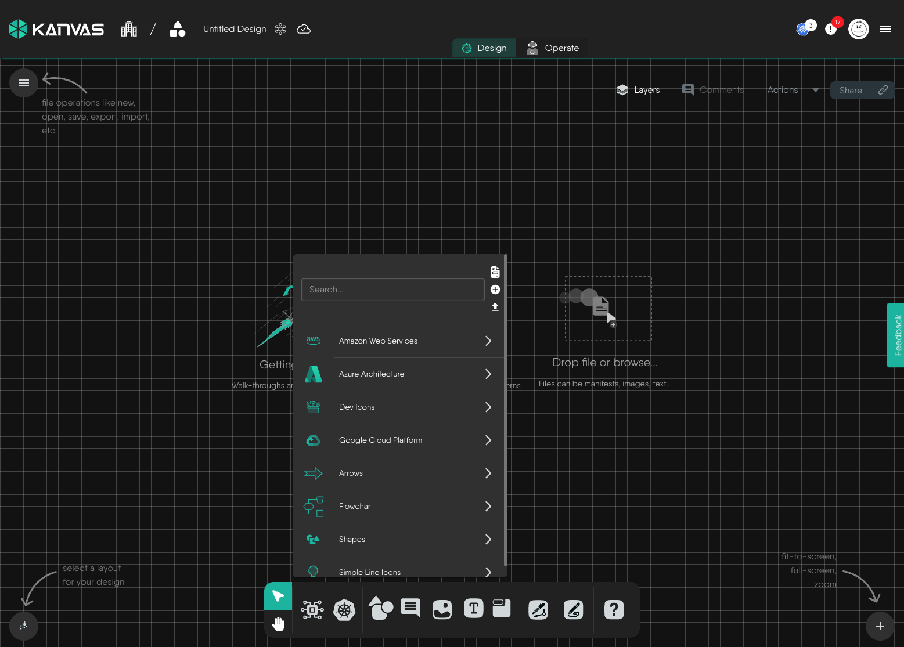
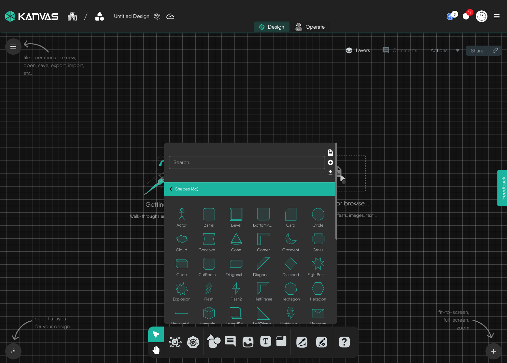
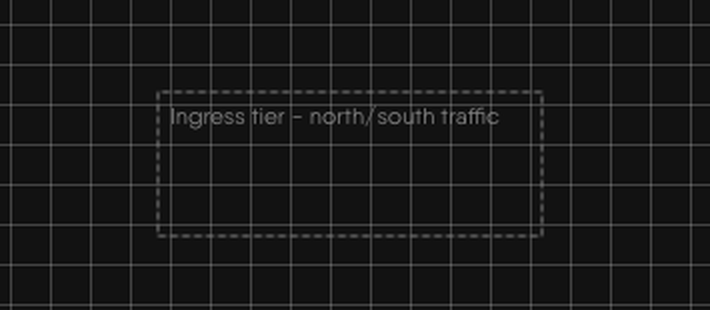

<!-- set of custom keyboard button classes -->
<link rel="stylesheet" href="https://unpkg.com/keyboard-css@1.2.4/dist/css/main.min.css" />

Everything you place on a Kanvas Designer canvas is an object, and every object answers to the same
small set of gestures. You add it, you style it, you copy or clone it, you lock it so nobody nudges
it, you resize it, and eventually you delete it. That is true whether the object is an Amazon EKS
cluster, a dashed **section** drawn around a group of services, a **textbox** holding a caption, or
a plain **shape** used as a legend key.

This page documents those gestures once and calls out the places where a particular kind of object
behaves differently. If you are looking for the freestyle pen and pencil tools instead, see
[Whiteboarding]().

## The four kinds of canvas object {#canvas-objects}

| Object | What it is | Where it comes from |
| --- | --- | --- |
| **Component** | A real piece of infrastructure under management - a Deployment, an S3 bucket, a Lambda function. Components carry configuration and can be deployed. | The components and Kubernetes tools in the dock, or an import. |
| **Shape** | A purely visual primitive - circle, hexagon, arrow, flowchart symbol, cloud-provider glyph. Shapes carry no configuration and are never deployed. | The shapes tool in the dock. |
| **Section** | A labeled, dashed rectangle used to fence off a region of the canvas. Other objects dropped inside a section become its children and move with it. | The section tool in the dock, or <button class="kbc-button kbc-button-xs">S</button>. |
| **Textbox** | A resizable box whose content is text. Used for titles, callouts and annotations that are not tied to a single component. | The textbox tool in the dock, or <button class="kbc-button kbc-button-xs">T</button>. |

Shapes, sections and textboxes are **annotations**, and Kanvas keeps them distinct from the
infrastructure in a design. They carry no configuration to deploy, they are left out of the
design's component count, and the Layers panel can hide or reveal all of them as one group.
Annotating a design therefore carries no risk to the infrastructure that design describes.

## Adding objects to the canvas {#adding-objects}

### Adding shapes {#adding-shapes}

Open the shapes tool in the dock. Kanvas presents its shape libraries: **Amazon Web Services**,
**Azure Architecture**, **Dev Icons**, **Google Cloud Platform**, **Arrows**, **Flowchart**,
**Shapes** and **Simple Line Icons**. Search across all of them from the box at the top, or drill
into one library at a time.

<figure>
  
  <figcaption>The shapes tool lists every shape library available to your design</figcaption>
</figure>

Drill into a library to browse its contents. The built-in **Shapes** library alone carries 66
primitives - Actor, Barrel, Bevel, Card, Circle, Cloud, Cone, Corner, Crescent, Cross, Cube,
Diamond, Explosion, Flash, HalfFrame, Heptagon, Hexagon and more.

<figure>
  
  <figcaption>The built-in Shapes library, expanded</figcaption>
</figure>

Drag a shape from the picker onto the canvas to place it where you want it. If you find yourself
reaching for the same library repeatedly, pin it to the dock - see
[Pinning a Model to the Dock]().

### Adding sections {#adding-sections}

Drag the section tool from the dock onto the canvas, or press
<button class="kbc-button kbc-button-xs">S</button> to drop a section near the center of the canvas.

A new section arrives as an 80-pixel-tall rectangle with a dashed border, a transparent fill and a
label rendered along its top edge rather than through its middle - so the region it encloses stays
readable. Drag other objects into it and they become children of the section: move the section and
they move with it.

### Adding textboxes {#adding-textboxes}

Drag the textbox tool from the dock onto the canvas, or press
<button class="kbc-button kbc-button-xs">T</button>. The keyboard route places the textbox near the
center of the canvas and puts the cursor straight into it, so you can start typing immediately.

A new textbox arrives 60 pixels tall with a dashed gray border and a transparent fill, and its text
sits at the top left of the box. To edit the text of an existing textbox - or of any shape, since
shapes accept body text too - double-click it.

<figure>
  
  <figcaption>A textbox carrying a caption, with its dashed border and transparent fill</figcaption>
</figure>

## Selecting and acting on objects {#object-menu}

Context-click (right-click) any object to open its menu. The menu is the same for shapes, sections,
textboxes and components; entries that do not apply to the object under the cursor are simply not
shown.

| Action | Keyboard | What it does |
| --- | --- | --- |
| Copy | <button class="kbc-button kbc-button-xs">Ctrl/⌘</button> + <button class="kbc-button kbc-button-xs">C</button> | Puts the object on your system clipboard |
| Duplicate | <button class="kbc-button kbc-button-xs">Ctrl/⌘</button> + <button class="kbc-button kbc-button-xs">D</button> | Clones the object into the same design |
| Lock / Unlock | - | Pins the object's position, or releases it |
| Delete | <button class="kbc-button kbc-button-xs">Delete</button> or <button class="kbc-button kbc-button-xs">Backspace</button> | Removes the object from the design |
| Reset styles | - | Restores the object's styling to its model's defaults |

<figure>
  
  <figcaption>The circular context menu, open on a selected object</figcaption>
</figure>

Every one of these acts on your whole selection, not just the object under the cursor. To build a
selection first, hold <button class="kbc-button kbc-button-xs">Shift</button> or
<button class="kbc-button kbc-button-xs">Ctrl/⌘</button> and drag a selection box across the
canvas; <button class="kbc-button kbc-button-xs">Ctrl/⌘</button> + <button class="kbc-button kbc-button-xs">A</button>
selects everything. All of these actions are undoable with
<button class="kbc-button kbc-button-xs">Ctrl/⌘</button> + <button class="kbc-button kbc-button-xs">Z</button>.

### Copying {#copying}

Copy writes the selected objects to your system clipboard, so you can paste them with
<button class="kbc-button kbc-button-xs">Ctrl/⌘</button> + <button class="kbc-button kbc-button-xs">V</button>
into the same design, into a different design, or into a different browser tab running Kanvas.
Pasted objects land at your cursor.

Copy carries the object's styling with it. A shape you have recolored, re-bordered and captioned
arrives in the target design looking exactly as it did in the source.

### Cloning {#cloning}

Duplicate - "clone" in the permission model - skips the clipboard and drops a copy straight into
the current design, offset 50 pixels right and 50 pixels down from the original so the two do not
sit on top of each other. The clone gets fresh identifiers; relationships drawn *between* members
of the cloned selection are cloned along with it, so duplicating a section and its children
reproduces the whole arrangement intact.

Use Duplicate when you want another one *here*, and Copy when you want one *somewhere else*.

### Locking and unlocking {#locking}

Locking an object fixes its position on the canvas. A locked object can still be selected,
inspected, styled and deleted - what it cannot do is move, whether you drag it directly or drag a
selection box across it. Unlock it from the same menu to release it.

Lock state is stored on the object and saved with the design, so it survives a reload and is
visible to your collaborators. It is the cheapest way to protect a finished layout from an
accidental nudge during a review.


Locking a section fixes the section itself; the objects inside it stay free to move. Lock a section
once your regions are settled and you can rearrange components inside them without ever knocking a
boundary out of alignment.


### Deleting {#deleting}

Delete removes the selected objects from the design. Pressing
<button class="kbc-button kbc-button-xs">Delete</button> or
<button class="kbc-button kbc-button-xs">Backspace</button> does the same thing to whatever is
currently selected.

Deleting a section deletes the section itself, not the objects inside it. If you want the contents
gone too, select them along with the section before you delete.

## Configuring styles {#configuring-styles}

Select any object and Kanvas floats a style toolbar above it. The toolbar is where every visual
property of the object lives:

- **Shape** - swap the object's outline for any of the primitives in the shape switcher.
- **Background** - fill color from the editor palette, plus an opacity slider from 0 to 1.
- **Border** - color, thickness (0-25) and style: solid, dotted, dashed or double.
- **Layer order** - push the object forward or back through the stack.
- **Name** - the label drawn with the object.
- **Link** - an external URL the object points at.
- **Image** - a background image, supplied by URL.
- **Text** - font size, weight, color, decoration, and horizontal and vertical alignment for the
  object's body text.
- **Animation** - none, blink, ripple, bounce or pulse.

With more than one object selected, a change made in the toolbar applies to **every** object in the
selection. That is the fastest way to bring a whole region of a design onto one palette.

### Per-object differences {#style-differences}

The toolbar adapts to what the object can actually do, so the controls you see depend on what you
have selected.

| | Shapes | Sections | Textboxes |
| --- | --- | --- | --- |
| Shape, background, border, layer order, name, link, image, animation | Yes | Yes | Yes |
| Text styling | Yes | **No** | Yes |
| Accepts other objects as children | Yes | Yes | Yes |
| Default appearance | Solid 1px border, 10% fill opacity | Dashed 1px border, transparent fill, label on the top edge | Dashed 1px gray border, transparent fill |

Sections deliberately carry no body text: a section is a frame, and its identity is the label along
its top edge. If you want prose inside a region, put a textbox in it.


Restyling an object changes only how it is drawn. It does not touch a component's configuration and
it does not change what gets deployed. To edit a component's configuration, use the configuration
panel - see [Working with Components](https://docs.layer5.io/kanvas/getting-started/working-with-components/).


## Resetting styles {#resetting-styles}

**Reset styles**, in the object's context menu, re-applies the styling recorded in the object's
model definition - shape, colors, border, dimensions, background image and text styling - throwing
away every change you made in the style toolbar.

Reset works from the definition, not from an edit history, so it is not an undo: it returns the
object to the way that kind of object looks when it is first placed, no matter how many rounds of
styling it has been through. The object's position, its lock state, its configuration and its
relationships are untouched.

This is the fast way out of a styling experiment that went wrong, and the fast way to bring one
object back into line with the rest of a design.

## Resizing {#resizing}

Select a single object and Kanvas draws a bounding box with eight handles around it - one at each
corner and one at the midpoint of each edge.

- Drag a **corner** handle to resize in both axes at once.
- Drag an **edge** handle to resize in one axis only.
- Hold <button class="kbc-button kbc-button-xs">Shift</button> while dragging to preserve the
  object's aspect ratio.

The new dimensions are stored on the object and saved with the design. Empty sections and textboxes
are resized exactly the same way - grow a textbox to fit a longer caption, or a section before you
start filling it.


The handles appear on objects that do not contain other objects. Once a section - or any shape - has
objects nested inside it, Kanvas treats it as a container and stops offering the handles; size it
before you fill it, or move the contents out, resize, and move them back.


## Permission reference {#permission-reference}

Each gesture on this page is governed by its own permission in Layer5 Cloud. Organization
administrators grant them through keychains and roles; see
[Keychains](https://docs.layer5.io/cloud/security/keychains/) and
[Roles](https://docs.layer5.io/cloud/security/roles/). Where a permission is withheld, the
corresponding control simply does not appear on the canvas.

| Permission | What it grants | Documented in |
| --- | --- | --- |
| Add shapes | Place shapes from any shape library onto the canvas | [Adding shapes](#adding-shapes) |
| Copy shapes | Copy a shape to the clipboard for pasting elsewhere | [Copying](#copying) |
| Clone shapes | Duplicate a shape into the same design | [Cloning](#cloning) |
| Lock shapes | Fix and release a shape's position | [Locking and unlocking](#locking) |
| Delete shapes | Remove a shape from the design | [Deleting](#deleting) |
| Configure shape styles | Change a shape's outline, colors, border, layers, image, text and animation | [Configuring styles](#configuring-styles) |
| Reset shape styles | Restore a shape to its model's default styling | [Resetting styles](#resetting-styles) |
| Add sections | Place sections onto the canvas | [Adding sections](#adding-sections) |
| Copy sections | Copy a section to the clipboard for pasting elsewhere | [Copying](#copying) |
| Clone sections | Duplicate a section into the same design | [Cloning](#cloning) |
| Lock sections | Fix and release a section's position | [Locking and unlocking](#locking) |
| Delete sections | Remove a section from the design (its contents are kept) | [Deleting](#deleting) |
| Configure section styles | Change a section's outline, colors, border, layers, image and animation | [Configuring styles](#configuring-styles) |
| Reset section styles | Restore a section to its model's default styling | [Resetting styles](#resetting-styles) |
| Add textboxes | Place textboxes onto the canvas | [Adding textboxes](#adding-textboxes) |
| Copy textboxes | Copy a textbox to the clipboard for pasting elsewhere | [Copying](#copying) |
| Clone textboxes | Duplicate a textbox into the same design | [Cloning](#cloning) |
| Lock textboxes | Fix and release a textbox's position | [Locking and unlocking](#locking) |
| Delete textboxes | Remove a textbox from the design | [Deleting](#deleting) |
| Configure textbox styles | Change a textbox's outline, colors, border, layers, image, text and animation | [Configuring styles](#configuring-styles) |
| Reset textbox styles | Restore a textbox to its model's default styling | [Resetting styles](#resetting-styles) |
| Reset component styles | Restore a component to its model's default styling | [Resetting styles](#resetting-styles) |
| Resize components | Change a component's width and height with the resize handles | [Resizing](#resizing) |

## Related reading

- [Whiteboarding]() - the pen and pencil tools, and line styling.
- [Understanding Tool Modes]() - selection, pan and connector modes.
- [Keyboard Shortcuts]() - the full shortcut reference.
- [Working with Components]() - configuring the components you place.
- [Reviewing Designs]() - comments, which are annotations with their own lifecycle.
