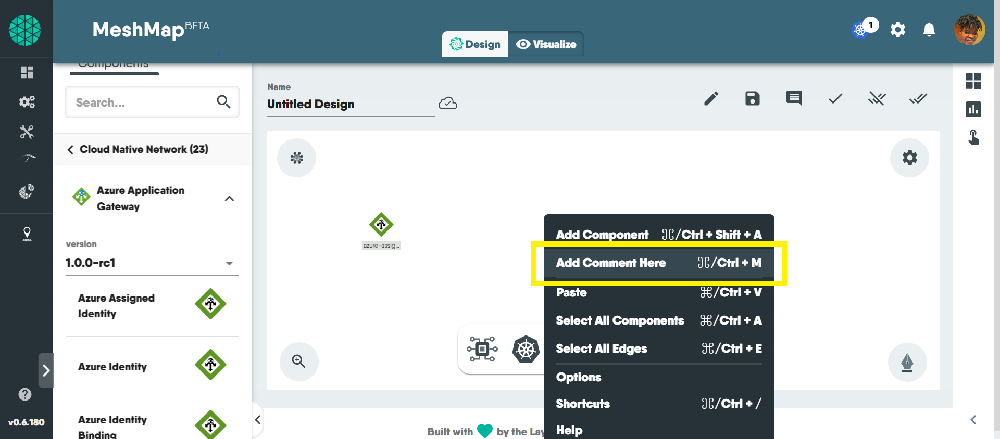
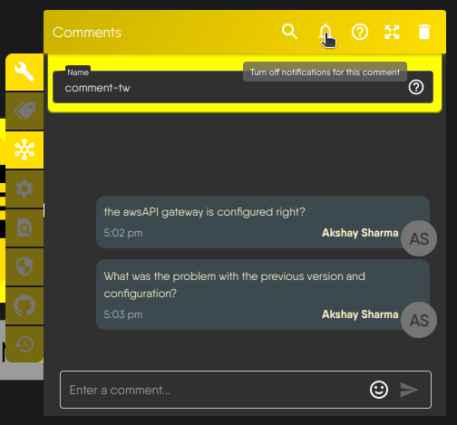

## Overview

Kanvas's Designer offers enables you to place comments "inline" with your infrastructure as code. Use comments to offer feedback to team members, take detailed design notes, capture helpful tips for your team members, and include justification as to your infrastructure and application configuration decisions. Pay it forward to your future self by leaving comments for reference later.

## Three Ways to Add Comments

You can add comments in three convenient ways:

### Commenting via the Activity Toolbar

Click on the comment icon in the toolbar to open a comment instantly. This is your go-to method for quick annotations without leaving your canvas.

### Commenting via Context-Click in Canvas

Right-click on any area of your canvas, and from the contextual menu, select "Comment" or use the shortcut ***Ctrl + M (Command + M for Mac users)***. This allows for swift comment placement right where you need it.

### Commenting via drag-and-drop from the Dock

   To access comment from whiteboarding doc make sure your whiteboarding feature is enabled, select comment tool from doc and drop it anywhere on canvas to comment.

## Tips for using Comments as a Design Review Tool

### Initiate Threads

You can initiate a comment thread by just adding a comment. Your comment may be a request for design review or feedback on a design. Team members can reply directly to comments to for a comment thread. This creates a structured dialogue around each point of feedback for easy referencing.

### Utilize Mentions

Easily draw the attention of relevant team members by tagging them in your comment. To activate this, type @ in the comment box and a list of your team members will appear then you can select who you want to mention. This ensures that the right people are notified and can contribute to the discussion.

### Comment on Specific Elements

Leave comments on specific elements within the design, whether it's a shape, text, or an entire component. This specificity ensures that feedback is targeted and directly related to the part of the design under discussion.
  
### Avoid Dangling Threads / Resolving Comment

Once revisions are complete, you can resolve the comment. This action closes the comment thread and signifies that the conversation around that feedback has concluded.

### View Comment History

After resolving a comment thread, you can access the comment history to review previous discussions and decisions.

### Enable Email Notifications

Customize your [notification preferences](https://docs.layer5.io/cloud/identity/users/notification-preferences) to receive emails for comments on your design. When this is enabled, you'll be notified when comments are made on your design, you're mentioned in a comment, or someone adds a comment to a thread you've previously engaged with.

### Unresolving Comments

After a comment has been resolved, there might be situations where you need to reopen the discussion. Unresolving a comment allows you to reinitiate conversations, address additional concerns, or make further changes. Follow the steps below to unresolve a comment:

### Mute Comment Notifications

Customize your notification preferences to mute email notifications for comments on your design. With notifications for new comments silenced, you won't receive email notifications for new comments on your design. This can be useful if you want to temporarily pause notifications or reduce email clutter.

**What Muting Affects:**

  -  *Muted Design's Comment Thread:* This includes all subsequent replies within the same thread, whether directed at you or not.
  -  *Your Mentions:* You won't receive email alerts when someone mentions you in the muted design's comment thread.

**What Muting Doesn't Affect:**

  -  *Mentions in Other Designs:* You'll still be notified if someone mentions you in new or existing comment threads on other designs in your portfolio.
  -  *New Comment Threads:* Muting only applies to the specific comment thread it's activated on. New threads on the same design will trigger notifications as usual.


- While email alerts are muted, you can still access and view all comments on the design at any time.
- You'll never miss an important mention, as notifications for mentions outside the muted thread remain active.


## Best Practices for Effective Design Reviews

### Be specific and actionable

Provide specific feedback rather that the design can act on. Vague comments can lead to misunderstandings and delays in the design process. Support your feedback with examples or references. This can help clarify your point and provide the designer with tangible suggestions for improvement.

### Balance positive and contructive feedback

Frame feedback in a constructive manner, focusing on how things can be improved rather than just pointing out flaws. Acknowledge what works well in the design before delving into areas that need improvement. This helps maintain a positive and collaborative atmosphere.

### Regularly check and respond to comments

Stay engaged in the review process. Regularly check and respond to comments to keep the conversation alive and ensure a smooth workflow.

### Prioritize feedback

Highlight the most critical feedback first. This ensures that the designer focuses on the most important aspects for improvement.


- The 'Comment' feature is currently in its beta phase, and we may introduce updates or improvements over time.
- Your feedback is invaluable! If you encounter any issues or have suggestions for enhancement, please take a moment to provide feedback.

