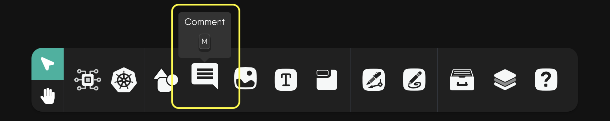
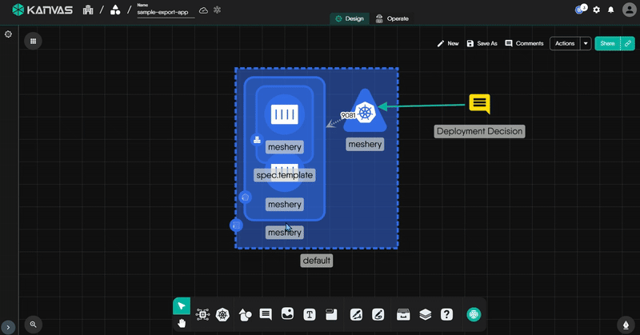
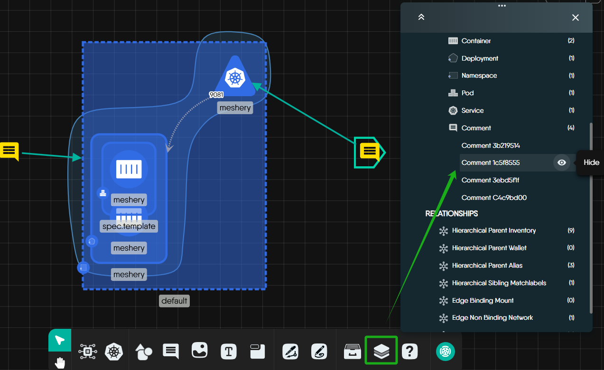
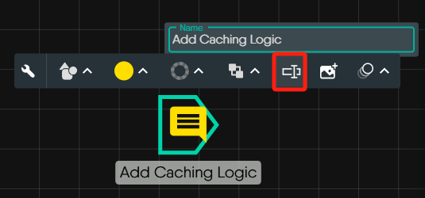
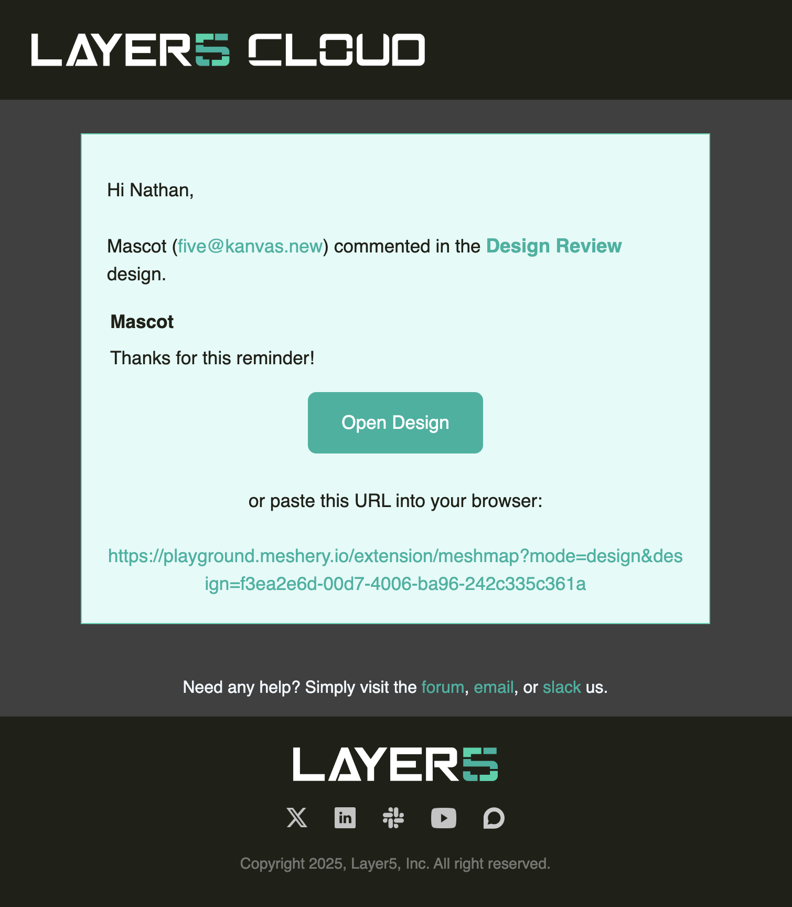
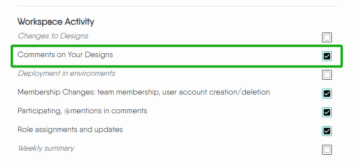
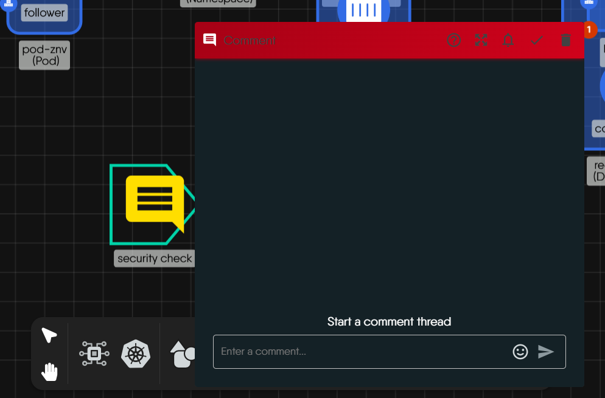
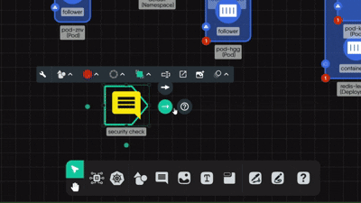
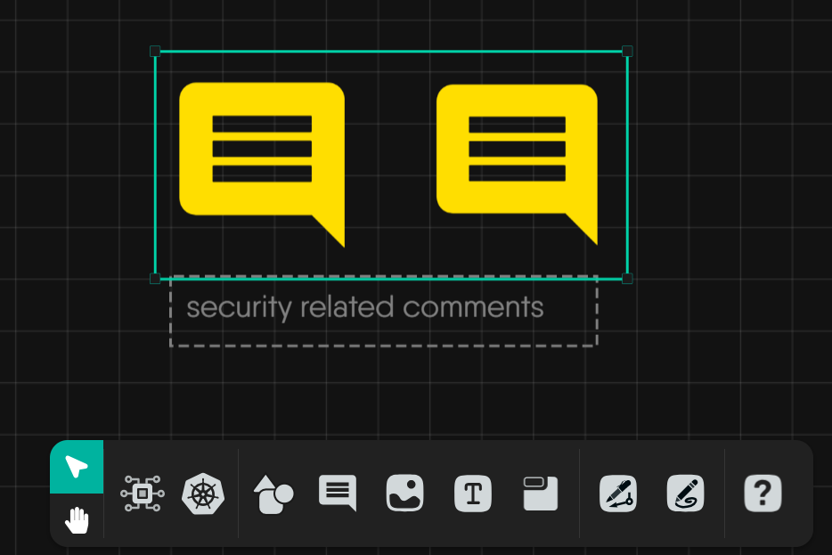

Kanvas's Designer enables you to place comments "inline" with your infrastructure as code. Use comments to offer feedback to team members, take detailed design notes, capture helpful tips for your team members, and include justification as to your infrastructure and application configuration decisions. Pay it forward to your future self by leaving historical record for reference later.

<figure>
  
  <figcaption>Example of comments in Designer</figcaption>
</figure>

Your comment may be a request for design review, to offer feedback to peers, or to simply record notes.

## Commenting on a Design

You can add comments in a number of convenient ways. Since designs are public by default, you can add comments to your designs without having to share them first. This is particularly useful for gathering feedback from team members or stakeholders before finalizing the design.

### Commenting via the Dock

1. Click on the comment icon in the toolbar to open a comment instantly. This is your go-to method for quick annotations without leaving your design or first identifying where you want to place your comment.
2. You can also create a comment by dragging and dropping the comment icon from the Dock to your design. This method allows you to place comments directly on specific elements or areas of your design.

<figure>

  <figcaption>Create a comment from the Dock</figcaption>
</figure>

### Commenting via context-click

Context-click on any area of your design, and from the contextual menu, select "Add a Comment". Using this context-click method allows for inline placement of your remarks right where you need them - _in context_.

<figure>

  <figcaption>Comment by context-clicking on your design</figcaption>
</figure>

### Commenting via hotkey

<button class="kbc-button kbc-button-xs">M</button> Add a comment into your design when you press "M" as the hotkey. After pressing the hotkey, a new comment will be displayed. You can move the new comment anywhere in your design.

## Design review using comments

<figure>
  
  <figcaption>Peer review using comments in Designer</figcaption>
</figure>

### Conversations in Comment Threads

Any number of users can participate in a single comment. When more than one user makes a remark in the same comment, a comment thread ensues.

You can initiate a comment thread by adding a remark to an existing comment. Collaborators can reply directly to comments in real-time (approximating a chat). Comment threads create a structured dialogue around each point of feedback for easy reference.

### Utilize Mentions

Easily draw the attention of relevant team members by tagging them in your comment. To activate this, type @ in the comment box and a list of your team members will appear then you can select who you want to mention. This ensures that the right people are notified and can contribute to the discussion.

### Comment on Specific Elements

Leave comments on specific elements within the design, whether it's a shape, text, or an entire component. This specificity ensures that feedback is targeted and directly related to the part of the design under discussion.

### Resolving a Comment

Resolving a comment thread indicates that the conversation on that topic has concluded. When a comment is resolved, the comment component is removed from view on the canvas.

As a practice, resolving comments can help expedite issue resolution on a particular topic. The action of resolving a comment is like a "soft delete" in that Kanvas designs retain history of each comment made and discussions within.

This retained history is kept as an archived copy of the comment within your design document. You can access this comment history to review previous discussions and decisions. A best practice is to resolve comments rather than delete them, specifically for the benefit of having a historical reference of prior notes, discussions, and decisions.

You can also reopen comments.

### View Comment History

<figure>
  
  <figcaption>View comment history</figcaption>
</figure>

Manage your comment history by clicking on the "View Comment History" button. This allows you to revisit past discussions and decisions, ensuring that important context is never lost.

### Duplicating / Copying Comments

Kanvas supports two ways to reuse comments: **Duplicate** and **Copy**. Both create a new comment based on the original, but they serve different use cases.

#### When to duplicate a comment?

Design reviews often involve evolving threads or multiple subtopics. Duplicate is ideal when:

- **Preserving Valuable Context**  
  Long threads may include resolved and unresolved content. Duplicating preserves ongoing relevance while letting you resolve the original.

- **Managing Multiple Action Items**  
  Break down one thread into focused, actionable items. This improves clarity and prevents blockers from holding up the discussion.

#### When to copy a comment?

**Copy** is helpful when you need flexibility to place the comment somewhere else—either within the same design or across different designs.  
This method supports:

- **Manual Placement**: Paste the copied comment exactly where you need it.
- **Bulk Operations**: Copy multiple selected comments at once using mouse drag.



Copying a comment into another design does **not** change the target design’s sharing settings:

- Participants from the original thread may not have access
- Notifications may still be sent, but users might not be able to view or respond

Learn more about [sharing settings](/kanvas/designer/sharing).



#### How to Copy or Duplicate

- **Right-click and Copy**: Choose **Copy** to manually paste it later.

  <figure>
    
    <figcaption>Copy a comment</figcaption>
  </figure>

- **Right-click and Duplicate**: Use **Duplicate** to instantly create a copy in the same design.

- **Keyboard Shortcuts**:
  - <button class="kbc-button kbc-button-xs">Ctrl + C</button> / <button class="kbc-button kbc-button-xs">Ctrl + V</button>: Copy and paste
  - <button class="kbc-button kbc-button-xs">Ctrl + Z</button>: Undo the action


Click and drag the left mouse button to select multiple comments and copy them together.


#### Naming Matters

Kanvas auto-generates comment names, useful for quick feedback. When duplicating or copying for tracking or history, **rename the copy** to reduce confusion and aid navigation.

#### What Happens When You Duplicate or Copy a Comment?

- **Timestamp**: The original creation time is preserved.
- **Threads**: All replies in the original thread are included.
- **Name**: If the comment has a name, the clone keeps the same name.
- **Placement**:
  - **Duplicate**: Instantly places the comment in the same design.
  - **Copy**: Allows you to paste the comment manually into the same or a different design.
- **Notifications**: Neither duplicating nor copying sends a creation notification to the design owner or participants. However, replies to the cloned comment will notify participants unless they’ve muted the thread.
- **Independence**: The clone is separate—editing or deleting the original does not affect the copy.

### Hide Comments Using the Layers Panel

You can temporarily hide or reveal open comments using the Layers panel—just like toggling layers in Photoshop.  
This helps you focus on the most important parts of your design and improves clarity during reviews.

<figure>
  
  <figcaption>Hide comments using the Layers panel</figcaption>
</figure>


Want to improve the performance of your workspace? [Learn more about using the Layers panel](https://docs.layer5.io/kanvas/advanced/performance/#optimize-your-design-using-the-layers-panel).


### Name Comments for Easy Access

If you plan to keep certain comments in your design for documentation, team reference, or historical context, it's a good idea to give them meaningful names. This simple habit improves clarity for both you and your team—especially when reviewing or revisiting designs later.

<figure>
  
    <figcaption>Naming a comment in Designer</figcaption>
</figure>


Give long-lived comments short, descriptive names like `"Needs Load Balancer"` or `"Review DNS settings"`  
so you can quickly find them in the Layers panel later on.


### Reopen a Resolved Comment

If a comment is resolved by mistake, it can be reopened. Adding a new comment to a resolved discussion will also re-open the thread. Reopening a comment allows you to reinitiate conversations, address additional concerns, or make further changes.

Follow the steps below to reopen a comment:

<figure>

  <figcaption>Unresolving comments in designer</figcaption>
</figure>

## Managing Comment Notifications

Each time that a new comment is made in a design, remark placed into existing comment, a comment is resolved or reopened, you and your collaborators might receive notification via email.

<figure>

  <figcaption>Example email notification received when design comment is made.</figcaption>
</figure>

As the owner of a design, you will recieve notification each time a comment is made in your design. Tag other users and have them receive notificaiton of your comment by mentioning their username with the `@` symbol.

All users participating in a comment will be notified as new remarks are added in a comment thread.

As new comments are added into the your design, collaborators (other users) with which you have shared the design, will not receive notification unless they are tagged in that comment.

### Enable Email Notifications

Customize your [notification preferences](/cloud/identity/users/notification-preferences) to receive emails for comments on your design. When this is enabled, you'll be notified when comments are made on your design, you're mentioned in a comment, or someone adds a comment to a thread you've previously engaged with.

### Muting Comment Notifications

Customize your notification preferences to mute email notifications for comments on your design. With notifications for new comments silenced, you won't receive email notifications for new comments on your design. This can be useful if you want to temporarily pause notifications or reduce email clutter.

<figure>
  
  <figcaption>Example of comments in Designer</figcaption>
</figure>

You can also manage all your comment notification settings centrally through the **Cloud -> Account -> [Preference](https://docs.layer5.io/cloud/identity/users/notification-preferences/)**.

<figure>
  
  <figcaption>Manage all comment notifications centrally in the Cloud</figcaption>
</figure>

#### What Muting Affects

- **Muted Comment Thread:** This includes all subsequent replies within the same thread, whether directed at you or not.
- **Your Mentions:** You won't receive email alerts when someone mentions you in the muted design's comment thread.

#### What Muting Doesn't Affect

- **Mentions in Other Designs:** You'll still be notified if someone mentions you in new or existing comment threads on other designs in your portfolio.
- **New Comment Threads:** Muting only applies to the specific comment thread it's activated on. New threads on the same design will trigger notifications as usual.



- While email alerts are muted, you can still access and view all comments on the design at any time.
- You'll never miss an important mention, as notifications for mentions outside the muted thread remain active.
  


Kanvas does not track the read or unread status of messages inside comment threads for each user. If a user is mentioned, but misses the notification, they might not become aware of the comment until they receive a new notification for another comment in that conversation.


## Best Practices for Effective Design Reviews

### Using Comment Features Effectively

To make your reviews more structured, Kanvas offers a number of tools inside the comment system itself. Use them to streamline collaboration and clarify your feedback.

#### Use Color-Coded Comments

<figure>
  
  <figcaption>Use color to visually categorize your comments</figcaption>
</figure>

- 🔴 **Security** concerns
- 🔵 **Scalability** or performance-related notes
- 🟢 **UI/UX** feedback
- 🟡 **Open questions** or suggestions

This makes it easy for team members to scan and prioritize feedback based on type.

#### Use Annotation Arrows 

Link your comment to a specific part of the design using **annotation arrows**. This reduces ambiguity and ensures the context of your comment is crystal clear.

Follow the steps about how to annotate the comment:

<figure>

  <figcaption>Annotating a comment</figcaption>
</figure>

#### Lock Important Comments

Lock comments in place to keep them visible even as you continue working. This is helpful for feedback that should remain persistent throughout the review cycle.

#### Group Related Comments

Bundle multiple related comments using the **Group** feature. This keeps threads organized and easier to track, especially for complex designs with many parts.

<figure>

  <figcaption>Two related comments Grouped</figcaption>
</figure>

### Resolving vs deleting comments

Resolving a comment hides it from the canvas but keeps its history, so you can always revisit or reopen it later. Deleting a comment removes it entirely — including all threads and history — and cannot be undone.

### Be specific and actionable

Provide specific feedback that the designer can act on. Vague comments can lead to misunderstandings and delays in the design process. Support your feedback with examples or references. This can help clarify your point and provide the designer with tangible suggestions for improvement.

### Balance positive and contructive feedback

Frame feedback in a constructive manner, focusing on how things can be improved rather than just pointing out flaws. Acknowledge what works well in the design before delving into areas that need improvement. This helps maintain a positive and collaborative atmosphere.

### Regularly check and respond to comments

Stay engaged in the review process. Regularly check and respond to comments to keep the conversation alive and ensure a smooth workflow.

### Prioritize feedback

Highlight the most critical feedback first. This ensures that the designer focuses on the most important aspects for improvement.

<!-- ## FAQs

**What if two people act at the same time?**

If someone resolves a comment while you're still typing in it, the comment will immediately close for both of you. You'll see a message letting you know that the thread was resolved.
 -->
