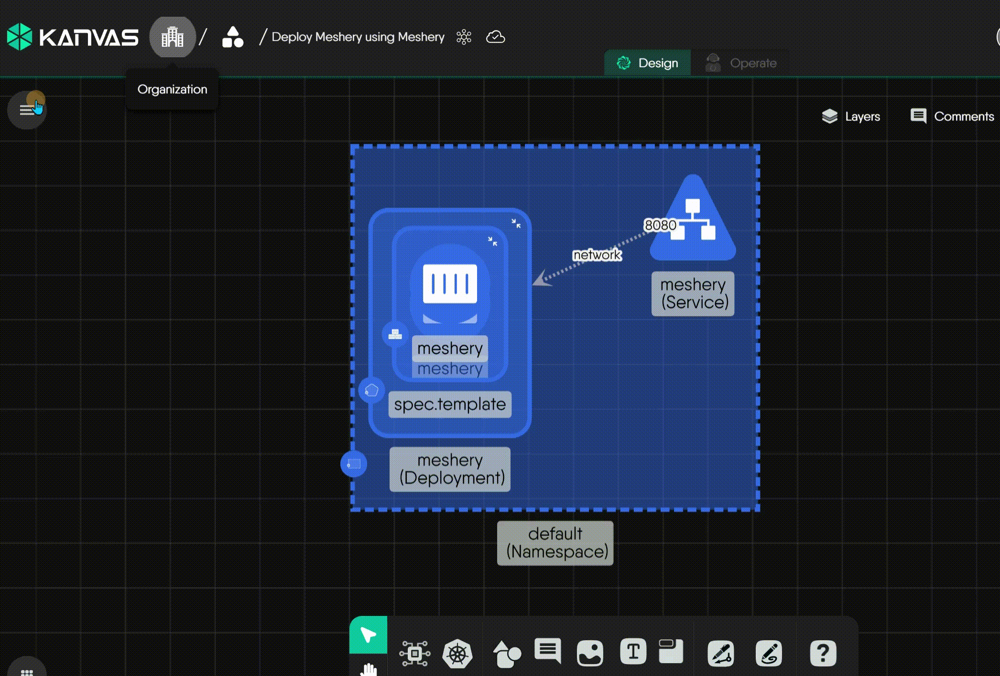

# Meshery Design Embedding
Meshery Design Embedding enables you to export a design in a format that can be seamlessly integrated into websites, blogs, or platforms supporting HTML, CSS, and JavaScript. This embedded version provides an interactive representation of the design, making it easier to share with infrastructure stakeholders.

## Embedding Your Design

To embed your Kanvas design, follow these steps:

1. **Access Embed Option**: Within the Kanvas Designer, select the design you wish to embed in the design drawer. Click on the export icon in the menu for the selected design. The export modal will appear, click on the "Embed" option.

   

2. **Download the Embedding Script**: Click on the download icon presented in the same modal to download the embedding script.

## Embedding in Static Sites

   The embed code for static site:

   ```html
   <div id="embedded-design-embedding-example"></div>
   <script src="./embedded-design-embedding-example.js" type="module"></script>
   ```

   Make sure the `src` attribute in the script tag points to the location of the downloaded embedding script on your local filesystem or server.

### Customization

You can customize the styles for the embedded design by targeting CSS classes exposed or by adding inline styles. The following class can be overridden:

- `embed-design-container`: for the embedding container
- `cy-container`: for the canvas

If you have multiple embeddings on a page, you can target them all using the classes or specific ones using the div's ID in the shortcode.

Here is a customization example:

```html
<style>
  .embed-design-container {
    width: 100%;
    border-radius: 1rem;
    margin: 1rem;
    overflow: hidden;
    margin-inline: auto;
    height: 35rem;
  }
  .embed-canvas-container {
    background-color: gray;
  }
</style>
```

## Embedding in React Projects

1. **Install the Package**: To integrate the Meshery Design into your React project, start by installing the package via npm:
```bash
  npm i meshery-design-embed
```
2. **Incorporate the Component**: Use the component to seamlessly embed designs within React and its associated frameworks.

```jsx
import MesheryDesignEmbed from '@layer5/meshery-design-embed'


function Design() {
  return (
    <>

      <div>
        <MesheryDesignEmbed
          embedScriptSrc="embedded-design-embed1.js"  // path to the embed script
          embedId="embedded-design-a3d3f26e-4366-44e6-b211-1ba4e1a3e644" // id of the embedding
        />
      </div>
    </>
  );
}
```

Make sure the `embedScriptSrc` attribute in the component points to the location of the downloaded embedding script on your react filesystem.
Usually the script is located "static" folder


### Embedding with Hugo

To prepare your Hugo site to support design embedding, perform the one-time task of adding the following shortcode definition to your site's set of supported shortcodes.

__Shortcode Definition__

```html

{{ $script := .Get "src" }}
{{ $id := .Get "id" }}
{{ $style := .Get "style" }}

<div
    id="{{ $id }}"
    {{ if $style }}
        style="{{ $style }}"
    {{ else }}
        style="height: 30rem; width: 100%; border: 1px solid #eee"
    {{ end }}
></div>

<script src="{{ $script }}" type="module"></script>
```

#### Shortcode Explaination

`src`: Specify the path to the exported JavaScript file.
`id`: Provide a unique ID for the embedded design.
`style`: (Optional) Customize the appearance of the embedded design with CSS styles. This allows you to control the height, width, border, and other visual aspects.

Now that your site has shortcode support for embedding Kanvas designs, you're ready to use the shortcode in any Hugo markdown file where you want embedded the designs to be visible to your site visitors. 

#### Shortcode Usage

Following the steps to export a design will generate a JavaScript file, containing your design. Add the Javascript file to your site and embed the design by using your new shortcode. In the following example, we use an exported design, "embedded-design-dapr.js". 

Use the shortcode in your Hugo content files as shown:

```html

```

This code snippet demonstrates how to embed a design named "embedded-design-dapr.js" with a specific ID. This will render an interactive diagram of a Dapr (Distributed Application Runtime) setup within your Hugo-based website. 

#### Embedded Design Example

Finally, render your designs in your pages. When Hugo builds your website, it will process this shortcode and generate the necessary HTML and JavaScript to embed the interactive Kanvas design. After finishing the steps, the embedded design will be rendered like in the example below.

<!-- Design Embed Container  -->




