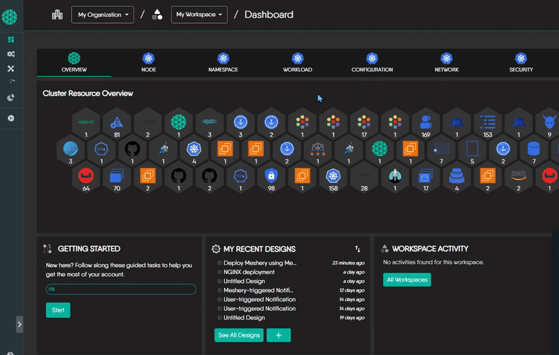

Kanvas let's you export a design in several formats, so you can:

* keep versioned backups  
* collaborate offline  
* push artifacts to OCI-compatible registries or Helm repositories  
* integrate designs into CI/CD or GitOps pipelines  
* embed interactive diagrams in documentation and blogs  

## Export in Two Steps

1. Open the export menu 
   Within the [Kanvas Designer](https://playground.meshery.io/extension/meshmap), select the design you wish to export in the design drawer. Click on the export icon in the menu for the selected design. 
2. Pick an export format 
   Choose the option that matches your workflow (see table below).

## Quick Reference: Export Formats

| Format                          | Keeps full design metadata? | Typical uses                                       |
|---------------------------------|-----------------------------|----------------------------------------------------|
| Meshery Design (YAML)           | ✔                           | Backups, sharing, re-import into Kanvas           |
| Meshery Design (OCI image)      | ✔                           | Store in Docker Hub/GHCR; registry-based versioning|
| Kubernetes Manifest (YAML)      | ✖ (lossy)                   | `kubectl apply`; raw K8s deployment                |
| Helm Chart (.tar.gz)            | ✖ (lossy)                   | Helm repos, GitOps (Argo CD/Flux), Artifact Hub    |
| Embed Design (JS snippet)       | -                           | Interactive diagrams in docs or dashboards         |

## Detailed Format Guide

### Meshery Design (YAML)

Exports a complete, lossless copy of your design.  
This format preserves all Meshery-specific metadata, including:

- Visual layout  
- Annotations and comments  
- Component grouping and configuration  

Use it to back up or move designs between Meshery instances. The file is saved as `<design-name>.yml`.

### Meshery Design (OCI Image)

Exports your design as an OCI-compliant container image.  
This format preserves all design metadata, just like the Meshery Design (YAML), but in a form suitable for container registries.

When to use:

- Version and distribute your design via Docker Hub, GitHub Container Registry, AWS ECR, etc.  
- Integrate with registry-based workflows or team collaboration tools  
- Store designs alongside application artifacts

The exported file is named `<design-name>.tar`, and can be pushed using tools like `docker push` or `oras push`.

### Kubernetes Manifest (YAML)  *Lossy Export*

Exports your design as raw Kubernetes YAML files, ready to apply with `kubectl`.

Best used when:
- You want to deploy directly to a cluster
- You're integrating with CI/CD tools that expect plain manifests
- You no longer need visual layout, annotations, or design metadata

This format strips out Meshery-specific context and includes only standard Kubernetes resource definitions.

> If you want to preserve the full editable design, use **Meshery Design (YAML)** instead.

### Helm Chart (.tar.gz)  *Lossy Export*

Packages your design as a standard Helm chart archive (`.tar.gz`).

Best used when:
- You want to deploy via Helm (`helm install`)
- You're working with GitOps tools like Argo CD or Flux
- You plan to publish to a Helm repository or Artifact Hub

This format includes only Kubernetes resource definitions.  Design layout, annotations, and other Meshery-specific metadata will not be included.

> If you want to keep your design fully editable in Meshery, use **Meshery Design (YAML)** instead.

### Embed Design (JavaScript Snippet)

Exporting your design as an embedding allows you to integrate it into websites, blogs, or other platforms that support HTML, CSS, and JavaScript. 

The embedded design version offers a visually interactive representation of your design, making it easy to share with infrastructure stakeholders.
> [Learn more](../embedding-designs) about Embedding Designs.

## Best Practices and Tips

| Need | Recommended format |
|------|--------------------|
| Preserve every design detail | Meshery Design (YAML) or OCI image |
| One-off deployment           | Kubernetes Manifest |
| Share a reusable package     | Helm Chart |
| Show an interactive diagram  | Embed Design |
| Publish to Helm repo         | Helm Chart (.tar.gz) |
| Store in container registry  | Meshery Design (OCI image) |

Note:
1. If you plan to keep editing in Meshery, avoid lossy formats.  
2. A Helm `.tar.gz` can be placed in any Helm repo and installed with `helm install`.  
3. An OCI image can be versioned and pulled just like an application image.

## Frequently Asked Questions

**Q. Can I re-import a Helm Chart or Kubernetes manifest into Meshery for editing?** 

You can import the resources, but design-time metadata (layout, annotations) is lost, so the graph will not reappear as originally designed.

**Q. What gets removed in a lossy export?**  
Layout coordinates, visual grouping, comments, and any Meshery-only metadata.

**Q. Is the Helm `.tar.gz` ready for `helm install`?**  
Yes. After export, run `helm install <release> <chart.tgz>` or add it to a Helm repo.

**Q. Should I use Helm Chart or OCI image for sharing?**  
Use Helm if your consumers deploy via Helm; use OCI if you rely on container registries for versioning.

**Q. Do I need to be logged in to export a design?**  
No, login is not required. You can export as a guest user.

**Q. Can I export someone else's published design?**  
Yes. Any published design can be exported, not just your own.

**Q. Where does the exported file go?**  
After export, your browser will either prompt you to choose a save location or automatically download the file to your default downloads folder.
