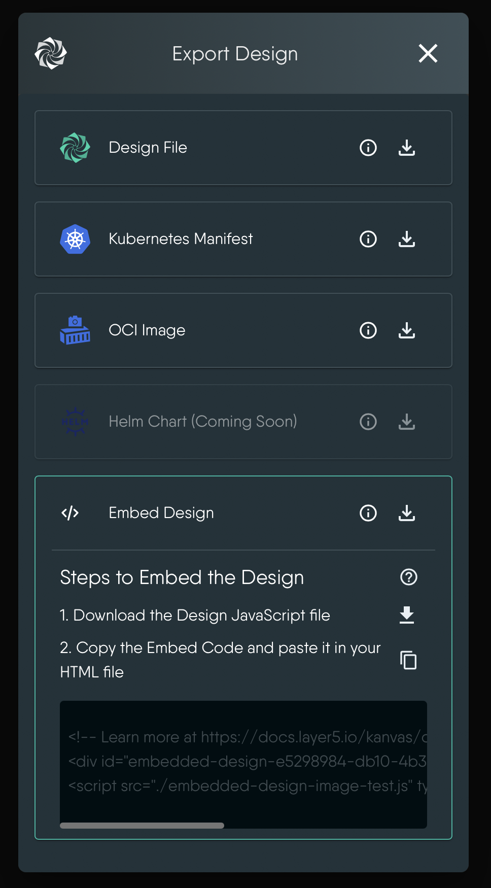

This documentation guides you on how to export your Meshery designs for various purposes, including backup, offline sharing, pushing to an OCI registry, publishing on Artifact Hub, or integration with other infrastructure tools. Kanvas Designer offers multiple export options, allowing you to choose the format that suits your needs.

## Exporting Your Design

To export your Kanvas design, follow these steps:

1. **Access Export Options**: Within the Kanvas Designer, select the design you wish to export in the design drawer. Click on the export icon in the menu for the selected design.

   

2. **Select Export Format**: The export modal will appear, offering various export formats:

   - **Original Source Form**: Export the design in its original source form.
   - **Current Design**: Obtain the design as it appears at the moment.
   - **Embedded Form**: Export the design for embedding into websites, blogs, or other platforms supporting HTML/CSS and JavaScript.

## Exporting as a Design File

Exporting your design as a design file provides you with a YAML file representing the current snapshot of your design. This file can be used for offline sharing, backup, or later import.

## Exporting as an OCI Image

Exporting your design as an OCI image allows you to package your design as a container image. This image can be shared, stored, or retrieved from any container registry, like Docker Hub.

## Exporting as a PNG Image

Exporting your design as a PNG image provides you with a visual snapshot of your design. This image can be shared, embedded, or used in presentations.

## Exporting as the Unmodified Source

If your design was generated from a source like HelmChart, Kubernetes manifest, or a previous design file, exporting it as an unmodified source will give you the original source file.

## Exporting as Embedding

Exporting your design as an embedding allows you to integrate it into websites, blogs, or other platforms that support HTML, CSS, and JavaScript. The embedded design version offers a visually interactive representation of your design, making it easy to share with infrastructure stakeholders.
[Learn more](../embedding-designs) about Embedding Designs.
