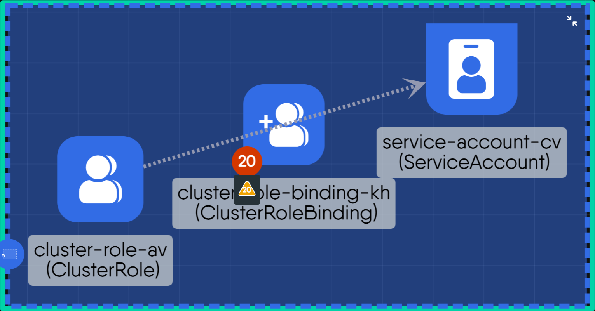
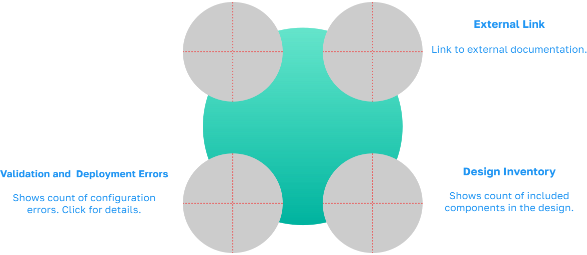
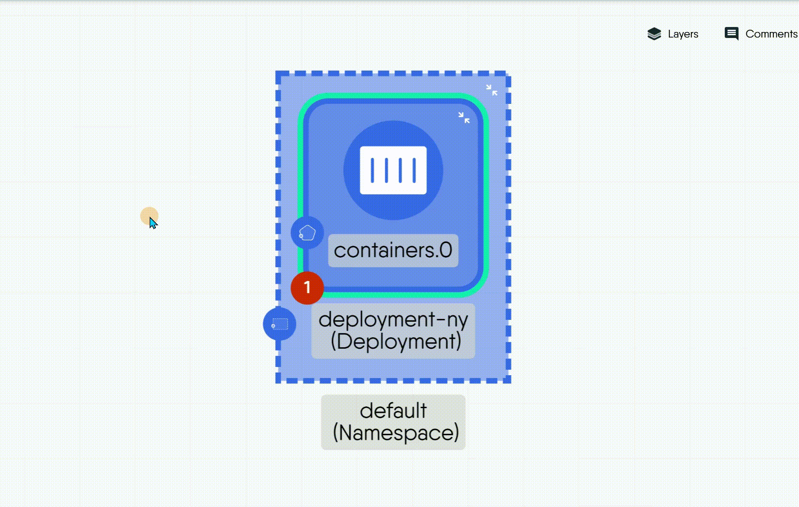
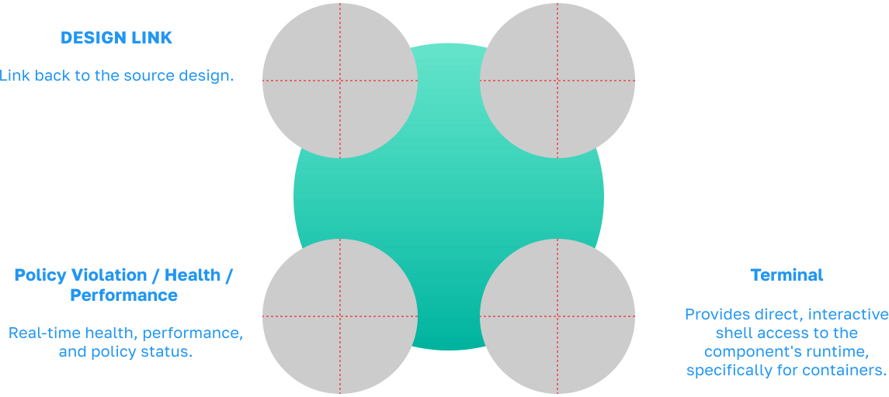
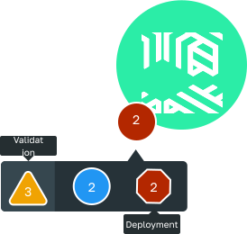

Ever wondered what those little icons in the corners of your components are? Think of them as your component's real-time status display. These indicators, called **badges**, give you at-a-glance information about everything from configuration errors to live performance.


A badge's meaning changes completely depending on your current mode. In **Designer**, badges help you build a valid blueprint. In **Operator**, they switch to providing real-time operational data from your live instances.


### What Each Corner Means

While the specific badges change depending on your mode, they all follow a consistent placement philosophy. Badges are organized into four quadrants around a component, with each corner reserved for a specific type of information.

- **Identity and Origin (Top-Left)**
  This corner answers the question, "Where did this come from?". It is used for primary metadata that identifies a component and traces its origin or management.

- **Contextual Actions (Top-Right)**
  This corner provides helpful, non-critical actions or shortcuts, such as a link to relevant documentation.

- **Management and Control (Bottom-Right)**
  This quadrant is for hands-on management, providing tools to either control a component's internal composition or interact directly with its live instance.

- **The "Problem Corner" (Bottom-Left)**
  This is your go-to spot for all status checks and issue reporting. If something needs attention, you'll find it here.

### Badges in Designer Mode

When you're in Designer Mode, your main goal is to build a valid and deployable blueprint. The badges here act as your assistants, helping you catch issues early.

#### Validation and Deployment Errors

Displays the total count of configuration errors found through schema validation and dry-run checks. Clicking the badge reveals the specific errors.

- For example, a badge showing "2" errors, which can be clicked to see details like "invalid image tag" or "missing required field".

If you see an error badge, you can often click on it to navigate directly to the configuration field that needs your attention.

#### Design Inventory

Shows the number of other components that are included or associated with this component in the design blueprint.

- For example, a badge on a Deployment showing "2", indicating it includes a ConfigMap and a Secret as part of its design.

#### External Link

A clickable link to external documentation relevant to the component.

- For example, a link to the official Kubernetes documentation for Deployments.

### Badges in Operator Mode

Once your design is deployed, you enter Operator Mode to monitor its live status. Here, the badges switch context to provide real-time operational data.

#### Design Link

Indicates the resource is managed by Meshery and provides a direct link back to the source design that was used for deployment.

- For example, a Meshery logo that, when clicked, opens the original design file in the Designer Mode.

#### Policy Violation / Health / Performance

Reports the real-time health, performance, and policy compliance status of the running instance.

- For example, a yellow icon indicating a performance warning, or a red icon for a critical policy violation.

#### Terminal

Provides direct, interactive shell access to the component's runtime, specifically for containers.

- For example, a terminal icon appears on a running Pod, which, when clicked, opens a live command-line shell to that container.

### Best Practices

- **Fix Errors First:**
Always resolve all validation errors in Designer before you deploy. A clean design is the best way to ensure a successful launch.

- **Find the Right Source File:**
When fixing a problem with a live service, use the Design Link in Operator Mode. It's the fastest way to open the correct configuration file, saving you time while being clear and reliable.

- **Know Your Mode:**
Pay close attention to your current mode. A badge's meaning is completely different in Designer than it is in Operator.