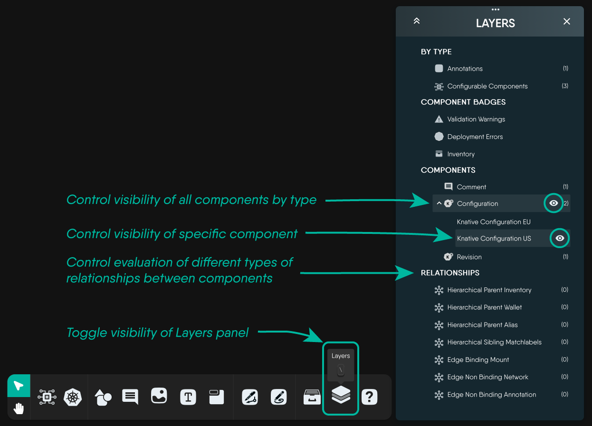

Two controls decide how a design reads on screen. **Layout** arranges the components - where they sit relative to one another. **Layers** decides which of them are drawn at all. Neither changes the design itself: a hidden component is still part of the design and is still deployed, and re-running a layout does not alter any component's configuration.

## Change design layout

The layout control sits in the toolbar at the bottom of the canvas, beside the zoom controls, showing the icon of the layout currently in use. Clicking it fans out the available layouts; picking one re-arranges every component on the canvas with an animated transition, so you can see where things moved to.

| Layout | Shape it produces | Suits |
| --- | --- | --- |
| Constrained | A force-directed arrangement that respects grouping and containment | The default, and the best general-purpose choice |
| Grid | Even rows and columns | Inventories and flat sets of similar components |
| Hierarchical | A layered, top-down tree following the direction of relationships | Designs with a clear flow, such as ingress to service to workload |
| Star | Concentric rings around the most connected components | Finding the hubs in a design |
| Bus | A breadth-first arrangement fanning out from a root | Tracing what a component reaches, level by level |
| Ring | A single circle | Small designs, and comparing components at a glance |

A design opened for the first time uses the Constrained layout. Once you drag components by hand, those positions are what the design stores; re-running a layout replaces them, so use undo if an automatic arrangement was not what you wanted.


Re-running a layout across a very large design is the most expensive operation on the canvas. If a design is slow to arrange, see [Performance Limits and Tuning]().


<!-- SCREENSHOT NEEDED: Kanvas Designer, the layout control at the bottom left of the canvas expanded, showing all six layout options with their tooltips -->

## Configure visible layers

The **Layers** panel controls what the canvas draws. Open it from the Layers button in the dock, or from the Layers action in the toolbar. Every entry has an eye toggle: switch it off and that entity disappears from the canvas until you switch it back on.

In Designer mode the panel is organised into four sections:

- **By type** - a single toggle each for **Annotations** (comments, shapes, text and other non-semantic components) and **Configurable Components** (the semantic components that actually get deployed). Turning annotations off is the fastest way to see the deployable shape of a design on its own. The count beside each is the number of components of that type in the design.
- **Component Badges** - **Validation Warnings**, **Deployment Errors** and **Inventory** badges. These are the small markers Kanvas draws on components; hiding them declutters a design that is mid-review. See [Interpreting Component Badges]().
- **Components** - every kind present in the design, grouped by model. Expanding a group lists the individual components, each with its own visibility toggle, so you can hide one Deployment without hiding the rest. Clicking a component's name selects it on the canvas and zooms the view to it.
- **Relationships** - each relationship kind, type and subtype found in the design, with its own toggle and a count. TagSet relationships appear here under that name.

The header of the panel expands or collapses every section at once.

Layer visibility is stored with the design, in its preferences, rather than in your browser. Someone else opening the same design sees the same components hidden, which makes the Layers panel a way of presenting a design as much as a way of reading one.


The Layers panel is present in Operator mode too, but it filters rather than hides: instead of design components it lists the Kubernetes resource kinds MeshSync has discovered - Cluster, Workloads, Configurations, Networking, Storage, Monitoring and Custom Resources - and choosing among them changes which resources are fetched and drawn. Those choices are what a saved [view]() records.


## Render mode

Layout and layers decide what is drawn and where. **Render mode**, in the Options drawer, decides how much detail each component is drawn with - from full fidelity down to a wireframe - and can be set to adapt automatically as a design grows. Reach for it when a design has become large enough that panning and zooming feel heavy.
