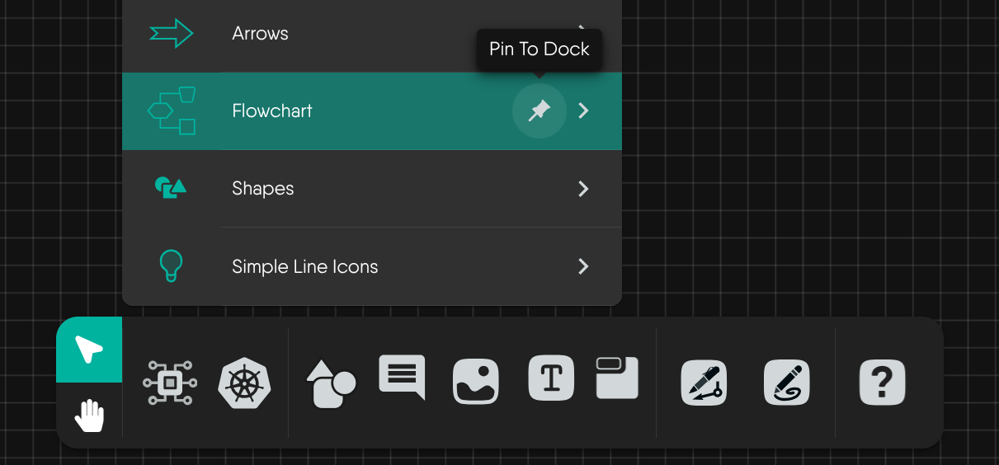
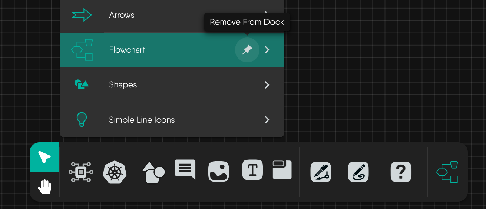

# Pinning Models to the Dock

The Kanvas Designer dock allows you to keep your most-used models and tools within easy reach. You can pin any model to the dock for quick access, and unpin it just as easily.

## Overview

Pinning a model adds it to the dock at the bottom of the Designer interface. This helps you:
- Quickly access frequently used models
- Customize your workspace
- Streamline your design workflow

## How to Pin a Model

1. Hover over the model you want to pin in the component list.
2. Click the **pin icon** that appears next to the model name. A tooltip will show "Pin To Dock".
3. The model will now appear in the dock at the bottom of the Designer.

## How to Remove a Model from the Dock

1. Hover over the pinned model in the dock.
2. Click the **pin icon** again (the tooltip will show "Remove From Dock").
3. The model will be removed from the dock.


You can pin as many models as your workflow needs and swap them out anytime as your project evolves.
