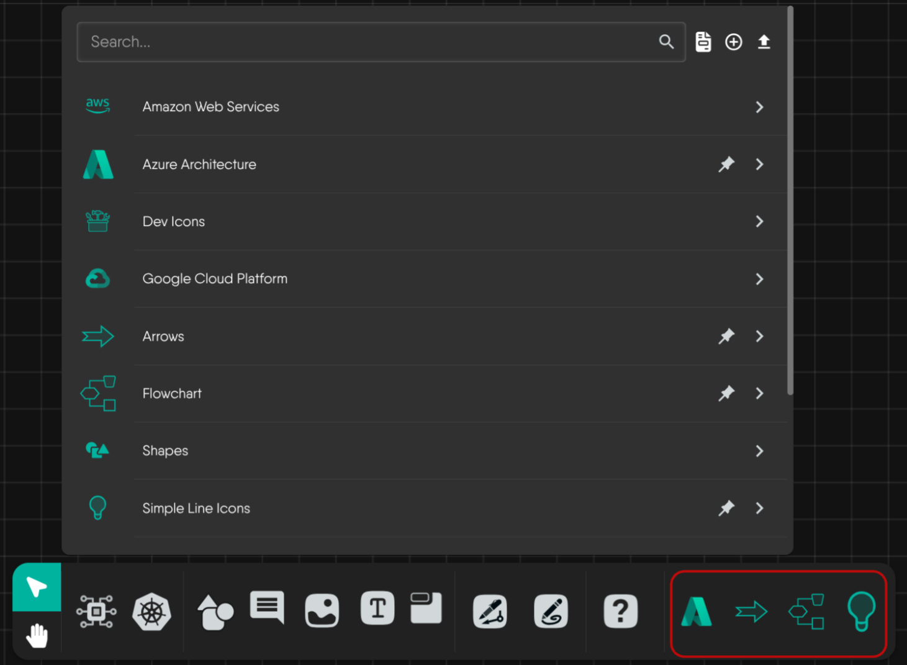
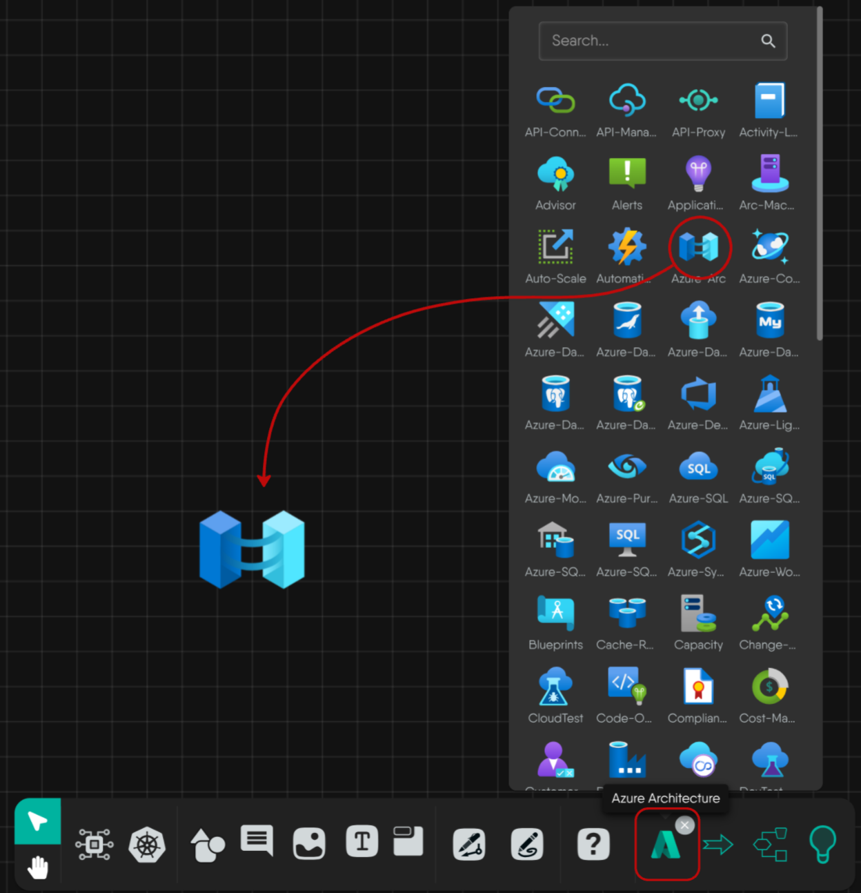
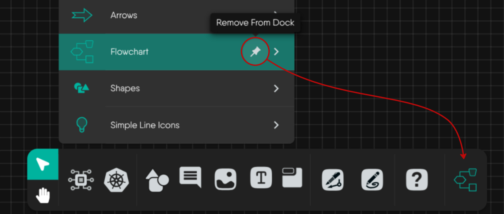
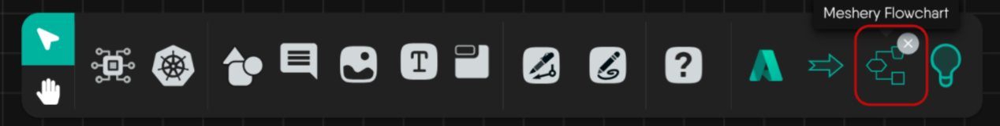

The Kanvas Designer dock allows you to keep your most-used models and tools within easy reach. You can pin any model to the dock for quick access, and unpin it just as easily.

## Overview

Pinning a model adds it to the dock at the bottom of the Designer interface. This helps you:

- Quickly access frequently used models
- Customize your workspace
- Streamline your design workflow

## How to Pin a Model

1. Hover over the model you want to pin in the component list on the left side of the Designer.
2. Click the pin icon that appears next to the model name. A tooltip will show "Pin To Dock".
3. The model will now appear in the dock at the bottom of the Designer.

## Pinned Model in the Dock

After you pin a model, it appears as an icon in the dock at the bottom of the Designer and remains there for quick access throughout your workflow. This makes it easy to find and reuse your favorite models at any time.

## How to Use a Pinned Model

Clicking a pinned model in the dock gives you quick access to all its components. You can use these components in your design by either clicking to add them or dragging them onto the canvas for easy placement and configuration.


Only models can be pinned to the dock. Individual components within a model cannot be pinned directly.


## How to Remove a Model from the Dock

You can remove a model from the dock in two ways:

### Method 1: Using the Pin Icon

1. Hover over the pinned model in the dock or in the component list.
2. Click the pin icon again (the tooltip will show "Remove From Dock").

### Method 2: Using the Close Button

1. Click the X (close) button on the pinned model icon in the dock to remove it instantly.


You can pin as many models as your workflow needs and swap them out anytime as your project evolves.

