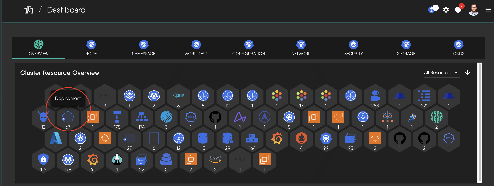

When you're designing and visualizing in [Kanvas](https://kanvas.new/), you'll interact with a rich library of visual elements. This guide is here to help you understand what those visuals mean.

We'll cover two main types of visual elements you'll encounter:
- **System-Defined Visuals:** These are icons and styles that Kanvas uses to represent specific functionalities, component types (like Kubernetes resources), or integrated technologies. They have **predefined** meanings within the system.
- **General Diagramming Elements:** These are tools like generic shapes, arrows, and flowchart symbols provided for your custom diagramming and annotation needs. Their meaning is primarily defined by you or by common diagramming conventions.

## System-Defined Visual Representations

This section focuses on visual elements that have a specific, predefined meaning within Kanvas. Understanding these will help you accurately interpret designs.

### Kubernetes Components

When you're working with Kubernetes designs, you'll notice that components related to Kubernetes have a distinct and consistent visual style. This deliberate approach is designed to help you instantly recognize and understand the various Kubernetes resources within your infrastructure designs.

Kanvas employs its own thoughtful design system to represent Kubernetes resources, built on a few key principles for clarity:
#### Principle 1: Color and Structure
- **Uniform Color Scheme:** Kubernetes component icons in Kanvas typically use a **distinctive blue background**. This blue often serves as a standard identifier for Kubernetes-related elements, helping you differentiate them at a glance.
- **Standardized Icon Structure:** While the exact outer container shape can vary, the fundamental structure is consistent: an outer container shape with the blue background, encompassing a unique inner white symbol.

#### Principle 2: Shape as an Indicator
You'll observe that the blue background is framed by different outer shapes. While a **blue rounded square** is the most versatile container, specific patterns do emerge:

- **Triangles:** A prominent pattern is the use of triangular outer shells for core networking resources like `Service` and `API Service`.
- **Hexagons:** You might observe hexagonal shapes for some foundational workload controllers like `StatefulSet`.
- **Unique Polygons:** Several Kinds feature highly unique shapes tailored to their function, such as those for `Endpoints`, `PriorityClass` (often resembling a gauge), or `ValidatingWebhookConfiguration` (which might use a shield shape, suggesting security).

> This systematic approach ensures that once you learn the basics of this visual language, you can easily identify any Kubernetes component in your designs.

### Icons for Integrated Technologies and Their Components

Ever looked at a complex design in Kanvas, perhaps one shared by a colleague, and seen various software logos wondering what they represent? Or, when crafting your own designs, have you needed to represent specific cloud services, databases, or other third-party tools using their official, recognizable visuals? Kanvas is designed to make this straightforward.


Kanvas organizes integrated components in a clear hierarchy:
1. **Categories:** High-level groups (e.g., "Cloud Native Network", "Database")
2. **Integration Models:** Specific technologies (e.g., "AWS App Mesh", "Prometheus")
3. **Designable Components:** Functional building blocks derived from each integration


Beyond Kubernetes-native resources, Kanvas allows you to visually represent a wide array of integrated services and technologies using their official, recognizable icons. This helps you create clear and immediately understandable designs for your hybrid, multi-cloud, and microservice architectures.

**What These Icons Mean in Your Design**

When you incorporate an icon representing a specific cloud service (like an AWS S3 bucket) or a component from an integrated technology, you are making a clear statement: your architecture includes, interacts with, or plans to use that specific external service or functional unit. This visual mapping is a system-defined representation.

This approach allows you to build rich, unambiguous designs where you and your team can easily see which parts of your system depend on specific cloud resources, networking functions, observability tools, or other managed services.


This guide covers the visual style of components. For a complete catalog of all technologies that Meshery integrates, visit the <a href="https://docs.meshery.io/extensions/integrations">integrations directory</a>.


## General Diagramming Elements

Now, let's explore the visual elements that give you creative freedom. This part of the guide focuses on elements designed for your flexible diagramming, annotation, and custom visual communication needs.


The key principle for all elements in this section is that the Meshery system itself does not assign them specific operational or semantic functions.


### Generic Shapes

The "Shapes" palette in Kanvas offers a diverse collection of common geometric figures and symbolic graphics. These are your go-to tools for general-purpose diagramming, especially when you need to represent concepts not covered by system-defined component icons. For every shape listed, we will explain its general use, but remember, its specific meaning in your design is up to you.

### Arrows

In Kanvas, arrows are fundamental tools for showing direction or creating simple visual annotations. They are static shapes intended for illustration.


The arrows shown here are static visual aids. To represent actual, functional relationships between components (like network traffic or dependencies), you should use the Edge system instead. <a href="https://docs.meshery.io/extensions/edges-shape-guide">Learn more</a>


### Flowchart Shapes

To help you visually map out processes, Kanvas includes a dedicated palette of standard flowchart shapes. If you've ever created a flowchart, these symbols will be very familiar to you.

### Simple Line Icons

Kanvas also provides a comprehensive library of **Simple Line Icons**, representing common objects, actions, and concepts. These icons are intended for user-driven annotations and visual enhancement. You might use a "lightbulb" icon to signify an idea, or a "warning" icon to flag a component for attention.

## Component Visuals in Different Contexts

A single component will be visually represented differently depending on where you encounter it in the Meshery UI. Let's take the Deployment component as an example to see how its appearance adapts to these different views:

1. **Deployment component with its distinctive shape and badge:**

2. **Deployment icon as it might appear in a component selection panel:**

3. **Deployment component as seen in a cluster resource overview:**

