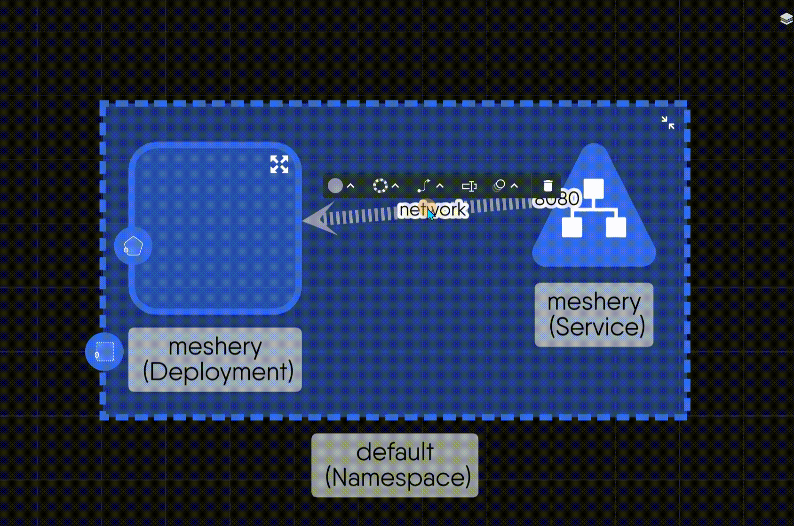

When you connect components in [Kanvas](https://kanvas.new/), the line you draw is called an **edge**. Each edge visually represents a [relationship](https://docs.layer5.io/kanvas/concepts/relationships/) between your components. This guide explains how to use different edge styles to create clear and effective infrastructure designs.

## Understanding Edge Types

In Kanvas, there are two main types of edges, each serving a different purpose:

### Semantic Edges: Representing Real Infrastructure

These edges represent real infrastructure relationships that Kanvas can understand and manage. For example:
- Network connections between services
- Volume mounts between containers
- Dependencies between components

What makes semantic edges special is their ability to automatically configure components in real-time as you design. When you draw a semantic edge, Kanvas immediately interprets the relationship and updates the components' configurations - for instance, a TCP connection edge automatically configures port bindings, while a volume mount edge updates container specifications. This real-time configuration makes semantic edges not just visual connectors, but active configuration tools that shape your infrastructure as you build it.

> For detailed information about each relationship type and their configuration effects, visit [Relationships Documentation](https://docs.layer5.io/kanvas/concepts/relationships/)

### Non-semantic Edges: Annotating Your Designs

These are visual aids that help you document and explain your design. They are useful for:
- Adding explanatory notes
- Showing conceptual relationships
- Highlighting important connections

Kanvas ignores these edges during deployment as they are purely for documentation.

## Working with Edge Styles

### Default Styles

To help you quickly understand your designs, Kanvas uses specific default styles for each type of edge:

**For Semantic Edges**:
- Style: Dotted line with an arrowhead
- Color: Grey/Blue
- Use: For all real infrastructure connections



**For Non-semantic Edges**:
- Style: Solid line with an arrowhead
- Color: Green
- Use: For all visual annotations and notes



### Customizing Edge Styles

While the default styles are designed to be clear and consistent, Kanvas gives you the flexibility to customize any edge to better suit your needs. Simply click an edge to reveal the styling toolbar.

#### Choosing a Line Type
- Dashed Line: For proposed or optional connections
- Wave Line: For asynchronous or non-continuous connections
- Zigzag Line: For disrupted or unreliable connections
- Tree Line: For hierarchical relationships (parent-child, system-subsystem)
- Line with Circles: For weak or indirect associations
- Bezier Curve: For non-linear or indirect connections

#### Defining Connection Points
- Arrow Head (Default): Shows general direction or flow
- Filled Diamond: For "whole-part" relationships (aggregation)
- Filled Square: For strong ownership relationships (composition)
- Filled Triangle: For inheritance or "is-a" relationships
- Filled Circle: For loose containment relationships

> **Note**: While Kanvas supports these UML-style relationships, the most commonly used styles are straight lines, dotted lines, and arrow heads. Use other styles when you need to express specific types of relationships in your designs.

#### Using Color for Visual Cues

Colors help you create a visual language in your designs. While Kanvas has default colors, you can use any color to convey meaning:

**Default Colors**
- Green: For non-semantic annotations
- Grey/Blue: For semantic relationships

**Suggested Color Meanings**
- Yellow: For connections that need review
- Red: For issues or breaking changes

#### Adding Labels

You can add text directly to edges to provide more information. This is especially useful for:
- Describing traffic flow (e.g., "User Traffic → API Gateway")
- Adding process steps (e.g., "Requires Manual Review")
- Noting important details (e.g., "Backup Route (Low Priority)")
- Specifying protocols (e.g., "gRPC / 50051")

#### Applying Visual Effects

The "Marching-ants" animation effect can be added to any edge to:
- Highlight specific connections in team reviews
- Emphasize critical paths


To learn how to interpret and understand designs in practice, including how components work together in a design, visit our comprehensive guide in the [Layer5 Academy](https://cloud.layer5.io/academy/learning-paths/mastering-meshery/introduction-to-meshery?chapter=interpreting-meshery-designs).



To learn how to interpret and understand designs in practice, including how components work together in a design, visit our comprehensive guide in the [Layer5 Academy](https://cloud.layer5.io/academy/learning-paths/mastering-meshery/introduction-to-meshery?chapter=interpreting-meshery-designs).



To learn more about the usage of shapes and why specific shapes were chosen for Kubernetes resources, see the [Component Shape Guide](https://docs.meshery.io/extensions/component-shape-guide).



These categories also serve as a guide for users customizing Kubernetes components. By using these established shapes and icons as a reference, you can ensure that your customizations maintain semantic meaning and align with the existing representations, helping to preserve clarity and consistency in your designs.
