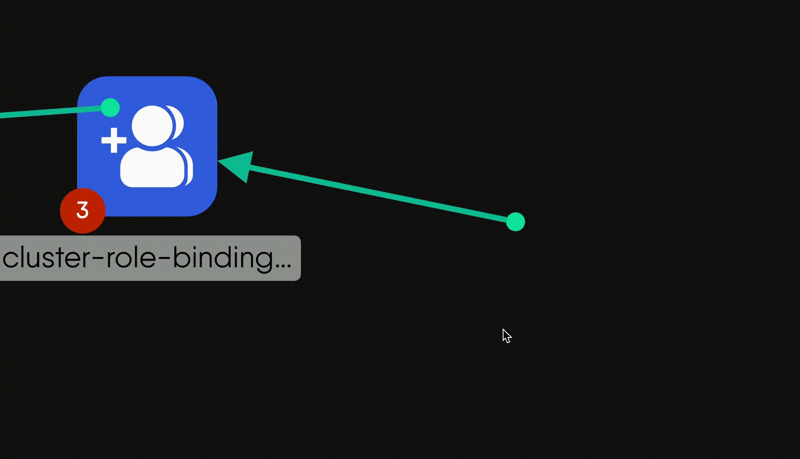

<!-- set of custom keyboard button classes -->
<link rel="stylesheet" href="https://unpkg.com/keyboard-css@1.2.4/dist/css/main.min.css" />
Kanvas Designer offers three modes: Default, Pencil, and Connector, which behave differently based on the context in which they are used. Understanding these modes is essential for effectively interacting with components and the canvas.

You can switch between mouse modes using hotkeys or tool selection. Here are hotkeys that control your mode:

- <button class="kbc-button kbc-button-xs">Spacebar</button>: Temporarily enables the alternative mouse mode (default mode vs pan mode)  
- <button class="kbc-button kbc-button-xs">H</button>: Switches to pan mode (hand icon)  
- <button class="kbc-button kbc-button-xs">Escape / V</button>: Switches to default mode irrespective of which mode you are currently using.

## Interacting with Components



<ul>
<li><b>Hover:</b> Nothing  
 Cursor style: “default (arrow)”</li>
 
<li><b>Click-and-drag:</b> Moves component in the direction of the mouse.
 Cursor style: “move”</li>
 
<li><b>Click:</b> Selects the component and displays the component toolbar, resize box, and connections handles.

 Cursor style: “default (arrow)”</li>
 
<li><b>Double-click on Component:</b> Opens the component configurator.

 Cursor style: “pointer”</li>
 
<li><b>Double-click on Textbox:</b> Enables text editing inside the component.

 Cursor style: “text”</li>
 
<li><b>Right-click:</b> Opens the circular component context menu.

 Cursor style: “default (arrow)”</li>
 
<li><b>Click-and-hold:</b> Initiates box selection for selecting multiple components.

 Cursor style: “crosshair”</li>
 
<li><b>Scroll wheel:</b> Pan up or down in the direction of the mouse.
 Cursor style: "default (arrow)”</li>
 
<li><b>Scroll wheel + CMD/CTL:</b> Zoom in/out in the direction of the mouse.
 Cursor style: "default (arrow)”</li>
 
<li><b>Horizontal scroll wheel:</b> Pan left or right in the direction of the mouse.
 Cursor style: "default (arrow)”</li>
 
</ul>



Pencil lines do not connect individual components, but offer annotating capability, allowing you to take notes and draw annotations to enhance your designs.
<ul>
<li><b>Hover:</b> Nothing
 Cursor style: “custom(pencil)”</li>
 
<li><b>Mouse down:</b> Initiates the pencil tool.
 Cursor style: “custom(pencil)”</li>
 
<li><b>Mouse down and drag:</b> Start drawing a freeform line.

 Cursor style: “custom(pencil)”</li>
 
<li><b>Mouse down + CTRL/CMD:</b> Start drawing a straight line in the direction of the mouse, which will initiate and remain as either a vertical or horizontal line.
 Cursor style: “custom(pencil)”</li>
 
<li><b>Mouse down + SHIFT:</b> Start drawing a straight line in the direction of the mouse, which will initiate and remain as either a vertical or horizontal line.  
 Cursor style: “custom(pencil)”</li>
 
<li><b>Mouse up</b>: Complete the line and renders into a component with full styling capabilities.
 Cursor style: “custom(pencil)”</li>
 
<li><b>Click</b>: Draws ink from the pencil.
 Cursor style: “custom(pencil)”</li>
 
<li><b>Scroll wheel</b>: Nothing
 Cursor style: “custom(pencil)”</li>
 
<li><b>Scroll wheel \+ CMD/CTL</b>: Nothing  
 Cursor style: “custom(pencil)”</li>
</ul>
<!-- *Developer notes:*

1. *In the future, the canvas moves with the pen/pencil as they near the edge of the viewport.*  
2. *In the future, the scroll wheel will behave as it normally does in default mode.* -->




The Pen tool operates as a creator of annotation edges. Note that the pen tool has two behaviors depending upon the context in which you initiate the connection.

The Pen Tool Mode is activated using <button class="kbc-button kbc-button-xs" style="max-width:fit-content;margin:0px;position:relative;display:inline;">CMD+E</button>


**Component-connect Behavior**: When you click an empty spot on the canvas, and drag to another empty spot on the canvas, you get a **joint** (aka a terminal node) from which you can create new connections as well as new edge relationships.

**Canvas-connect Behavior**: When you click an empty spot on the canvas, and drag to an existing component, you get an annotation edge relationship.


<ul>
<li><b>Hover:</b> Nothing

 Cursor style: “pen”</li>
 
<li><b>Mouse down and drag:</b> Nothing

Creating connections happens in three phases.

<b>Click</b> (press primary mouse button and release):
Initiate connection.

 Cursor style: “pen”</li>
 
<li><b>Click and move:</b> if a connection was initiated, moves the ghost edge around else does nothing.

 Cursor style: “pen” and the annotation edge following the mouse around.</li>
 
<li><b>Click while connecting</b>: Establish and render connection.

 Cursor style: “pen”</li>
 
<li><b>Click and move:</b> if a connection was initiated, moves the ghost edge around else does nothing.

 Cursor style: “pen” and the annotation edge following the mouse around.</li>
 
<li><b>Click while connecting</b>: Establish and render connection.

 Cursor style: “pen”</li>
 
<li><b>How to Draw and Connect Lines</b>
</li>

<li><b>How to customize nodes at the ends of connections</b> 
</li>
</ul>
<!-- 
*Developer notes:*

1. *In future, when the connector is released on an empty spot on the canvas, offer a component picker from which users can always choose a “Joint” component.*  
2. *Rename PenTerminalNode to “**Joint**”, unless there’s something better to call it.* -->


<ul>
<li><b>Hover:</b> Nothing</b>
 Cursor style: “hand”</li>
 
<li><b>Click-and-hold:</b> Grab the canvas and pan in the direction of mouse movement.  
 Cursor style: “grabbing-hand”</li>
 
<li><b>Scroll wheel \+ CMD/CTL</b>: Zoom in/out in the direction of the mouse.  
 Cursor style: “grabbing-hand”</li>
 
<li><b>Horizontal scroll wheel</b>: Pan left or right in the direction of the mouse.  
 Cursor style: “grabbing-hand”</li>


