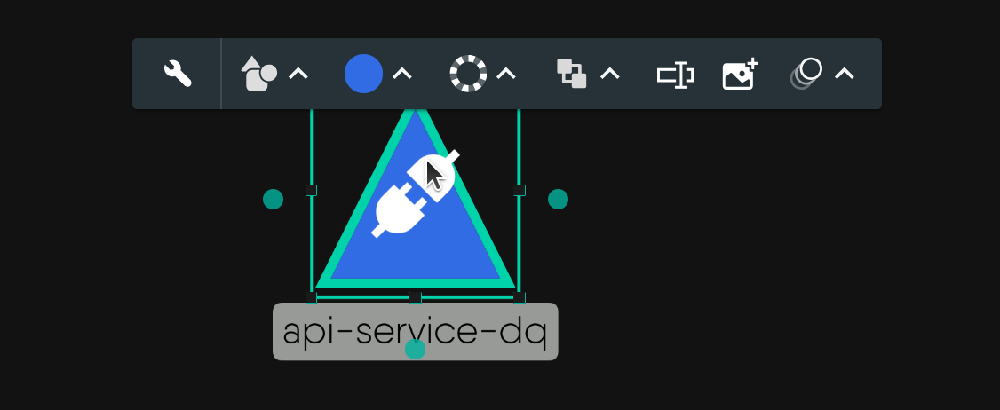
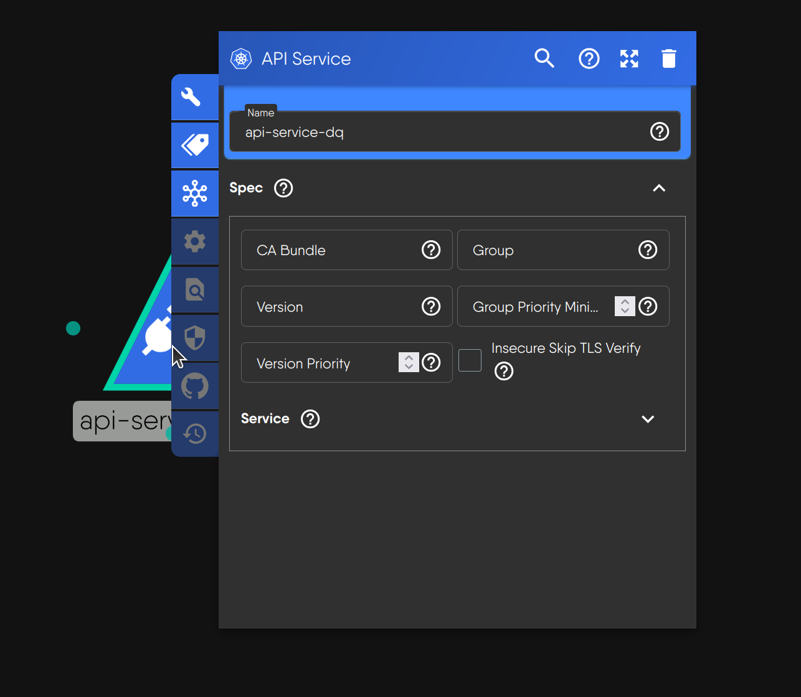
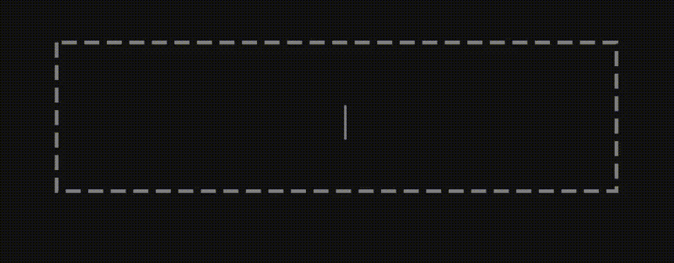
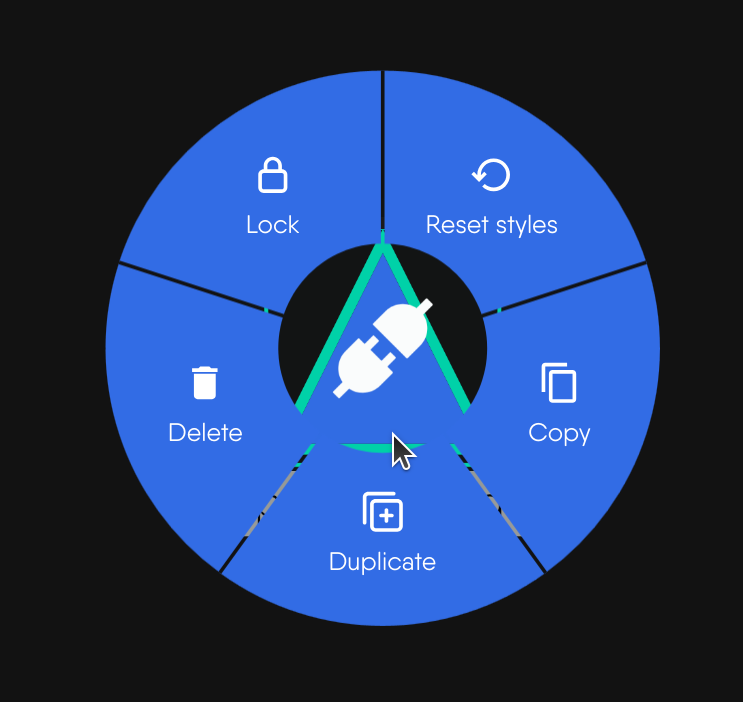
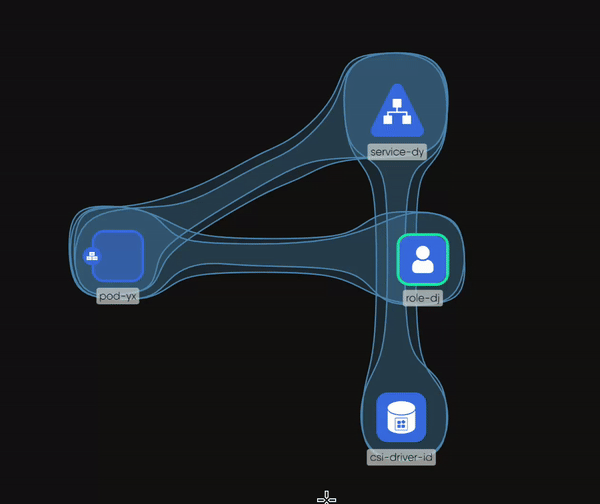
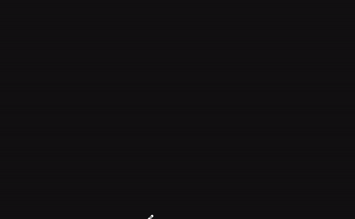
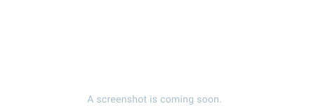
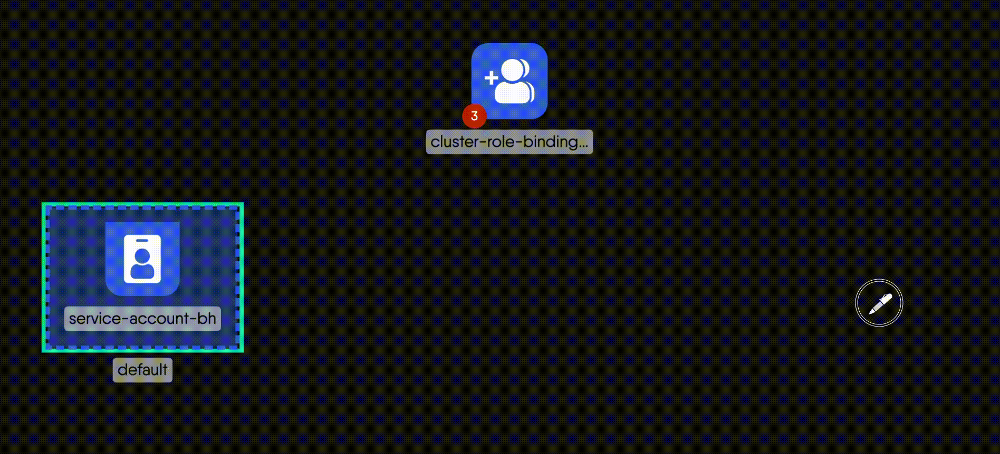
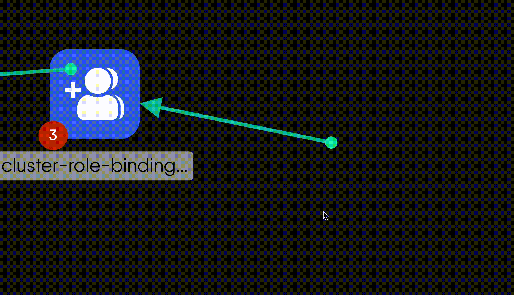

<link rel="stylesheet" href="https://unpkg.com/keyboard-css@1.2.4/dist/css/main.min.css" />

# Tool Modes

You can switch between mouse modes using hotkeys or tool selection. Here are hotkeys that control your mode:

| Hotkeys                                                          | Description                                                                 |
|------------------------------------------------------------------|-----------------------------------------------------------------------------|
| <button class="kbc-button kbc-button-xs">Spacebar</button>       | Temporarily enables the alternative mouse mode (default mode vs pan mode)   |
| <button class="kbc-button kbc-button-xs">H</button>              | Switches to pan mode (hand icon)                                            |
| <button class="kbc-button kbc-button-xs">Escape / V</button>     | Switches to default mode irrespective of which mode you are currently using. |

---

## Interacting with Components

{}

{}
| Action                         | Cursor Style        | Behavior                                                                     | Example                                                 |
|--------------------------------|---------------------|------------------------------------------------------------------------------|-------------------------------------------------------|
| **Hover**                      | `default (arrow)`   | Nothing                                                                      |                                                       |
| **Click-and-drag**             | `move`              | Moves component in the direction of the mouse                                |                                                       |
| **Click**                      | `default (arrow)`   | Displays component toolbar, resize box, and connection handles               | <a href="./click.png"><picture></picture></a> |
| **Double-click (component)**   | `pointer`           | Opens the component configurator                                             | <a href="./double_click.png"><picture></picture></a> |
| **Double-click (textbox)**     | `text`              | Enables text editing inside the component                                    | <a href="./text-box-double-click.gif"><picture></picture></a> |
| **Right-click**                | `default (arrow)`   | Opens the circular component context menu                                    | <a href="./right_click.png"><picture></picture></a> |
| **Click-and-hold**             | `crosshair`         | Initiates box selection for selecting multiple components                    | <a href="./select.gif"><picture></picture></a> |
| **Scroll wheel**               | `default (arrow)`   | Pan up or down                                                                |                                                       |
| **Scroll wheel + CMD/CTL**     | `default (arrow)`   | Zoom in/out                                                                   |                                                       |
| **Horizontal scroll wheel**    | `default (arrow)`   | Pan left or right                                                             |                                                       |
{}

{}
Pencil lines do not connect individual components, but offer annotating capability, allowing you to take notes and draw annotations to enhance your designs.

| Action                      | Cursor Style        | Behavior                                            | Example                                                 |
|-----------------------------|---------------------|-----------------------------------------------------|-------------------------------------------------------|
| **Hover**                   | `custom(pencil)`    | Nothing                                             |                                                       |
| **Mouse down + drag**       | `custom(pencil)`    | Start drawing a freeform line                       | <a href="./pencil.gif"><picture></picture></a> |
| **Mouse down + SHIFT**      | `custom(pencil)`    | Start drawing a straight vertical or horizontal line |                                                       |
| **Mouse up**                | `custom(pencil)`    | Complete the line and render into a styled component |                                                       |
| **Click**                   | `custom(pencil)`    | Draws ink from the pencil                           |                                                       |
| **Scroll wheel**            | `custom(pencil)`    | Nothing                                             |                                                       |
| **Scroll wheel + CMD/CTL**  | `custom(pencil)`    | Nothing                                             |                                                       |
{}

{}
The Pen tool operates as a creator of annotation edges. It has two behaviors depending on context.

**To Activate:** `CMD+E`

<strong>Connector Behaviors</strong>

- **Component-connect Behavior**: When you click an empty spot on the canvas, and drag to another empty spot on the canvas, you get a joint (aka a terminal node) from which you can create new connections as well as new edge relationships.  
- **Canvas-connect Behavior**: When you click an empty spot on the canvas, and drag to an existing component, you get an annotation edge relationship.

| Phase                            | Cursor Style | Behavior                                                      | Example                                                 |
|----------------------------------|--------------|---------------------------------------------------------------|-------------------------------------------------------|
| **1. Click & release**           | `pen`        | Initiate connection                                            | <a href="./tool-mode-placeholder.svg"><picture></picture></a> |
| **2. Click-and-move**            | `pen`        | Move the ghost edge around if a connection was initiated       | <a href="./tool-mode-placeholder.svg"><picture></picture></a> |
| **3. Click while connecting**    | `pen`        | Establish and render the connection                            | <a href="./tool-mode-placeholder.svg"><picture></picture></a> |

#### Additional Examples

| Description                                  |                   Example                               |
|------------------------------------------|-------------------------------------------------------|
| How to Draw and Connect Lines            | <a href="./draw_line.gif"><picture></picture></a> |
| How to customize nodes at the ends of connections | <a href="./customize_end.gif"><picture></picture></a> |
{}

{}
| Action                      | Cursor Style        | Behavior                                 |
|-----------------------------|---------------------|------------------------------------------|
| **Hover**                   | `hand`              | Nothing                                  |
| **Click-and-hold**          | `grabbing-hand`     | Grab the canvas and pan in the direction of mouse movement  |
| **Scroll wheel + CMD/CTL**  | `grabbing-hand`     | Zoom in/out in the direction of the mouse.  |
| **Horizontal scroll wheel** | `grabbing-hand`     | Pan left or right in the direction of the mouse.   |
{}

{}
