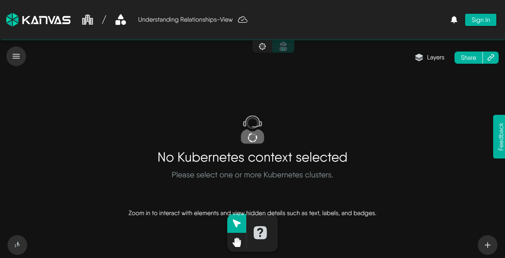
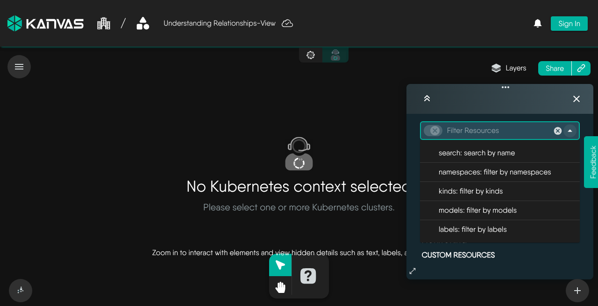

Discover and examine your Kubernetes clusters and cloud native infrastructure using Operator mode.

<figure>
  
  <figcaption>Operator with no Kubernetes context selected — choose one or more clusters to populate the topology (anonymous capture, Sep 2026).</figcaption>
</figure>

## Using Filters

Use filters to select the Kubernetes resources you want to view. Apply one or more filters — for example by namespace, kind, model, or label — to narrow the topology to the resources that matter. Combine filters to focus on a subset of your cluster without leaving Operator.

<figure>
  
  <figcaption>Filter Resources in Operator: search, namespaces, kinds, models, and labels. Captured without a cluster context selected (anonymous, Sep 2026).</figcaption>
</figure>

## Search and Select Specific Resources

Using the search bar, you can search for specific resources and select them. The selected resources are highlighted in the Operator canvas. Details of the selected resources are displayed in the right panel.

## Connecting with Kubernetes Pods

Operator supports connecting to Kubernetes pods via the following methods.

- [Log Streaming](): Learn how to live-tail logs from your Kubernetes pods and containers directly within the visual topology.
- [Interactive Terminal](): Learn how to establish an interactive shell session with your containers.

## Working in Operator Mode

- [Views](): Save, open, share and export named perspectives of your clusters.
- [Instance Details](): Inspect the live state, metrics and events of any discovered resource.
- [Performance Testing](): Generate load against a Service or Ingress using a saved performance profile.
