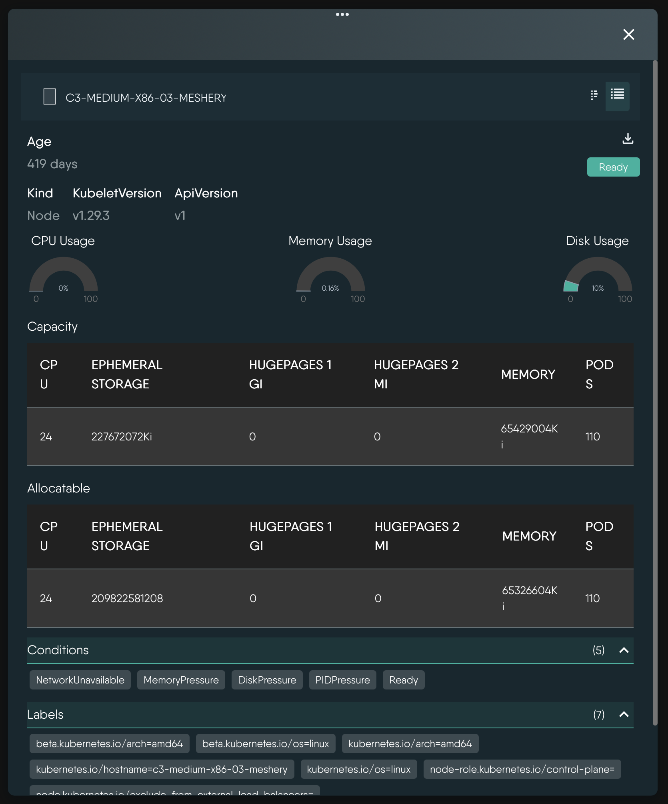
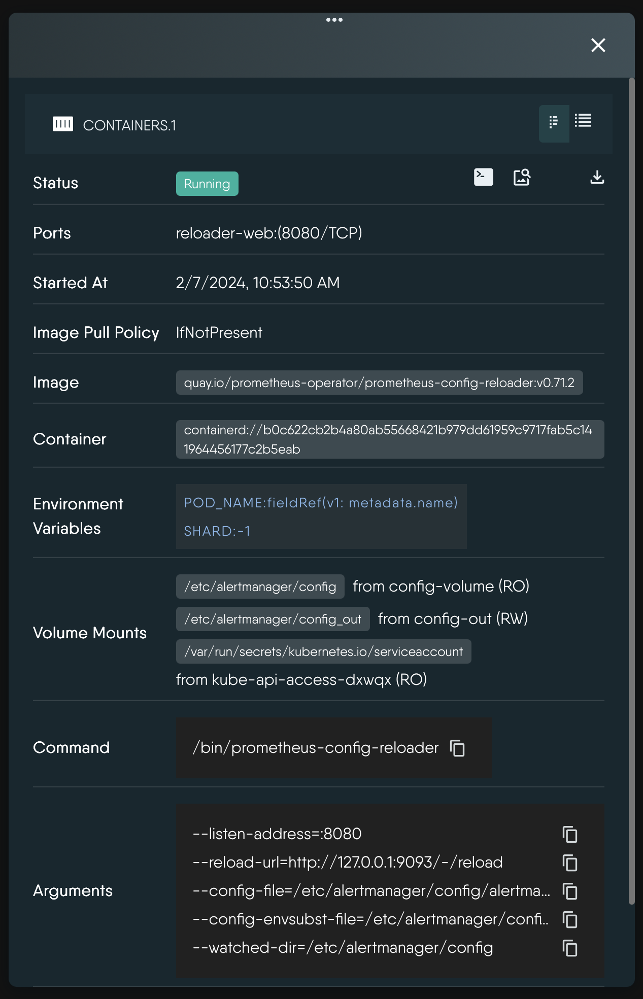

In Kanvas, the Instance Details tab provides a detailed view of Kubernetes resources such as Nodes, Pods, Deployments, and more. This tab is essential for understanding the configuration and status of individual resources within your Kubernetes cluster.
The Instance Details tab is accessible when you select a specific Kubernetes resource from the Resources tab. It allows you to view and manage the details of that resource, including its configuration, status, and associated events.

Depending on the type of resource selected, the Instance Details tab will display relevant information. For example, if you select a Node, it will show details about the node's status, capacity, and conditions. If you select a Pod, it will display information about the pod's containers, their statuses, and any associated labels.


  
    
    
<i>Example: Kubernetes Node details.</i>

  
    </a>
  
    
    
    
<i>Example: Kubernetes Pod Container details.</i>

  
  </a>


## What the Details panel shows

Select any component on the Operator canvas and the Details panel reports that resource's live state, as discovered by MeshSync. The panel is assembled per resource kind, so you only ever see fields that apply to the resource in front of you:

- **Identity and lifecycle** - name, namespace, kind, API version and age.
- **Status and conditions** - the resource's current status, with its Kubernetes conditions collapsed into an expandable list.
- **Labels and annotations** - shown as chips. Clicking a label adds it to the active view filter, so you can pivot straight from one resource to everything that shares that label.
- **Workload shape** - ready and available replica counts, update or deployment strategy, node selectors, tolerations, and the container images in the pod template.
- **Networking** - cluster IP, external IPs, service type, load balancer ingress addresses and Ingress rule hosts.
- **Storage** - access modes, storage class, requested size, bound claim, and the volumes mounted into the pod.
- **Containers** - each container and init container with its spec alongside its runtime status.
- **Deep links** - the Node, Namespace and ServiceAccount a resource is attached to. Clicking one re-filters the canvas onto that resource, which is the quickest way to walk from a failing pod to the node it landed on.

Because MeshSync streams changes from your cluster continuously, the panel reflects the current state of the resource rather than a snapshot taken when you opened it.

## Actions available from the Details panel

The header of the Details panel carries the actions that apply to the selected resource:

| Action | Available on | What it does |
| --- | --- | --- |
| Initiate Terminal Session | Pods and Containers | Opens a shell into the container. See [Interactive Terminal](). |
| Initiate Log Session | Pods and Containers | Live-tails the container's logs. See [Log Streaming](). |
| Initiate Performance Test | Services and Ingresses | Generates load against the resource's endpoint. See [Performance Testing in Operator](). |
| Open In Design | Resources deployed by Meshery | Opens the design that produced this resource in Designer mode, with this component selected for configuration. |
| Open Source Design | Resources deployed by Meshery | Opens the source design itself in Designer mode. |
| Download | All resources | Downloads the resource's full JSON representation to your machine. |

The same actions are available by right-clicking the component on the canvas.

## Resource metrics and events

Operator mode surfaces the standard Kubernetes signals you would otherwise gather with `kubectl describe` and `kubectl get events`, without leaving the canvas.

### Node capacity metrics

Select a Node and the Details panel renders three gauges - CPU, memory and ephemeral storage - derived from the two figures Kubernetes reports in the node's status:

- **`capacity`** - the total resources the node has.
- **`allocatable`** - the portion of that capacity available to ordinary Pods, after Kubernetes holds back what it reserves for the kubelet, the container runtime, the operating system and the eviction threshold.

Each gauge shows the difference between the two as a percentage of capacity - in other words, the share of the node that is **not** available to your workloads. The gauges are color-banded, shifting from green through amber to red as that share climbs past 30%, 60% and 90%, so a node with unusually little left for Pods stands out. Full `Capacity` and `Allocatable` tables sit alongside the gauges for the exact numbers.


These gauges describe how the node's capacity is divided between Kubernetes itself and the Pods it can schedule. They say nothing about what the Pods currently running on the node are <em>requesting</em> or <em>consuming</em> - Operator mode does not render live utilization figures or time series. For those, pair Kanvas with your metrics stack.


### Workload state

For Pods, Deployments, StatefulSets and DaemonSets the panel reports ready and available replica counts, per-container restart counts and states, and the QoS class assigned to the pod - the numbers you need to tell a slow rollout from a stuck one.

### Kubernetes events

MeshSync discovers Kubernetes `Event` objects like any other resource, so events can be drawn on the Operator canvas alongside the resources they describe. Open the Layers panel, expand **Monitoring**, and enable **Events**. Selecting an event component shows its full detail - reason, message, involved object, count and timestamps - in the Details panel.

Because events are namespaced and short-lived, they are most useful narrowed down: filter to the namespace you are investigating before enabling the Events layer.
