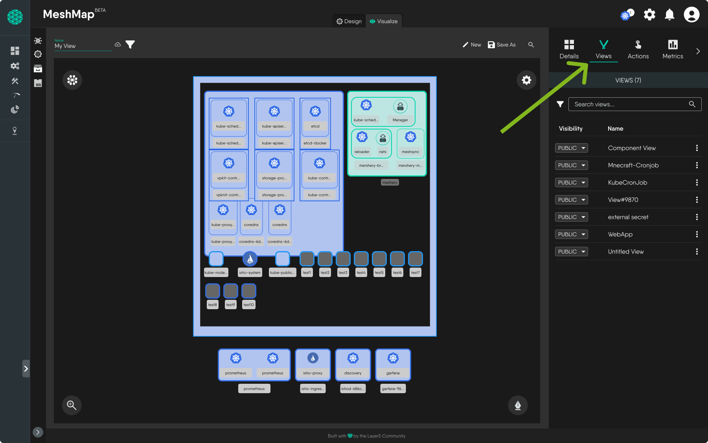
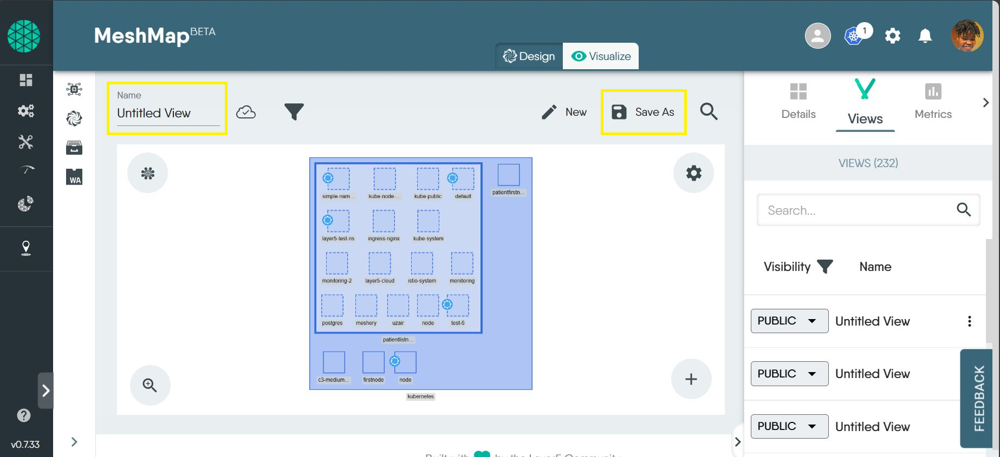
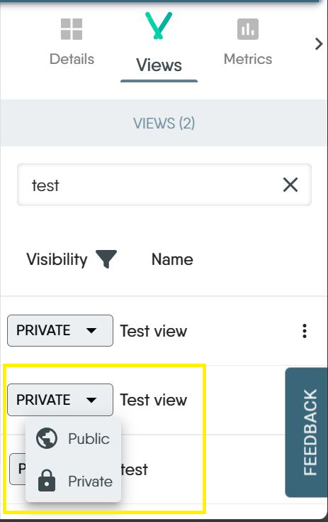
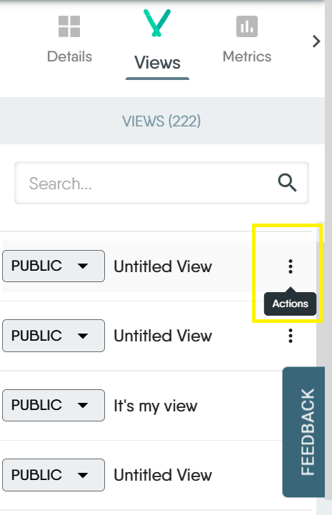
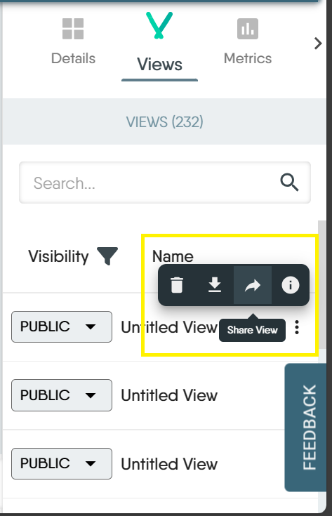
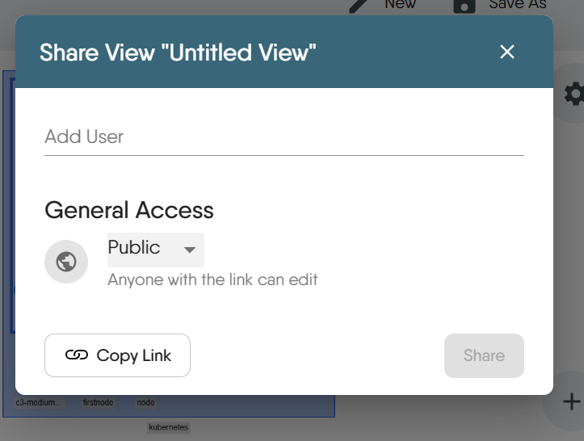
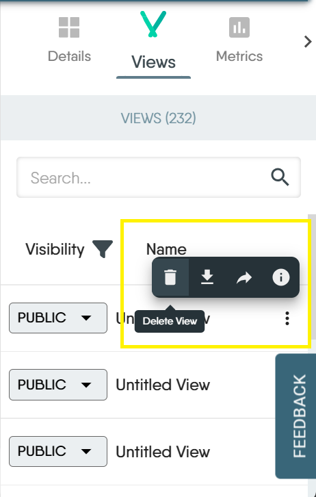
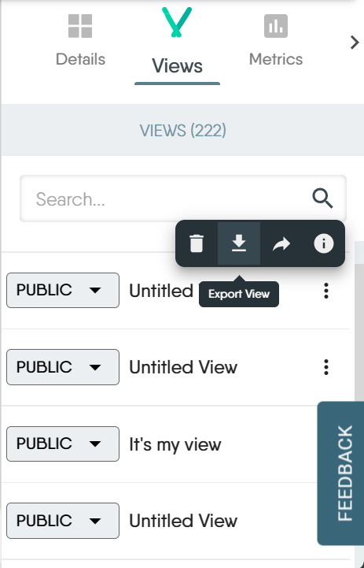
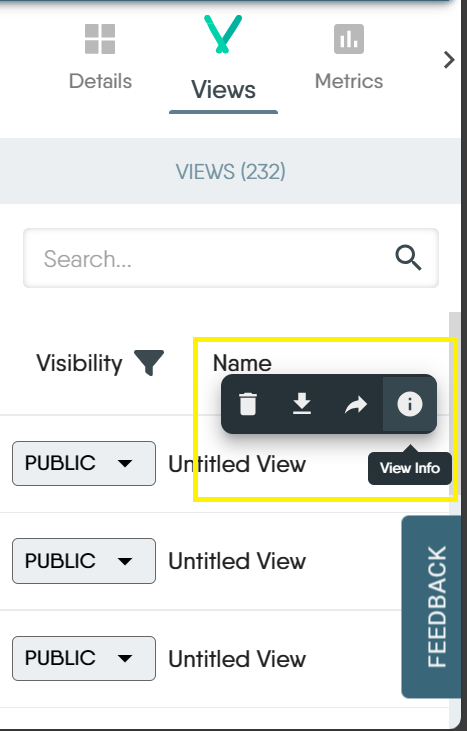

The Views tab is located on the right side of the screen just beside the Details tab in Kanvas Operator. It lists every view you can reach in the current workspace - the ones you created and the ones teammates have made public - so that you can move between saved perspectives of your clusters without rebuilding the filters each time. Think of views for Operator mode as you would designs for Designer mode.

A view is a named, saved set of filters over the resources that MeshSync has discovered in your connected clusters: the namespaces, kinds, labels and search terms that decide which resources are drawn on the Operator canvas. Saving those filters as a view means the same slice of your infrastructure comes back on demand, for you and for your team.

## Managing Views

Here's what you can do with views in Operator:

### 1. Save a view

  To save a view, simply give your view a title in the Name field at the top of the canvas. Any changes made to the view will be automatically saved. Alternatively, click on the "Save as" button at the top of the canvas. A modal will pop up for you to give your view a name and save it.

  
### 2. Set view visibility

  You can choose to set your views to be either public or private. When views are set as public, everyone within your workspace can access these views. Views set as private are visible only to the person who created the view, ie the owner.

  
### 3. Share a view

  Sharing a view lets you collaborate with team members. In the share modal, you can add the user you want to share the view with. You can also set your view access as either public or private. When it's set to public, anyone with the link to the view can edit the view. When it's set to private, others can view but only the owner can edit.

  Views use the same Share modal and access list as designs. After you grant or revoke access, confirm the result under **People with Access**. For guidance on verifying access and for the notifications Kanvas shows when share or visibility actions cannot complete, see [Sharing Designs]().

  To share a view,

  1. Click on the actions icon to the right of the view you want to share.

     

  2. You'll find a list of actions. Share is the third icon from the left

     

  3. Click on the share icon to open up the share modal.

     

  4. Enter the name of the user you want to share a view with and set the view access.

### 4. Delete a view

  You can delete a view when you no longer have use of it. You can only delete a view that you created. Views created by others and made public cannot be deleted, except by the owner of that view.

  
### 5. Export a view

  To export a view, click on the export icon in the actions list. The view will be downloaded to your device in json format.

 

### 6. View info

  View info shows you the owner of the design, the view visibility (whether it's set to public or private), the date the design was created and the date it was last modified. If you're the owner of the view, you'll also see an input field where you can add notes about the design.

  

### 7. Open a view

  Open a saved view to return to the slice of infrastructure it describes. Kanvas re-applies the view's filters and redraws the canvas against the current state of your clusters, so an opened view always shows live resources rather than a snapshot.

  - From the Views tab, click the view you want to open.
  - From the file menu at the top left of Kanvas, choose **Open...** and pick the view from your workspace.
  - From Layer5 Cloud, open the workspace that the view is assigned to and select it there.

### 8. Edit a view

  A view is edited by changing what it shows. With the view open, adjust the filters in the Layers panel - namespaces, kinds, labels - or type into the search bar, and rename the view in the Name field at the top of the canvas. Kanvas saves those changes back to the view automatically; the cloud icon beside the name reports whether the current state has been persisted.

  You can only edit a view that you own. If you open someone else's public view and change its filters, save your own copy with **Save as...** instead - see [Duplicate a view](#9-duplicate-a-view).

### 9. Duplicate a view

  To work from an existing view without altering it, open the view and choose **Save as...** from the file menu. Give the copy a name and Kanvas stores it as a new, independent view owned by you. The original is left untouched, and the copy starts out private until you change its visibility.

### 10. View component details

  A view is a window onto real resources, so every component drawn on the Operator canvas can be inspected in place. Click a component and the Details panel on the right shows that resource's live state as MeshSync reports it - status and conditions, labels and annotations, containers, and the relationships that connect it to the rest of the cluster.

  For a full description of what the panel shows for each kind of resource, and of the actions available from it, see [Instance Details]().

<!-- SCREENSHOT NEEDED: Kanvas Operator, a saved view open with a Pod selected, showing the Views tab list on the right alongside the Details panel for the selected Pod -->
