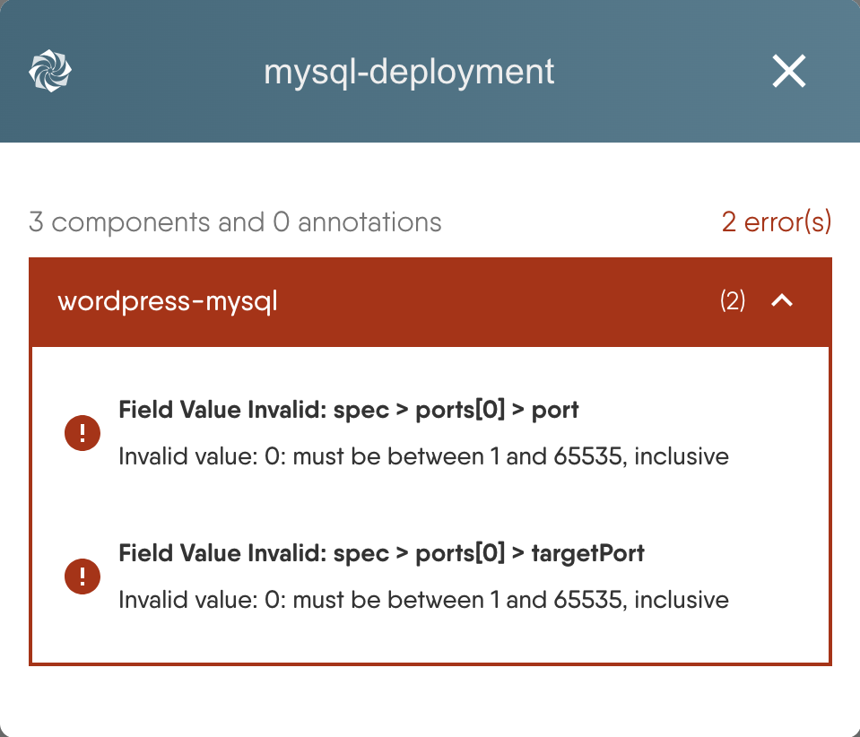
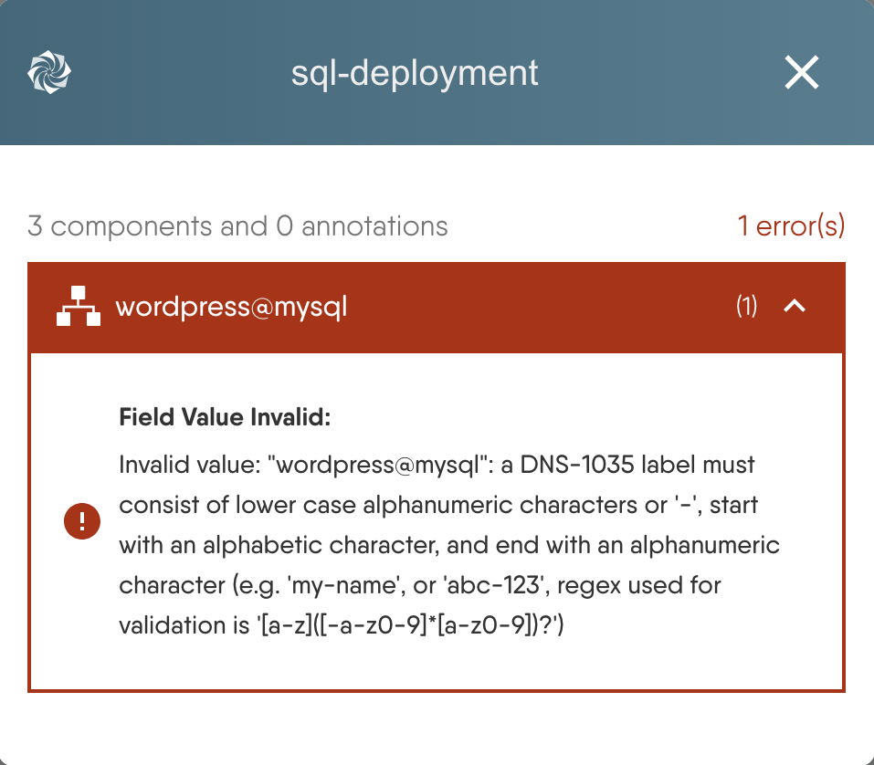
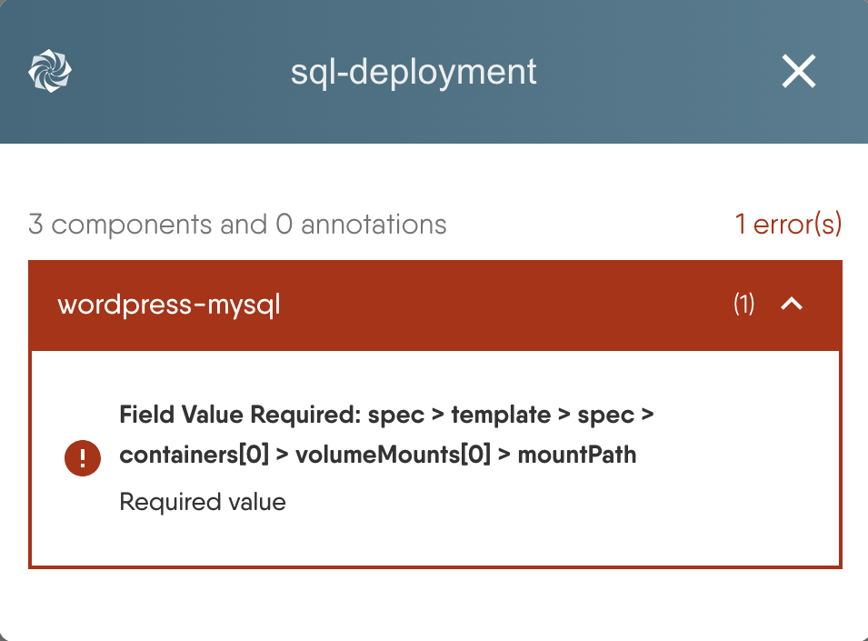
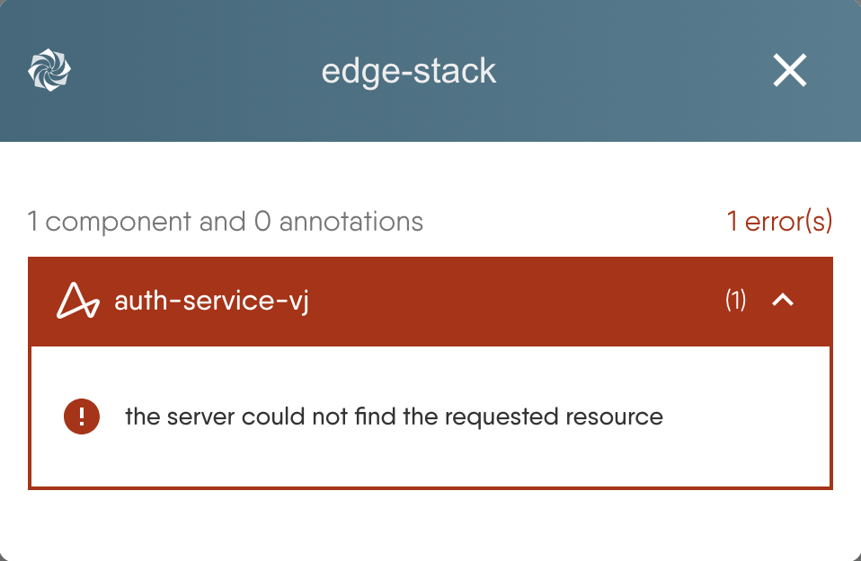

A dry run in Meshery simulates the deployment of your design in the selected target environment without making any actual changes. This step is highly beneficial as it helps identify potential issues before they occur, ensuring a smoother and more reliable deployment process.

Each component in your design is submitted to the Kubernetes API server of every selected cluster as a dry-run request. The API server validates the resource exactly as it would on a real apply - schema, field values, admission - and then discards it. Nothing is created, updated, or persisted, so a dry run is safe to repeat as often as you like.

## Performing Dry Run

1. Navigate to the **Actions** button at the top of the Design canvas.

2. Click on the **Dry Run** icon.

3. Select the Kubernetes cluster or clusters you want to simulate against, then run the simulation. If no clusters are selected, the dry run targets all connected clusters.

4. Review the results to identify any potential issues.

5. Make necessary adjustments to your configuration based on the feedback provided by the dry run.

6. Re-run the dry run to ensure all issues have been resolved.

### Reading the Results

Results are grouped by component, with the number of errors beside each component's name. Expand a component to see its individual errors, each one naming the kind of problem, the field path it was found at, and the message the Kubernetes API server returned.

Click an error to jump straight to the offending field: Kanvas opens that component's configurator with the field in question in view, so you can correct it without hunting for it.

A dry run reports on Kubernetes-configurable components only. Annotation components - text, shapes, comments, and other visual elements - carry no infrastructure and are counted separately in the summary rather than validated.

## Dry Run and Validate

**Validate** and **Dry Run** answer different questions, and a design can pass one while failing the other.

| | Validate | Dry Run |
|---|---|---|
| Checks against | The component's own schema, in Meshery | Your live Kubernetes cluster |
| Catches | Malformed or missing configuration | Everything Validate catches, plus admission failures, missing CRDs, and cluster-specific policy |
| Needs a cluster | No | Yes |

Validate is the faster loop and needs nothing connected; run it while you are still building. Dry Run is the check to run before you deploy, because it is the only one that involves the cluster you are about to deploy to.

## Dry Run Inside Deploy and Undeploy

You do not have to remember to dry run before deploying: **Dry Run** is a built-in step of both the deploy and the undeploy flow. Starting either from the **Actions** menu opens a stepper that runs **Validate Design**, then **Identify Environments**, then **Dry Run**, before you reach **Finalize** and **Finish**.

Within that step you can also:

- **Include Dependencies** - extend the simulation to the resources your components depend on.
- **Bypass errors and initiate deployment** - proceed despite reported errors. Use it deliberately; the errors were reported by the cluster you are about to deploy to.

In the undeploy flow the same step simulates removal instead of creation, so you can see what an [undeploy]() would touch before you commit to it.

## Dry Run Errors

### Invalid Field Value

This error indicates that a field has an invalid value. For example, when configuring a Kubernetes Service, the fields `spec.ports[0].port` and `spec.ports[0].targetPort` may have invalid values of 0. These values must be between 1 and 65535, inclusive.

### Missing Required Field

This error occurs when a required field in the configuration has not been provided. Ensure all required fields are properly configured before running the dry run.

### Missing Dependencies

This error occurs because a Kubernetes Custom Resource Definition (CRD) should have been deployed first before attempting to deploy a component that relies on it.

To resolve this, ensure that all necessary dependencies, such as CRDs, are deployed before deploying the components that rely on them.

