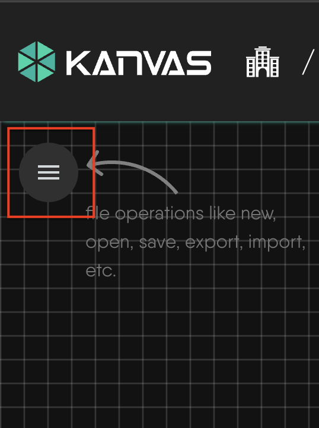
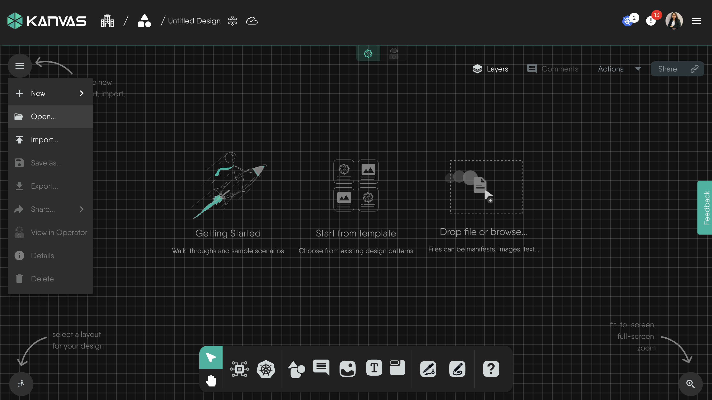
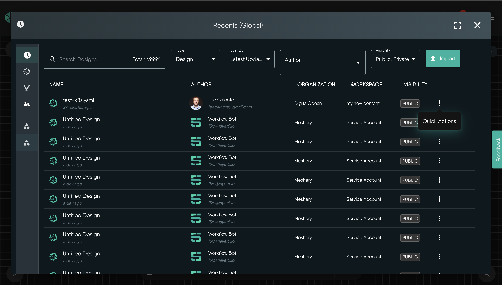
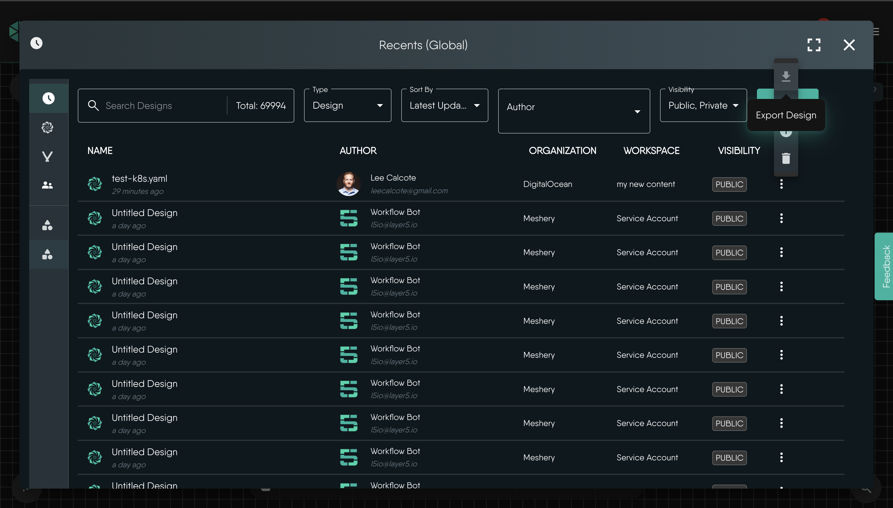
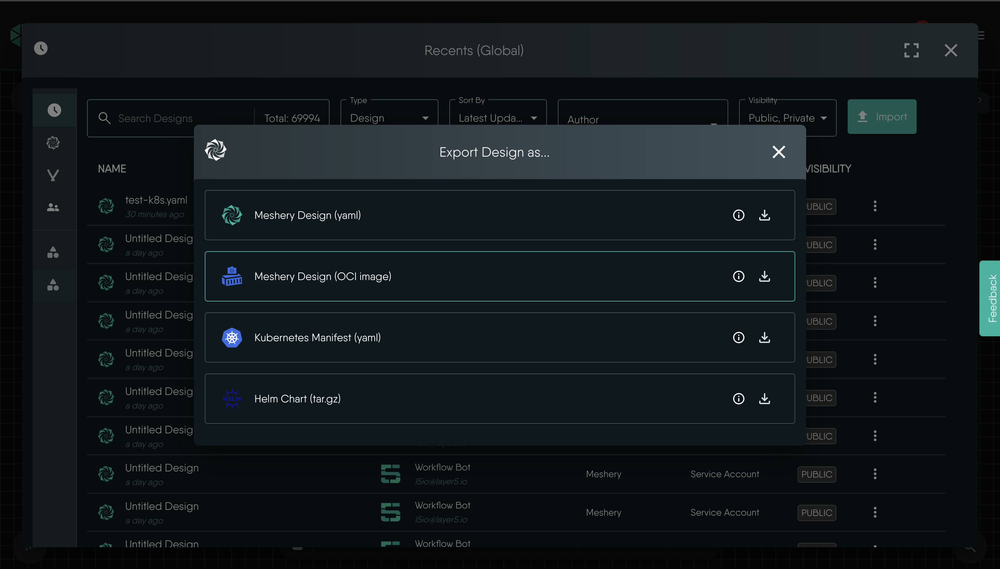
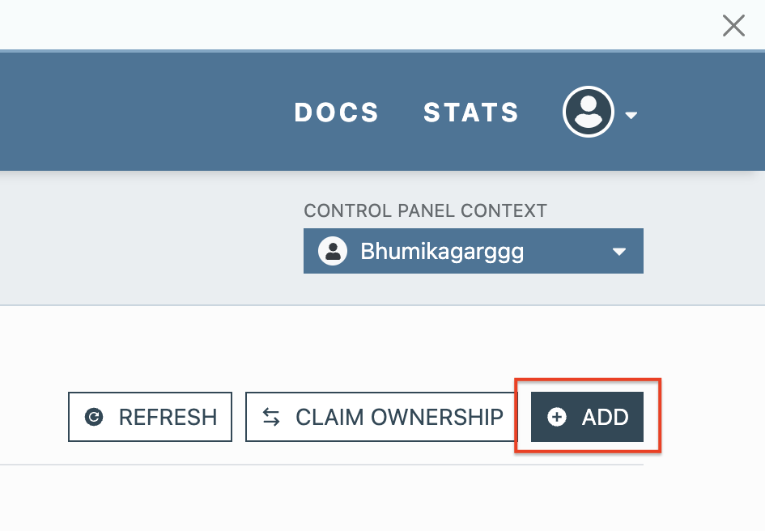
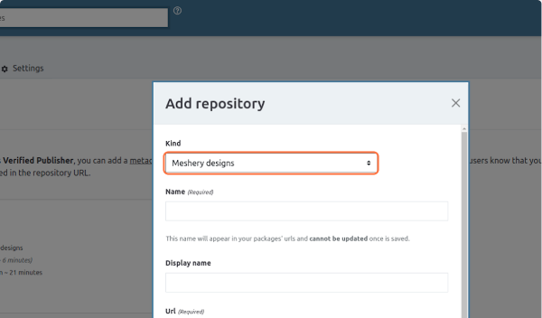
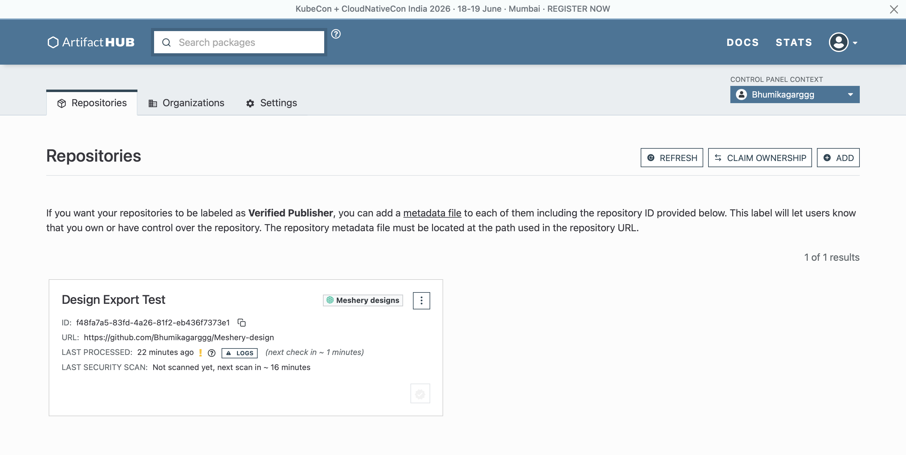

## Introduction

In this tutorial, we'll see how to export a Design from Meshery which we will
use to populate an Artifact Hub repository.

## Prerequisites

- A prepared Artifact Hub repository with `Kind` set to
  [Meshery Designs](https://artifacthub.io/docs/topics/repositories/meshery-designs).

## Steps

### 1. Open the hamburger menu in Kanvas

### 2. Click Open

### 3. Find the Design in the Panel

### 4. Click Export Design

### 5. Click on EXPORT under OCI

### 6. Prepare your Artifact Hub repo

You will need to have an Artifact Hub repository already created with `Kind` as
`Meshery Designs`. See
[Artifact Hub documentation](https://artifacthub.io/docs/topics/repositories/meshery-designs/)
for more information on managing repositories.

1. Navigate to the Artifact Hub control panel.
2. Click **ADD** to create a new repository.

3. Select `Meshery designs` as the repository kind and fill in the repository
   details.

### 7. Push Design to Artifact Hub repository

After exporting your design as a Meshery Design (OCI image) from Kanvas, a
`.tar` archive will be downloaded.

1. Extract the downloaded .tar archive.
2. Inside the extracted contents, locate the `.tar.gz` archive and extract it.
3. After extraction, you should find the following files: `artifacthub-pkg.yml`
   and `design.yml`.
4. Move these files into your prepared Artifact Hub repository.
5. Commit and push the changes to your repository.

### 8. Verify Repository in Artifact Hub

After pushing the files, wait for Artifact Hub to index your repository. Once
indexing is complete, verify the published Meshery Design from the Artifact Hub
control panel. 
