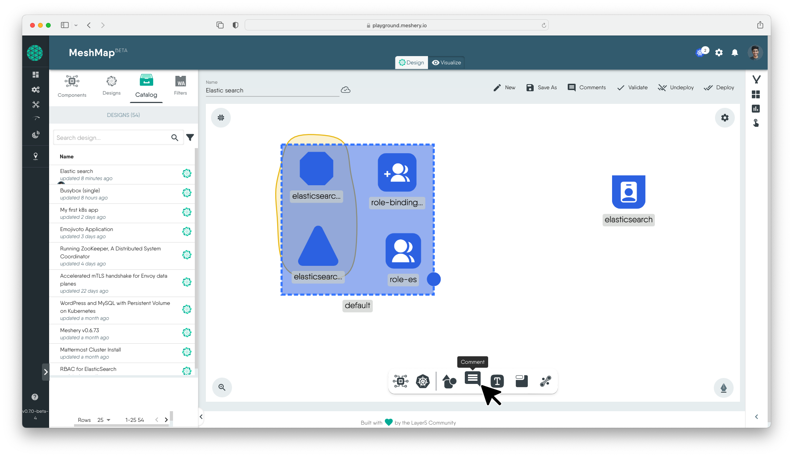
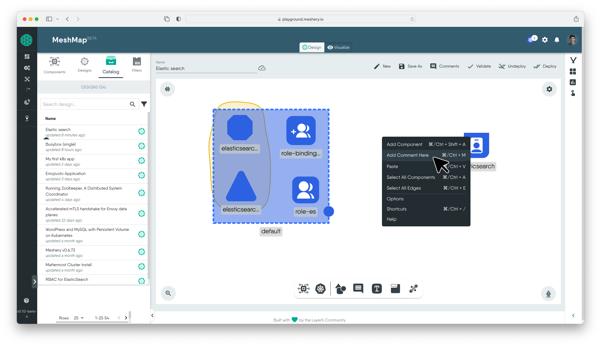

## Overview

MeshMap's Designer Mode offers a powerful collaboration feature through comments. You can use it to write detailed design description, add pointers for you team members, and include any helpful information that can help you or others collaborate.

## How to Add Comments

You can add comments in two convenient ways:

1. **Drag comment from dock:**
   To access comment from whiteboarding dock make sure your whiteboarding feature is enabled, select comment tool from dock and drop it anywhere on canvas to comment.

2. **Right-Click in Canvas:**
   Right-click on any area of your canvas, and from the contextual menu, select "Comment" or use the shortcut <button class="kbc-button kbc-button-xs">Ctrl</button> + <button class="kbc-button kbc-button-xs">M</button> and for mac users <button class="kbc-button kbc-button-xs">⌘ Command</button> + <button class="kbc-button kbc-button-xs">M</button>. This allows for swift comment placement right where you need it.

## How to Use Comment for Design Reviews

1. **Initiate a Comment Thread:**

     You can initiate a comment thread by just adding a comment. Your comment may be a request for design review or feedback on a design. Team members can reply directly to comments to for a comment thread. This creates a structured dialogue around each point of feedback for easy referencing.

     

2. **Use Mention Feature to Notify Team Member:**

    Easily draw the attention of relevant team members by tagging them in your comment. To activate this, type @ in the comment box and a list of your team members will appear then you can select who you want to mention. This ensures that the right people are notified and can contribute to the discussion.

3. **Comment on Specific Elements:**

    Leave comments on specific elements within the design, whether it's a shape, text, or an entire component. This specificity ensures that feedback is targeted and directly related to the part of the design under discussion.
  
4. **Resolve a Comment:**

   Once revisions are complete, you can resolve the comment by right-clicking. This will open a context menu, and you can select "Resolve." In case you accidentally resolve the comment, you can easily undo it by pressing <button class="kbc-button kbc-button-xs">⌘ Command</button> + <button class="kbc-button kbc-button-xs">Z</button>. Resolving a comment closes the comment thread and signifies that the conversation regarding that feedback has concluded.

5. **View All Comments and Comment History:**

   MeshMap also supports maintaining comment history, which can be helpful for reviewing previous discussions and decisions. You can easily access the comment history by clicking on the "Comments" button in the toolbar.

6. **Emoji Picker:**

   Comments support an emoji picker, allowing you to review designs and collaborate with friends in a more expressive way. Use **:** when typing a comment to open the emoji picker.

## Best Practices for Effective Design Reviews

 

### 1. Be specific and actionable

Provide specific feedback rather that the design can act on. Vague comments can lead to misunderstandings and delays in the design process. Support your feedback with examples or references. This can help clarify your point and provide the designer with tangible suggestions for improvement.

### 2. Balance positive and contructive feedback

Frame feedback in a constructive manner, focusing on how things can be improved rather than just pointing out flaws. Acknowledge what works well in the design before delving into areas that need improvement. This helps maintain a positive and collaborative atmosphere.

### 3. Regularly check and respond to comments

Stay engaged in the review process. Regularly check and respond to comments to keep the conversation alive and ensure a smooth workflow.

### 4. Prioritize feedback

Highlight the most critical feedback first. This ensures that the designer focuses on the most important aspects for improvement.


- The 'Comment' feature is currently in its beta phase, and we may introduce updates or improvements over time.
- Your feedback is invaluable! If you encounter any issues or have suggestions for enhancement, please take a moment to provide feedback. [Discuss Form](https://discuss.layer5.io/), [Slack](https://slack.layer5.io)

