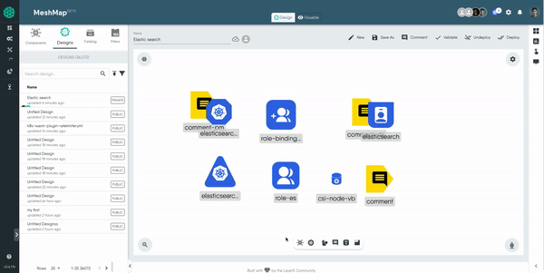

## Overview

MeshMap's Designer Mode offers a powerful collaboration feature through comments. You can use it to write detailed design description, add pointers for you team members, and include any helpful information that can help you or others collaborate.

## Why Use Comments?

### Enhance Collaboration

Comments serve as a communication channel, allowing team members to discuss specific part of a MeshMap design. Whether it's seeking feedback, asking questions, or providing clarifications, comments foster a collaborative environment.

### Streamline Design Reviews

Facilitate efficient design reviews by using comments to highlight key aspects, address concerns, and capture feedback directly within the Designer Mode. This approach ensures that discussions are contextually tied to the design, reducing the need for external communication channels.

## How to Add Comments

You can add comments in three convenient ways, ensuring a seamless and versatile commenting experience:

1. **Comment through Toolbar:**
   Click on the comment icon in the toolbar to open a comment box instantly. This is your go-to method for quick annotations without leaving your canvas.

2. **Right-Click in Canvas:**
   Right-click on any area of your canvas, and from the contextual menu, select "Comment" or use the shortcut ***Ctrl + M (Command + M for Mac users)***. This allows for swift comment placement right where you need it.

3. **Drag comment from doc:**
   To access comment from whiteboarding doc make sure your whiteboarding feature is enabled, select comment tool from doc and drop it anywhere on canvas to comment.

## Additional Features (Coming Soon)

1. **Mention Feature:**
   Enhance collaboration by mentioning specific team members in your comments using the @username feature. This ensures that the right people are notified and involved in relevant discussions.

2. **Resolving a Comment for Conclusion:**
   Use the resolution feature to conclude a comment thread after addressing the feedback or making necessary changes. Resolving a comment signifies that the conversation on that specific topic has been concluded, allowing for a clean and organized design canvas.

3. **Comment History for Insightful Tracking:**
   After resolving a comment thread, you can access the comment history to review previous discussions and decisions.


- The 'Comment' feature is currently in its beta phase, and we may introduce updates or improvements over time.
- Your feedback is invaluable! If you encounter any issues or have suggestions for enhancement, please take a moment to provide feedback.


## Conclusion

Comments in Designer Mode are a valuable tool for enhancing collaboration and conducting efficient design reviews within MeshMap. Leverage this feature to enhance communication, capture feedback, and ensure a smooth collaborative design process within MeshMap designer.