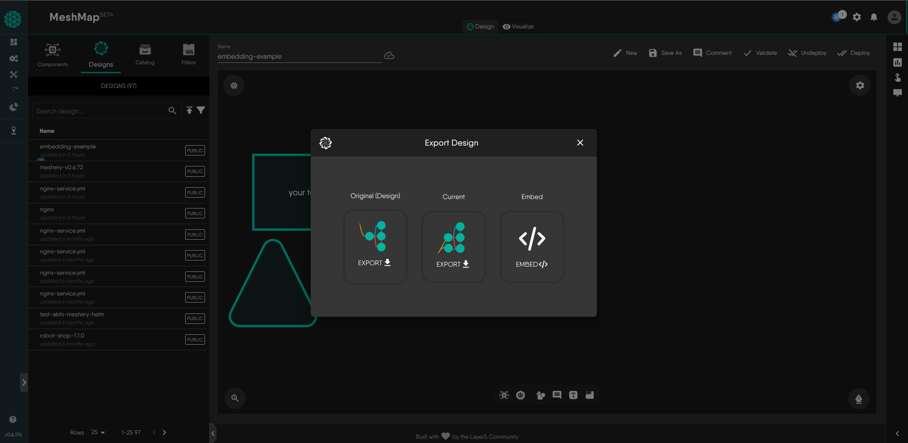

# Exporting Your MeshMap Designs

This documentation guides you on how to export your MeshMap designs for various purposes, including backup, offline sharing, or integration with other infrastructure tools. MeshMap Designer offers multiple export options, allowing you to choose the format that suits your needs.

## Exporting Your Design

To export your MeshMap design, follow these steps:

1. **Access Export Options**: Within the MeshMap Designer, select the design you wish to export in the design drawer. Click on the export icon in the menu for the selected design.

   

2. **Select Export Format**: The export modal will appear, offering various export formats:

   - **Original Source Form**: Export the design in its original source form.
   - **Current Design**: Obtain the design as it appears at the moment.
   - **Embedded Form**: Export the design for embedding into websites, blogs, or other platforms supporting HTML/CSS and JavaScript.

## Exporting as a Design File

Exporting your design as a design file provides you with a YAML file representing the current snapshot of your design. This file can be used for offline sharing, backup, or later import.

## Exporting as the Unmodified Source

If your design was generated from a source like HelmChart, Kubernetes manifest, or a previous design file, exporting it as an unmodified source will give you the original source file.

## Exporting as Embedding

Exporting your design as an embedding allows you to integrate it into websites, blogs, or other platforms that support HTML, CSS, and JavaScript. The embedded design version offers a visually interactive representation of your design, making it easy to share with infrastructure stakeholders.

**Note**: While the embedded version is not directly connected to your infrastructure, it will still contain information such as component names and connections.

To export a design as an embedding, follow these steps:

1. In the design modal, click on the "Embed" option.

2. Click on the download icon presented in the same modal to download the embedding script. Additionally, there will be an embed code shown in the modal for integrating the embedding script into your sites/pages.

   The embed code will be of the form:

   ```html
   <div id="embedded-design-embedding-example"></div>
   <script src="./embedded-design-embedding-example.js" type="module"></script>
   ```

   Make sure the `src` attribute in the script tag points to the location of the downloaded embedding script on your local filesystem or server.

   

3. After following the above steps, you will be able to see an embedded version of your design. To test the embedding locally, place the shortcode inside an HTML file and use a lightweight HTTP server like `python -m http.server` or `live-server` to view it. Please note that the file cannot be directly opened in Chrome or Safari due to CORS restrictions imposed by these browsers on local files.

4. After Finishing the steps , the embedded design will be rendered like :

<!-- Design Embed Container  -->
<div id="embedded-design-6afd9029-60cf-4662-b031-cf4f9ab854fd" style="height:30rem;width:100%"></div>
<script src="./embedded-design-mongo_configuration_using_configmap.js" type="module" ></script>

### Customization

You can customize the styles for the embedded design by targeting CSS classes exposed or by adding inline styles. The following class can be overridden:

- `embed-design-container`: for the embedding container
- `cy-container`: for the canvas

If you have multiple embeddings on a page, you can target them all using the classes or specific ones using the div's ID in the shortcode.

Here is a customization example:

```html
<style>
  .embed-design-container {
    width: 100%;
    border-radius: 1rem;
    margin: 1rem;
    overflow: hidden;
    margin-inline: auto;
    height: 35rem;
  }
  .embed-canvas-container {
    background-color: gray;
  }
</style>

<!-- Design Embed Container  -->
<div id="embedded-design-abedbfc6-2a46-4866-99d4-1f9eadd90d0c"></div>
<script src="./embedded-design-embedding-example.js" type="module"></script>
```

<style>
  .embed-design-container {
    width: 100%;
    border-radius:1rem;
    margin:1rem;
    overflow:hidden;
    margin-inline: auto;
    height: 35rem;
  }
  .embed-canvas-container {
    background-color: gray;
  }
</style>
<!-- Design Embed Container  -->
<div id="embedded-design-abedbfc6-2a46-4866-99d4-1f9eadd90d0c"></div>
<script src="./embedded-design-embedding-example.js" type="module" ></script>

Now you have the flexibility to export your MeshMap designs in various formats and customize the embedded design to suit your needs.
