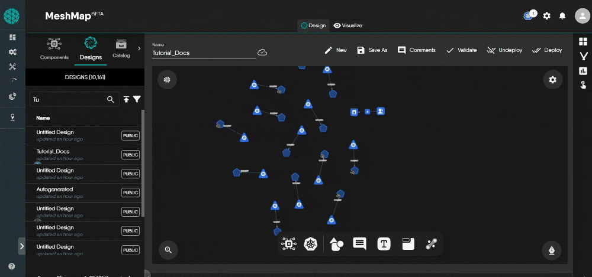

# Meshery Design Embedding
Meshery Design Embedding enables you to export a design in a format that can be seamlessly integrated into websites, blogs, or platforms supporting HTML, CSS, and JavaScript. This embedded version provides an interactive representation of the design, making it easier to share with infrastructure stakeholders.

## Embedding Your Design

To embed your MeshMap design, follow these steps:

1. **Access Embed Option**: Within the MeshMap Designer, select the design you wish to embed in the design drawer. Click on the export icon in the menu for the selected design. The export modal will appear, click on the "Embed" option.

   

2. **Download the Embedding Script**: Click on the download icon presented in the same modal to download the embedding script.

## Embedding in Static Sites

   The embed code for static site:

   ```html
   <div id="embedded-design-embedding-example"></div>
   <script src="./embedded-design-embedding-example.js" type="module"></script>
   ```

   Make sure the `src` attribute in the script tag points to the location of the downloaded embedding script on your local filesystem or server.

## Embedding in React Projects

1. **Install the Package**: To integrate the Meshery Design into your React project, start by installing the package via npm:
```bash
  npm i meshery-design-embed
```
2. **Incorporate the Component**: Use the component to seamlessly embed designs within React and its associated frameworks.

```jsx
import MesheryDesignEmbed from '@layer5/meshery-design-embed'


function Design() {
  return (
    <>

      <div>
        <MesheryDesignEmbed
          embedScriptSrc="embedded-design-embed1.js"  // path to the embed script
          embedId="embedded-design-a3d3f26e-4366-44e6-b211-1ba4e1a3e644" // id of the embedding
        />
      </div>
    </>
  );
}
```

Make sure the `embedScriptSrc` attribute in the component points to the location of the downloaded embedding script on your react filesystem.
Usually the script is located "static" folder